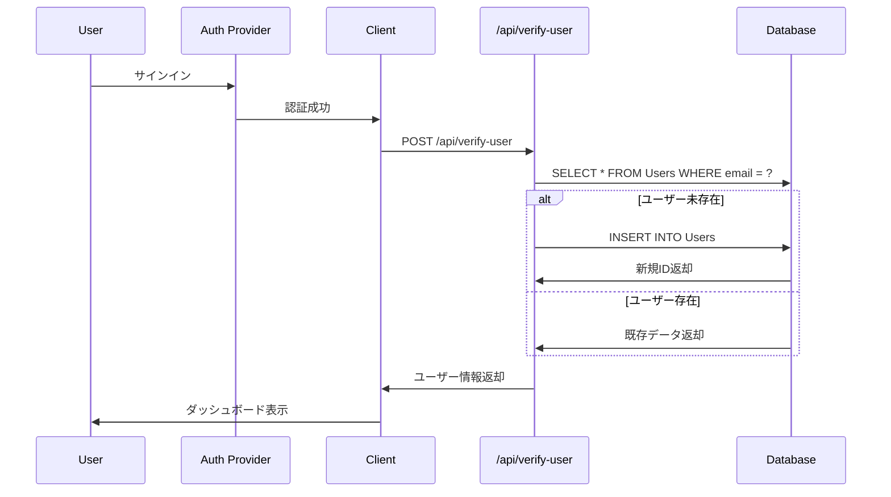
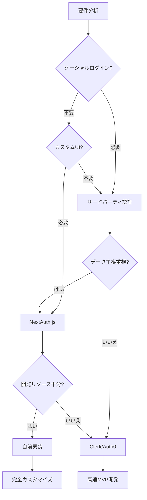

# 認証パターン

Next.js SaaSアプリケーションにおける認証実装の標準パターン。

---

## 1. 認証プロバイダ統合

### サードパーティ認証サービスの活用

現代のSaaSアプリケーションでは、認証機能をサードパーティサービス（Clerk、Auth0、Supabase Auth等）に委譲するのが一般的。

**主な利点:**
- ソーシャルログイン（Google、GitHub等）のプリビルトサポート
- セキュリティベストプラクティスの自動適用
- ユーザー管理UIの提供
- パスワードリセット、二要素認証などの機能

### 環境変数の設定

```env
# .env.local
NEXT_PUBLIC_CLERK_PUBLISHABLE_KEY=pk_test_...
CLERK_SECRET_KEY=sk_test_...

# リダイレクトURL（開発/本番で切り替え）
NEXT_PUBLIC_CLERK_SIGN_IN_URL=/sign-in
NEXT_PUBLIC_CLERK_SIGN_UP_URL=/sign-up
NEXT_PUBLIC_CLERK_AFTER_SIGN_IN_URL=/dashboard
NEXT_PUBLIC_CLERK_AFTER_SIGN_UP_URL=/dashboard
```

### Provider Wrapperパターン

認証プロバイダをアプリケーション全体でラップする。

```jsx
// app/layout.js
import { ClerkProvider } from '@clerk/nextjs';

export default function RootLayout({ children }) {
  return (
    <ClerkProvider>
      <html lang="ja">
        <body>{children}</body>
      </html>
    </ClerkProvider>
  );
}
```

---

## 2. ミドルウェアによるルート保護

### Next.js Middlewareでの認証チェック

サーバーサイドでルートアクセスを制御し、未認証ユーザーをブロック。

```js
// middleware.js
import { clerkMiddleware, createRouteMatcher } from '@clerk/nextjs/server';

// 保護対象のルートを定義
const isProtectedRoute = createRouteMatcher([
  '/dashboard(.*)',
  '/api/protected(.*)',
]);

export default clerkMiddleware(async (auth, req) => {
  if (isProtectedRoute(req)) {
    await auth.protect(); // 未認証なら自動でサインインページへリダイレクト
  }
});

export const config = {
  matcher: [
    // Next.js内部ファイルを除外
    '/((?!_next|[^?]*\\.(?:html?|css|js(?!on)|jpe?g|webp|png|gif|svg|ttf|woff2?|ico|csv|docx?|xlsx?|zip|webmanifest)).*)',
    '/(api|trpc)(.*)',
  ],
};
```

### createRouteMatcherパターン

```js
// 複数パターンの定義
const isProtectedRoute = createRouteMatcher([
  '/dashboard(.*)',
  '/settings(.*)',
  '/billing(.*)',
]);

const isPublicRoute = createRouteMatcher([
  '/',
  '/pricing',
  '/about',
  '/sign-in(.*)',
  '/sign-up(.*)',
]);

export default clerkMiddleware(async (auth, req) => {
  if (!isPublicRoute(req) || isProtectedRoute(req)) {
    await auth.protect();
  }
});
```

### パブリックルートとプロテクトルートの分離

| ルートタイプ | 例 | 認証要否 |
|------------|-------|---------|
| パブリック | `/`, `/pricing`, `/about` | 不要 |
| 認証関連 | `/sign-in`, `/sign-up` | 不要（認証前） |
| プロテクト | `/dashboard`, `/settings` | 必須 |
| API | `/api/protected/*` | 必須 |

---

## 3. カスタム認証UI

### Route Groupを活用した認証ページ構成

Next.js App Routerの `(auth)` Route Groupで認証ページを整理。

```
app/
  (auth)/
    layout.jsx                    # 認証ページ共通レイアウト
    sign-in/
      [[...sign-in]]/
        page.jsx                  # サインインページ
    sign-up/
      [[...sign-up]]/
        page.jsx                  # サインアップページ
  (dashboard)/                    # プロテクトルート
    layout.jsx
    dashboard/
      page.jsx
```

### Catch-all Routeパターン

`[[...sign-in]]` パターンで柔軟なルーティングを実現。

```jsx
// app/(auth)/sign-in/[[...sign-in]]/page.jsx
import { SignIn } from '@clerk/nextjs';

export default function SignInPage() {
  return (
    <div className="flex items-center justify-center min-h-screen">
      <SignIn
        appearance={{
          elements: {
            formButtonPrimary: 'bg-blue-600 hover:bg-blue-700',
            card: 'shadow-xl',
          }
        }}
      />
    </div>
  );
}
```

### 認証ページ共通レイアウト

```jsx
// app/(auth)/layout.jsx
export default function AuthLayout({ children }) {
  return (
    <div className="flex min-h-screen items-center justify-center bg-gray-50">
      <div className="w-full max-w-md">
        <div className="mb-8 text-center">
          <h1 className="text-3xl font-bold">Your SaaS</h1>
          <p className="text-gray-600">Welcome back</p>
        </div>
        {children}
      </div>
    </div>
  );
}
```

---

## 4. ユーザー検証と自動登録

### API Route経由でのユーザー存在確認

認証後、初回ログイン時にDBへユーザー情報を自動登録。

```js
// app/api/verify-user/route.js
import { db } from '@/lib/db';
import { Users } from '@/lib/schema';
import { eq } from 'drizzle-orm';
import { auth } from '@clerk/nextjs/server';

export async function POST(req) {
  const { user } = await auth();

  if (!user) {
    return Response.json({ error: 'Unauthorized' }, { status: 401 });
  }

  try {
    // ユーザー存在確認
    const userInfo = await db
      .select()
      .from(Users)
      .where(eq(Users.email, user.primaryEmailAddress.emailAddress));

    // 新規ユーザーの場合、DB登録
    if (userInfo?.length === 0) {
      const newUser = await db
        .insert(Users)
        .values({
          name: user.fullName,
          email: user.primaryEmailAddress.emailAddress,
          imageUrl: user.imageUrl,
          createdAt: new Date(),
        })
        .returning({ id: Users.id });

      return Response.json({ result: newUser[0] });
    }

    return Response.json({ result: userInfo[0] });
  } catch (error) {
    return Response.json({ error: error.message }, { status: 500 });
  }
}
```

### useEffectでの認証状態監視

```jsx
// app/(dashboard)/layout.jsx
'use client';
import { useUser } from '@clerk/nextjs';
import { useEffect, useState } from 'react';

export default function DashboardLayout({ children }) {
  const { user } = useUser();
  const [userDetail, setUserDetail] = useState(null);

  useEffect(() => {
    if (user) {
      verifyUser();
    }
  }, [user]);

  const verifyUser = async () => {
    const res = await fetch('/api/verify-user', {
      method: 'POST',
    });
    const data = await res.json();
    setUserDetail(data.result);
  };

  return <div>{children}</div>;
}
```

### 自動登録フローの設計



---

## 5. ユーザー情報の共有（Context Pattern）

### React Contextでの認証情報グローバル管理

複数コンポーネント間でユーザー情報を共有。

```jsx
// contexts/UserDetailContext.jsx
'use client';
import { createContext, useState } from 'react';

export const UserDetailContext = createContext();

export function UserDetailProvider({ children }) {
  const [userDetail, setUserDetail] = useState(null);

  return (
    <UserDetailContext.Provider value={{ userDetail, setUserDetail }}>
      {children}
    </UserDetailContext.Provider>
  );
}
```

### Providerでラップ

```jsx
// app/(dashboard)/layout.jsx
import { UserDetailProvider } from '@/contexts/UserDetailContext';

export default function DashboardLayout({ children }) {
  return (
    <UserDetailProvider>
      {/* verifyUser()でsetUserDetailを呼び出す */}
      {children}
    </UserDetailProvider>
  );
}
```

### 子コンポーネントで使用

```jsx
// components/UserProfile.jsx
'use client';
import { useContext } from 'react';
import { UserDetailContext } from '@/contexts/UserDetailContext';

export default function UserProfile() {
  const { userDetail } = useContext(UserDetailContext);

  if (!userDetail) return <div>Loading...</div>;

  return (
    <div>
      <h2>{userDetail.name}</h2>
      <p>{userDetail.email}</p>
    </div>
  );
}
```

### Context Pattern の設計原則

| パターン | 用途 | 注意点 |
|---------|------|--------|
| 単一Context | ユーザー情報のみ | シンプル、ファイル分割推奨 |
| 複数Context | ユーザー + テーマ + 設定 | Provider のネスト管理 |
| Context + Reducer | 複雑な状態更新 | useReducer併用 |

---

## 6. UserButtonコンポーネント

### プリビルトUIコンポーネントの活用

認証プロバイダが提供するUserButtonで、プロフィール表示・サインアウト機能を簡単に実装。

```jsx
// components/Header.jsx
import { UserButton } from '@clerk/nextjs';

export default function Header() {
  return (
    <header className="border-b">
      <div className="flex items-center justify-between px-4 py-3">
        <h1 className="text-xl font-bold">Dashboard</h1>
        <UserButton
          afterSignOutUrl="/"
          appearance={{
            elements: {
              avatarBox: 'w-10 h-10',
            }
          }}
        />
      </div>
    </header>
  );
}
```

### カスタマイズオプション

```jsx
<UserButton
  afterSignOutUrl="/sign-in"
  appearance={{
    elements: {
      avatarBox: 'w-12 h-12 ring-2 ring-blue-500',
      userButtonPopoverCard: 'shadow-2xl',
    }
  }}
  userProfileMode="modal"
  userProfileProps={{
    appearance: {
      elements: {
        card: 'shadow-none',
      }
    }
  }}
/>
```

### 主要プロパティ

| プロパティ | 説明 | デフォルト |
|-----------|------|-----------|
| `afterSignOutUrl` | サインアウト後のリダイレクト先 | `/` |
| `appearance` | スタイルカスタマイズ | - |
| `userProfileMode` | プロフィール表示形式（`modal`/`navigation`） | `modal` |
| `showName` | ユーザー名表示 | `false` |

---

## 7. 判断基準テーブル

### 認証実装パターンの選択

| 要件 | 推奨パターン | 理由 | 実装コスト |
|------|------------|------|-----------|
| **ソーシャルログイン必須** | サードパーティ認証サービス（Clerk、Auth0） | プリビルトUI、多プロバイダ対応、セキュリティ保証 | 低 |
| **カスタムUI必要** | Elements/カスタムコンポーネント | ブランド一貫性、デザインシステム統合 | 中 |
| **完全自社管理** | NextAuth.js + 自前DB | データ主権、カスタマイズ性 | 高 |
| **サーバーサイド認証** | Middleware | 全ルート一括保護、SEO対応 | 低 |
| **クライアント認証状態** | `useUser` + Context | コンポーネント間状態共有 | 低 |
| **API保護** | Middleware + `auth()` ヘルパー | サーバーコンポーネント/API Route両対応 | 低 |
| **段階的移行** | Middleware の `createRouteMatcher` | 既存ルートを段階的に保護 | 低 |

### 認証フロー選択基準



### コスト vs カスタマイズ性

| 実装方式 | 初期コスト | 保守コスト | カスタマイズ性 | セキュリティ |
|---------|----------|----------|-------------|------------|
| Clerk/Auth0 | ⭐ | ⭐ | ⭐⭐⭐ | ⭐⭐⭐⭐⭐ |
| NextAuth.js | ⭐⭐ | ⭐⭐ | ⭐⭐⭐⭐ | ⭐⭐⭐⭐ |
| 自前実装 | ⭐⭐⭐⭐⭐ | ⭐⭐⭐⭐⭐ | ⭐⭐⭐⭐⭐ | ⭐⭐ |

---

## まとめ

Next.js SaaSアプリケーションの認証実装における推奨パターン:

1. **サードパーティ認証サービスを活用** - 開発速度とセキュリティを両立
2. **Middlewareで一括保護** - サーバーサイドルート制御
3. **Route Groupで認証ページ整理** - 保守性向上
4. **Context PatternでDB情報共有** - クライアント状態管理
5. **自動登録フローでUX最適化** - 初回ログイン時のスムーズな体験

**トレードオフの考慮:**
- **速度重視** → Clerk/Auth0 + プリビルトUI
- **カスタマイズ重視** → NextAuth.js + カスタムコンポーネント
- **データ主権重視** → 自前実装（JWT/Session管理）
