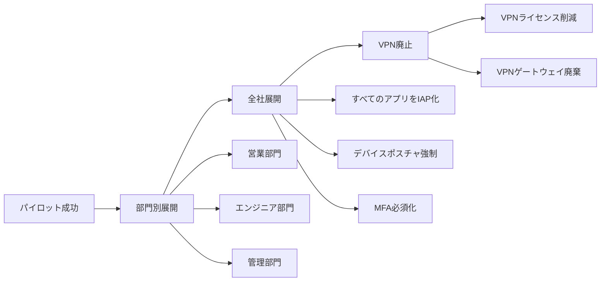

# GCP Zero Trust・BeyondCorp リファレンス

従来のVPNベース境界防御からゼロトラスト・BeyondCorpへの移行ガイド。Identity-Aware Proxy（IAP）、Context-Aware Access、Endpoint Verificationによる動的アクセス制御の実践。

---

## Zero Trust とは

### 従来モデル vs Zero Trust

| 観点 | 従来の境界防御モデル | Zero Trust モデル |
|------|-------------------|------------------|
| **信頼の前提** | 社内ネットワーク内は信頼 | すべてのトラフィックを疑う（Never trust, always verify） |
| **アクセス制御** | ネットワーク位置ベース（VPN接続後は自由） | アイデンティティ・デバイス・コンテキストベース |
| **侵害時の影響** | ラテラルムーブメント（横展開）容易 | セグメント化により影響範囲最小化 |
| **認証タイミング** | VPN接続時の一度のみ | 毎リクエスト継続的検証 |
| **デバイス管理** | 社内デバイスのみ信頼 | デバイスポスチャを動的評価 |

### Zero Trust 原則

1. **Never trust, always verify（決して信頼せず、常に検証）**
   - ネットワーク内外を問わず、すべてのリクエストを認証・認可
   - 暗黙の信頼を排除

2. **Least privilege（最小権限）**
   - ユーザー・サービスに必要最小限のアクセスのみ付与
   - Just-in-Time（JIT）アクセスで一時的権限昇格

3. **Assume breach（侵害を前提）**
   - 既に侵害されている前提で設計
   - マイクロセグメンテーションで影響範囲を限定

4. **Continuous verification（継続的検証）**
   - セッション継続中もデバイス状態・ユーザー行動を監視
   - 異常検知時にアクセスを動的に制限

### GCP における Zero Trust 実装レイヤー

| レイヤー | 実装技術 | 主要機能 |
|---------|---------|---------|
| **アイデンティティ** | Cloud Identity, Workspace, IAM | SSO、MFA、ユーザー・グループ管理 |
| **デバイスポスチャ** | Endpoint Verification, Chrome Enterprise | OS バージョン、暗号化状態、セキュリティパッチレベル検証 |
| **ネットワーク** | VPC Service Controls, Private Google Access | データ境界制御、プライベート通信 |
| **アプリケーション** | Identity-Aware Proxy (IAP), Access Context Manager | アプリケーション層認証・認可、コンテキスト評価 |
| **データ** | Cloud KMS, DLP, VPC-SC | 暗号化、データ分類、データエクスフィルト防止 |

---

## BeyondCorp Enterprise

GoogleがCEOメール侵害事件「Operation Aurora」（2009年）後に開発した社内Zero Trustモデル。従業員がVPN不要でグローバルアプリケーションに安全アクセス可能にする仕組みを商用化。

### BeyondCorp の核心思想

**「ネットワーク位置は信頼の根拠にならない」**

- VPNで社内ネットワークに入れば信頼される → ❌
- 毎リクエストでアイデンティティ・デバイス・コンテキストを検証 → ✅

### BeyondCorp Enterprise コンポーネント

```
ユーザー（社員/契約社員/パートナー）
  ↓
① Chrome Browser（Chrome Enterprise Connector）
  - デバイス証明書・ポスチャ情報収集
  ↓
② BeyondCorp Proxy（Google Front End）
  - TLS終端、IAP認証トリガー
  ↓
③ Identity-Aware Proxy（IAP）
  - Cloud Identity認証、Access Context Manager評価
  ↓
④ Access Context Manager
  - デバイス・ロケーション・時間帯ポリシー適用
  ↓
⑤ アプリケーション（Web App / API）
  - 認可済みリクエストのみ到達
```

### BeyondCorp の3つの柱

| 柱 | 説明 | 実装技術 |
|----|------|---------|
| **Identity-centric（アイデンティティ中心）** | ユーザー認証を全アクセス制御の起点とする | Cloud Identity, OAuth 2.0, OIDC |
| **Device posture（デバイスポスチャ）** | デバイスのセキュリティ状態を継続的に評価 | Endpoint Verification, Chrome Enterprise Connectors |
| **Context-aware policies（コンテキスト認識ポリシー）** | 位置情報・時刻・IPレピュテーション等を動的評価 | Access Context Manager, Access Levels |

---

## Identity-Aware Proxy（IAP）

アプリケーション層（Layer 7）でリクエストを認証・認可するリバースプロキシ。VPNなしで内部アプリケーションへのセキュアアクセスを実現。

### IAP の仕組み

```
ユーザー → IAP → 認証（Cloud Identity） → 認可（IAM） → アプリケーション
         ↓ 未認証
         ↓ Google ログイン画面にリダイレクト
```

**IAP が保護するリソース**:
- App Engine アプリケーション
- Compute Engine / GKE バックエンド（HTTP(S) Load Balancer経由）
- Cloud Run / Cloud Functions
- オンプレミスアプリケーション（Hybrid Connectivity経由）

### IAP 有効化手順

#### 1. OAuth 同意画面の構成

```bash
# OAuth 同意画面の作成（GCP Console で実施）
# https://console.cloud.google.com/apis/credentials/consent

# 内部（組織内ユーザーのみ）または外部を選択
# アプリ名、サポートメール、承認済みドメインを設定
```

#### 2. IAP の有効化

```bash
# Compute Engine バックエンドサービスに IAP を有効化
gcloud compute backend-services update BACKEND_SERVICE_NAME \
  --global \
  --iap=enabled,oauth2-client-id=CLIENT_ID,oauth2-client-secret=CLIENT_SECRET

# App Engine で IAP 有効化
gcloud app update --iap=enabled

# Cloud Run サービスに IAP 適用（Cloud Load Balancer経由）
gcloud compute backend-services update BACKEND_SERVICE \
  --global \
  --iap=enabled,oauth2-client-id=CLIENT_ID,oauth2-client-secret=CLIENT_SECRET
```

#### 3. IAM ロールでアクセス制御

```bash
# 特定ユーザーに IAP-secured Web App User ロールを付与
gcloud iap web add-iam-policy-binding \
  --resource-type=backend-services \
  --service=BACKEND_SERVICE_NAME \
  --member=user:alice@example.com \
  --role=roles/iap.httpsResourceAccessor

# グループ全体に付与
gcloud iap web add-iam-policy-binding \
  --resource-type=backend-services \
  --service=BACKEND_SERVICE_NAME \
  --member=group:engineers@example.com \
  --role=roles/iap.httpsResourceAccessor
```

### IAP ヘッダーの検証（アプリケーション側）

IAPが付与するJWTトークンをアプリケーションで検証し、なりすまし防止。

```python
# Python Flask での IAP JWT 検証例
from google.auth.transport import requests
from google.oauth2 import id_token

def verify_iap_jwt(iap_jwt, expected_audience):
    """IAP JWTトークンを検証"""
    try:
        decoded_jwt = id_token.verify_token(
            iap_jwt,
            requests.Request(),
            audience=expected_audience,
            certs_url='https://www.gstatic.com/iap/verify/public_key'
        )
        return decoded_jwt  # {'email': 'user@example.com', 'sub': '...'}
    except Exception as e:
        print(f"JWT validation failed: {e}")
        return None

# Flaskアプリでの使用
from flask import Flask, request, abort

app = Flask(__name__)
EXPECTED_AUDIENCE = "/projects/PROJECT_NUMBER/global/backendServices/BACKEND_ID"

@app.route('/')
def index():
    iap_jwt = request.headers.get('X-Goog-IAP-JWT-Assertion')
    if not iap_jwt:
        abort(401, "No IAP JWT token")

    user_info = verify_iap_jwt(iap_jwt, EXPECTED_AUDIENCE)
    if not user_info:
        abort(403, "Invalid IAP JWT")

    return f"Hello, {user_info['email']}"
```

**EXPECTED_AUDIENCE の取得**:
```bash
# バックエンドサービスの詳細から取得
gcloud compute backend-services describe BACKEND_SERVICE_NAME --global
# signed_url_key_names フィールドから算出
```

### IAP TCP 転送（SSH/RDP）

VM への SSH/RDP アクセスも IAP 経由で保護可能（外部IPアドレス不要）。

```bash
# IAP TCP トンネル経由でSSH接続
gcloud compute ssh VM_NAME \
  --zone=us-central1-a \
  --tunnel-through-iap

# RDP接続（Windows VM）
gcloud compute start-iap-tunnel VM_NAME 3389 \
  --local-host-port=localhost:3389 \
  --zone=us-central1-a

# 接続後、ローカルの RDP クライアントで localhost:3389 に接続
```

**IAM 権限（TCP転送用）**:
```bash
gcloud projects add-iam-policy-binding PROJECT_ID \
  --member=user:alice@example.com \
  --role=roles/iap.tunnelResourceAccessor
```

---

## Context-Aware Access

デバイス・ロケーション・IPアドレス・時刻等のコンテキストに基づき、動的にアクセス制御を適用。

### Access Levels（アクセスレベル）

**基本アクセスレベル**:
```yaml
# basic_access_level.yaml
name: corporate_network
title: "Corporate Network Only"
basic:
  conditions:
  - ipSubnetworks:
    - "203.0.113.0/24"  # 本社IPレンジ
    - "198.51.100.0/24" # 支社IPレンジ
```

**デバイスポリシーアクセスレベル**:
```yaml
# device_policy_level.yaml
name: managed_devices_only
title: "Managed Corporate Devices"
basic:
  conditions:
  - devicePolicy:
      requireScreenlock: true
      requireCorpOwned: true
      osConstraints:
      - osType: DESKTOP_CHROME_OS
        minimumVersion: "90.0"
```

**カスタムアクセスレベル（CEL式）**:
```yaml
# custom_access_level.yaml
name: business_hours_only
title: "Business Hours Access"
custom:
  expr:
    expression: |
      request.time.getHours() >= 9 && request.time.getHours() < 18 &&
      request.time.getDayOfWeek() >= 1 && request.time.getDayOfWeek() <= 5
    title: "Weekdays 9AM-6PM"
```

### Access Context Manager 設定

```bash
# アクセスレベル作成
gcloud access-context-manager levels create corporate_network \
  --policy=ACCESS_POLICY_ID \
  --title="Corporate Network Only" \
  --basic-level-spec=basic_access_level.yaml

# サービスペリメーター作成（VPC Service Controls統合）
gcloud access-context-manager perimeters create secure_perimeter \
  --policy=ACCESS_POLICY_ID \
  --title="Production Environment" \
  --resources=projects/PROJECT_ID \
  --restricted-services=storage.googleapis.com,bigquery.googleapis.com \
  --access-levels=corporate_network

# IAP にアクセスレベルを適用
gcloud iap web add-iam-policy-binding \
  --resource-type=backend-services \
  --service=BACKEND_SERVICE \
  --member=user:alice@example.com \
  --role=roles/iap.httpsResourceAccessor \
  --condition='expression=request.auth.access_levels.contains("accessPolicies/POLICY_ID/accessLevels/corporate_network"),title=Corporate Network Only'
```

### ユースケース別ポリシー例

| ユースケース | アクセスレベル条件 | 適用先 |
|------------|-----------------|--------|
| **本社からのみアクセス許可** | 特定IPサブネット | IAP, Cloud Console |
| **管理対象デバイスのみ** | `requireCorpOwned: true` + OS最小バージョン | 管理画面、財務システム |
| **営業時間内のみ** | 時刻・曜日制限（CEL式） | 勤怠システム、社内Wiki |
| **特定地域からの遮断** | `regions: ["CN", "RU"]` で拒否 | 全サービス（地政学リスク対策） |
| **MFA必須** | `requireMfa: true` | 本番環境アクセス |

---

## Endpoint Verification（デバイスポスチャ検証）

### Endpoint Verification のインストール

```bash
# Chrome拡張機能としてインストール
# https://chrome.google.com/webstore/detail/endpoint-verification/

# macOS/Windows/Linux エージェントインストール
# Admin Console > Devices > Endpoint verification > Download
```

### 収集されるデバイス情報

| 情報カテゴリ | 収集項目 | 用途 |
|------------|---------|------|
| **OS情報** | OS種別、バージョン、ビルド番号 | 最小バージョンポリシー適用 |
| **セキュリティ状態** | ディスク暗号化、ファイアウォール、スクリーンロック | コンプライアンス確認 |
| **証明書** | デバイス証明書（企業管理デバイス） | 管理対象デバイス判定 |
| **パッチレベル** | セキュリティパッチ適用状況 | 脆弱性対策検証 |

### デバイスポスチャポリシー例

```yaml
# device_posture_policy.yaml
name: secure_device_baseline
title: "Secure Device Baseline"
basic:
  conditions:
  - devicePolicy:
      requireScreenlock: true          # スクリーンロック必須
      requireDiskEncryption: true      # ディスク暗号化必須
      requireCorpOwned: true           # 企業管理デバイス
      osConstraints:
      - osType: DESKTOP_WINDOWS
        minimumVersion: "10.0.19041"   # Windows 10 20H1以上
      - osType: DESKTOP_MAC
        minimumVersion: "11.0"         # macOS Big Sur以上
      - osType: DESKTOP_CHROME_OS
        minimumVersion: "90.0"
```

### デバイスポスチャ違反時の挙動

| 違反内容 | 対応アクション | 実装 |
|---------|--------------|------|
| **スクリーンロック未設定** | アクセス拒否、警告表示 | Access Level で `requireScreenlock: true` |
| **OSバージョン古い** | 読み取り専用アクセスに降格 | IAP条件付きIAMバインディング |
| **ディスク暗号化なし** | 即座にアクセス遮断 | `requireDiskEncryption: true` |
| **パッチ未適用** | 一時的なアクセス許可 + 通知 | Cloud Functions で管理者通知 |

**動的アクセス降格の実装例**:
```bash
# 準拠デバイスはフルアクセス
gcloud iap web add-iam-policy-binding \
  --resource-type=backend-services \
  --service=BACKEND_SERVICE \
  --member=user:alice@example.com \
  --role=roles/iap.httpsResourceAccessor \
  --condition='expression=device.is_secure && device.encryption_status == "ENCRYPTED",title=Secure Device Only'

# 非準拠デバイスは読み取り専用
gcloud iap web add-iam-policy-binding \
  --resource-type=backend-services \
  --service=BACKEND_SERVICE_READONLY \
  --member=user:alice@example.com \
  --role=roles/iap.httpsResourceAccessor \
  --condition='expression=!device.is_secure,title=Read-Only for Non-Secure Devices'
```

---

## VPN → Zero Trust 移行ガイド

### 移行ステップ

#### Phase 1: 現状分析（2-4週間）

```bash
# 既存VPN使用状況の調査
# 1. VPN接続ユーザー一覧取得
# 2. アクセス先アプリケーション一覧化
# 3. ネットワーク依存関係マッピング

# 移行候補アプリケーションの選定基準
# - HTTP(S)ベースのWebアプリケーション（優先度: 高）
# - SSH/RDP等のTCPプロトコル（優先度: 中）
# - レガシープロトコル（SMB等）（優先度: 低、ハイブリッド移行）
```

#### Phase 2: パイロット展開（4-8週間）

```bash
# 1. Cloud Identity セットアップ
gcloud identity groups create pilot-users@example.com \
  --organization=example.com \
  --display-name="Zero Trust Pilot Users"

# 2. Endpoint Verification 配布（パイロットユーザー向け）
# Chrome 拡張 + デバイスエージェント

# 3. 低リスクアプリケーションで IAP 有効化
# 例: 社内Wiki、ドキュメント管理システム

# 4. アクセスレベル作成（緩い条件）
gcloud access-context-manager levels create pilot_access \
  --policy=ACCESS_POLICY_ID \
  --title="Pilot Phase Access" \
  --basic-level-spec=pilot_access_level.yaml

# pilot_access_level.yaml
basic:
  conditions:
  - members:
    - group:pilot-users@example.com
```

#### Phase 3: 段階的ロールアウト（8-16週間）



**段階的移行スクリプト**:
```bash
# 部門ごとにIAPアクセスを段階的に付与
DEPARTMENTS=("engineering" "sales" "hr" "finance")

for dept in "${DEPARTMENTS[@]}"; do
  echo "Enabling IAP for $dept department..."

  # 部門グループに IAP ロール付与
  gcloud iap web add-iam-policy-binding \
    --resource-type=backend-services \
    --service=BACKEND_SERVICE \
    --member=group:${dept}@example.com \
    --role=roles/iap.httpsResourceAccessor

  # 2週間の並行運用期間
  echo "Monitoring $dept for 2 weeks..."
  sleep $((14 * 24 * 3600))  # 実際は手動確認
done

echo "All departments migrated. VPN can be decommissioned."
```

#### Phase 4: VPN 廃止（4-8週間）

```bash
# VPN 使用状況の最終確認
# Cloud Logging で VPN 接続ログを分析

# VPN ライセンスの段階的削減
# - 90日間の猶予期間設定
# - 緊急時のVPNロールバック手順準備

# VPN ゲートウェイ停止
# （実際のコマンドはVPN製品により異なる）
```

### 移行チェックリスト

#### 移行前確認事項

- [ ] すべてのアプリケーションがHTTP(S)対応 or TCP転送対応か
- [ ] Cloud Identity / Workspace セットアップ完了
- [ ] OAuth 同意画面構成完了
- [ ] Endpoint Verification 配布計画策定
- [ ] 移行ロールバック手順文書化
- [ ] ユーザートレーニング計画策定

#### 移行中モニタリング

- [ ] IAP アクセスログ監視（Cloud Logging）
- [ ] 認証失敗率モニタリング（<5%目標）
- [ ] ユーザーサポートチケット増加率確認
- [ ] デバイスポスチャ違反率追跡
- [ ] VPN 使用率の減少トレンド確認

#### 移行後検証

- [ ] VPN 完全停止後の接続テスト
- [ ] インシデント対応手順の更新
- [ ] セキュリティ監査レポート作成
- [ ] コスト削減効果測定（VPNライセンス料削減）
- [ ] ユーザー満足度調査実施

### トラブルシューティング

| 問題 | 原因 | 解決策 |
|------|------|--------|
| **IAP 認証ループ** | OAuth クライアントID不一致 | `gcloud iap web enable` で再設定 |
| **デバイスポスチャ未検出** | Endpoint Verification 未インストール | Chrome拡張 + エージェント再インストール |
| **特定ユーザーのみアクセス不可** | IAM ロールバインディング欠落 | `gcloud iap web get-iam-policy` で確認 |
| **レイテンシ増加** | IAP プロキシ経由のオーバーヘッド | Cloud CDN有効化、リージョン最適化 |
| **レガシーアプリ非対応** | Kerberos/NTLM認証依存 | ハイブリッドモデル（一部VPN併用）検討 |

---

## ベストプラクティス

### Zero Trust 設計原則

1. **段階的移行を基本とする**
   - 一度にすべてを移行せず、パイロット → 部門展開 → 全社展開
   - 各フェーズで2-4週間のモニタリング期間設定

2. **最小権限を徹底**
   - グループベースのIAM管理（個別ユーザー付与は避ける）
   - Just-in-Time アクセス（一時的な権限昇格）

3. **継続的デバイス検証**
   - Endpoint Verification で常時ポスチャ監視
   - 違反時の自動アクセス降格

4. **監査証跡の保持**
   - Cloud Logging で IAP アクセスログを長期保存
   - 異常アクセスパターンのアラート設定

5. **ユーザーエクスペリエンスを重視**
   - シングルサインオン（SSO）で認証の手間削減
   - デバイスポスチャ違反時の明確なエラーメッセージ

### セキュリティチェックリスト

#### アイデンティティ層

- [ ] MFA を全ユーザーに強制
- [ ] パスワードレス認証（FIDO2）導入検討
- [ ] Cloud Identity Premium でアカウント侵害保護有効化
- [ ] ゲストアクセスは期限付き・最小権限で付与

#### デバイス層

- [ ] 企業管理デバイスのみ本番環境アクセス許可
- [ ] スクリーンロック・ディスク暗号化を強制
- [ ] OS 最小バージョンポリシー適用
- [ ] セキュリティパッチ未適用デバイスの隔離

#### ネットワーク層

- [ ] VPC Service Controls でデータ境界設定
- [ ] Private Google Access 有効化（パブリックIP回避）
- [ ] Cloud Armor でDDoS保護
- [ ] Cloudflare/Akamai等のCDN統合検討

#### アプリケーション層

- [ ] すべての内部アプリに IAP 適用
- [ ] JWT トークン検証をアプリ側で実装
- [ ] セッションタイムアウト設定（推奨: 12時間）
- [ ] 高リスク操作は再認証必須

#### 監視・監査層

- [ ] Cloud Logging で IAP アクセスログ記録
- [ ] Security Command Center で異常検知
- [ ] 定期的なアクセスレビュー実施（四半期ごと）
- [ ] コンプライアンスレポート自動生成

---

## 参考リソース

- [BeyondCorp: A New Approach to Enterprise Security (Google Research)](https://research.google/pubs/pub43231/)
- [BeyondCorp Enterprise Documentation](https://cloud.google.com/beyondcorp-enterprise/docs)
- [Identity-Aware Proxy Documentation](https://cloud.google.com/iap/docs)
- [Access Context Manager Documentation](https://cloud.google.com/access-context-manager/docs)
- [Endpoint Verification Documentation](https://support.google.com/a/answer/9007320)
- [Zero Trust Architecture (NIST SP 800-207)](https://csrc.nist.gov/publications/detail/sp/800-207/final)
