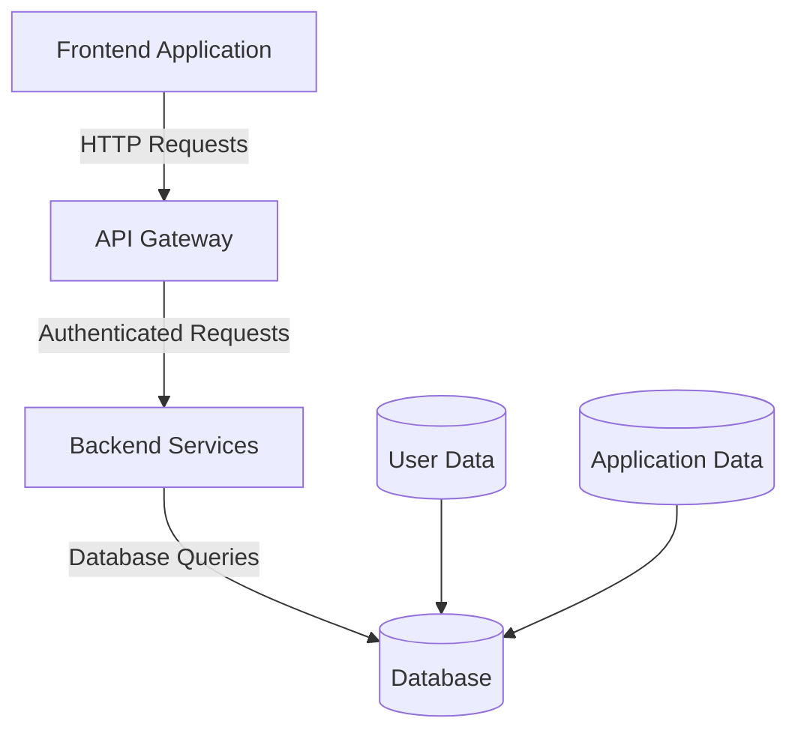

# AI支援設計とコード生成

## AIのアーキテクチャ決定における役割

AI支援アーキテクチャは3つの基本原則に基づく：

| 原則 | 実践例 |
|------|--------|
| **Augmented Intelligence（拡張知能）** | AIが3つのデプロイメントモデル（コスト・スケーラビリティ分析付き）を推奨し、アーキテクトが組織制約・チーム能力と照合して検証 |
| **Systematic Analysis（体系的分析）** | AIがTOGAFフレームワークのフェーズに従ってアーキテクチャ成果物を生成し、確立された方法論と品質属性の一貫性を維持 |
| **Transparent Reasoning（透明性のある推論）** | AI出力に構造化JSON形式の詳細なコスト内訳を含め、インフラ費用・運用オーバーヘッド・スケーリング予測をデータソースとともに提示 |

### AIが得意な領域 vs 人間が必須な領域

| 活動 | AIの得意領域 | 人間の責任 |
|------|------------|-----------|
| **技術選定** | 互換性マトリクス分析、パターンマッチング、初期候補生成 | 最終決定、組織文脈の統合、政治的配慮 |
| **パフォーマンス分析** | ボトルネック特定、メトリクス相関、ベンチマークデータ処理 | ビジネスインパクト評価、トレードオフ判断 |
| **リスク評価** | 技術リスク列挙、依存関係分析、過去事例からのパターン抽出 | 組織リスク評価、戦略的リスク許容度判断、ステークホルダー管理 |
| **ドキュメント生成** | ADR下書き、アーキテクチャ図生成、テンプレート適用 | レビュー・承認、組織標準との整合性確認 |

### AIの限界と運用境界

**AIの弱点**:
- 組織の政治、予算制約、チーム能力、文化的要因の理解
- 新規性の高い課題やトレーニングデータ外の問題への対応
- 複雑なステークホルダーダイナミクスの管理

**リスク管理フレームワーク**:
- **技術リスク**: AI推奨の不整合、システム制約の見落とし、トレーニングデータのバイアス
- **プロセスリスク**: AI推奨への過度な依存、人間の専門知識の劣化、検証プロトコルの不足
- **組織リスク**: AI影響決定の説明責任、意思決定プロセスの透明性、制度的知識管理

---

## 要件分析と仕様策定

### AI支援要件収集

自然言語処理によるステークホルダー入力分析で暗黙的要件を特定し、曖昧性を表面化。リアルタイムでフォローアップ質問を提案し、要件発見を促進。

**プロンプト例: CRM要件収集**

```markdown
# CRM要件収集セッション

## コンテキスト設定
ユーザーペルソナ: 営業担当、マーケティングマネージャー、カスタマーサービス担当
ビジネス目標: [目標リスト...]
技術制約: [制約リスト...]

## 期待するアウトプット
各ペルソナ向けに構造化インタビュー質問を生成:
1. ロール固有の機能要件
2. パフォーマンス・ユーザビリティ期待値
3. 統合・相互運用性ニーズ
4. セキュリティ・コンプライアンス考慮事項
```

**AI支援の主要利点**:
- 要件ドキュメント内の曖昧性・不整合・欠落の効果的特定
- 不十分な詳細を持つ要件の自動認識
- 複数ソース間の矛盾ステートメント体系的検出
- 追加ステークホルダー入力が必要な領域の積極的推奨
- 論理的一貫性・完全性の形式的検証
- 循環依存・要件間矛盾の早期特定

### UX設計とプロトタイピング

**ワイヤーフレーム生成による要件明確化**

ステークホルダーは「直感的」「ユーザーフレンドリー」などの曖昧な記述を使用しがち。AIはこれを視覚化することで暗黙の仮定を明示化。

**ツール例**:
- Figma with AI plugins
- Adobe XD with generative features
- 汎用コーディングアシスタント（構造化仕様生成経由）

**フロントエンドとバックエンドの整合性**:
- UIコンポーネント（顧客注文履歴画面）はAPIエンドポイント（`/customer/{id}/orders`）に対応
- ワイヤーフレームレイアウトはAPI返却データ構造を反映
- OpenAPI仕様と連携してFigmaレイアウト生成

**インタラクティブプロトタイプ生成**

HTMLCSSJavaScriptでの機能的Webアプリケーション構築により、本物のUX検証が可能。

**プロンプト例: プロトタイプ生成**

```markdown
## 要件説明
ECサイト商品フィルタリングインターフェースを作成:
- カテゴリフィルター（折りたたみセクション）
- 価格範囲スライダー（最小・最大入力）
- レーティングフィルター（星選択）
- フィルタリング中のローディング状態

## 求める成果物
各コンポーネントについて:
1. ユーザーインタラクション動作・状態変化
2. ビジュアルトランジション・アニメーション
3. スクリーンリーダー・キーボードナビゲーションのアクセシビリティ
```

### 技術仕様生成

高レベル要件から詳細技術仕様への体系的分解。機能要件を分析してシステムコンポーネント・データ構造・インターフェース仕様を特定。

**プロンプト例: 技術仕様生成**

```markdown
## コンテキスト・問題定義
リアルタイム在庫管理システムの技術仕様を生成:
- 500小売拠点で在庫レベル追跡
- 時間あたり50,000トランザクション処理、99.9%可用性維持
- 顧客へのリアルタイム在庫可視性提供
- 既存POS・ERPシステムとの統合

## 期待する成果物
1. システムアーキテクチャ概要
2. データモデル・ストレージ要件
3. 外部統合用API仕様
4. パフォーマンス・スケーラビリティ考慮事項
5. セキュリティ・コンプライアンス要件
```

**品質基準**: AI生成仕様は実装チーム向けの十分な詳細性と明確性・可読性を両立。テンプレートベースアプローチで一貫性・効率性を確保しつつ、プロジェクトタイプ・組織コンテキストに応じた動的適応を実現。

### ステークホルダーコミュニケーション

技術仕様を各組織レベル向けにアクセス可能なフォーマットに翻訳し、意思決定を促進。

**プロンプト例: ステークホルダー向けドキュメント生成**

```markdown
## ステークホルダーとロールのリスト
マイクロサービスアーキテクチャ決定に関するドキュメントを作成:
- 経営陣: ビジネスインパクト、コスト影響、タイムライン
- 開発チーム: 技術実装詳細、ツール要件、スキル開発ニーズ
- 運用チーム: デプロイメントプロセス、監視要件、保守考慮事項
- エンドユーザー: 機能・パフォーマンス期待値、サポートプロセス

## ドキュメント構造への期待
各ドキュメントに含む:
1. 対象者に適した言語と詳細レベル
2. 関連する意思決定根拠とトレードオフ
3. 論理的な実装マイルストーン
4. 成功メトリクス・評価基準
5. リスク評価・軽減戦略
```

---

## システムアーキテクチャ設計

### アーキテクチャパターン分析・選定

**パターン評価フレームワーク**

ビジネス要件を技術評価基準に変換。金融トレーディングシステムの例:

**プロンプト例: パターン評価**

```markdown
## ユースケースと要件定義
高スループット金融トレーディングシステムのアーキテクチャパターン分析:

要件:
- 100,000トランザクション/秒をサブミリ秒レイテンシで処理
- トレーディング時間中99.999%稼働、市場変動時10倍スパイク対応
- 完全な監査証跡・トランザクション順序保証
- プライマリ/セカンダリデータセンター配置サポート

## 評価対象パターン
1. Event-driven architecture with CQRS
2. Microservices with event sourcing
3. Reactive streams with backpressure

## 各パターンの出力構造
- 各要件に対する適合性スコア（1-10）
- 重大な実装課題
- パフォーマンスボトルネックと軽減戦略
- 運用複雑性評価
- 規制コンプライアンス影響
```

体系的スコアリング方法論でパターン間の客観的比較を実現しつつ、実装考慮事項の詳細分析が最終決定を通知。

**トレードオフ分析とADR**

全アーキテクチャパターンは品質属性間のトレードオフを体現。マイクロサービスは独立デプロイメント能力を改善するが運用複雑性を増加。イベント駆動パターンは応答性を向上させるがデバッグを複雑化。

Architecture Decision Records (ADR)がパターン選択の根拠を捕捉し、将来の決定のための貴重なドキュメントを作成。

**ADRテンプレート例**:

```markdown
## ADR-001: [決定タイトル]

**日付**: YYYY-MM-DD
**ステータス**: [Proposed | Accepted | Rejected | Superseded]
**参加者**: [ステークホルダーリスト]

### コンテキスト
意思決定を必要とするアーキテクチャ問題または機会を記述。関連する制約・仮定・意思決定に影響する要件を含む。

### 検討した代替案
1. **オプションA**: 簡潔な説明
   - 利点: 主要な利点
   - 欠点: 主な不利点
   - 影響: 実装・運用への影響

### 決定
選択した代替案と主要な理由を記述。最も影響力のあった決定基準を含む。

### 結果
- **肯定的**: 期待される利益・改善
- **否定的**: 受け入れられるリスク・制限
- **中立的**: その他の影響と必要なフォローアップ決定

### 実装ノート
主要な実装考慮事項、タイムライン、依存関係。
```

### システム分解とコンポーネント設計

**ドメイン駆動分解戦略**

ビジネスプロセス・情報フローを分析して自然なシステム境界（bounded context）を特定。

**プロンプト例: システム分解**

```markdown
## システムとビジネス機能の定義
ECプラットフォームをビジネス機能に基づいて論理コンポーネントに分解:

ビジネス機能: Customer management, Product catalog, Order processing, Payments

## 期待する成果
各機能について:
1. コンポーネントの主要責任
2. 他コンポーネントとの相互作用
3. 統合が必要な外部システム
```

**コンポーネントインターフェース設計**

明確なインターフェースはコンポーネント間の契約として機能し、独立した開発・デプロイメントを可能に。

**統合パターンとコミュニケーション**

**プロンプト例: 統合パターン比較**

```markdown
## システムコンテキスト
4つの相互依存サービスを持つ注文処理システムの統合パターン評価（高可用性・データ一貫性・10Kメッセージ/秒スループット要件）

## 要件定義
以下のパターンを比較:
1. Synchronous REST calls
2. Asynchronous messaging
3. Event-driven architecture
4. Shared database

各パターンについて分析: 適合性、トレードオフ、障害処理、スケーラビリティ
```

**AI支援スケーラビリティ・パフォーマンス計画**

パフォーマンス要件を包括的スケーラビリティアーキテクチャに変換。具体的なパフォーマンスターゲット、ユーザー成長予測、コスト制約を提供すると、水平スケーリングパターン、キャッシング階層、データベースパーティショニング戦略、オートスケーリング構成の詳細推奨を生成。

### アーキテクチャ可視化とドキュメント

**テキストベース図（迅速デモ用）**

文字ベース図はツール不要で即座の視覚表現を提供。コードコメント・ドキュメントファイル・CLIに直接埋め込み可能。

**プロンプト例**:

```markdown
基本的なWebアプリケーションアーキテクチャのテキストベース図を作成（Frontend、API Gateway、Backend Services、Database含む）。コンポーネント間のデータフローと接続を表示。
```

**Mermaidによるプロフェッショナル可視化**

Mermaid構文はテキストベースでプロフェッショナルな視覚化にレンダリング可能。バージョン管理・協働編集を促進。

**プロンプト例**:

```markdown
基本的なWebアプリケーションアーキテクチャのMermaid図を作成（Frontend、API Gateway、Backend Services、Database含む）。コンポーネント関係とデータフロー方向を含める。
```

**AI生成Mermaid例**:



**レンダリング方法**:
- **GitHub統合**: モダンプラットフォームがMarkdown内のMermaid図を自動レンダリング
- **手動変換**: mermaid.live でテキスト入力から即座にレンダリング
- **スクリプト生成**: ビルドスクリプトにMermaidレンダリングを統合してドキュメント最新性を確保

**高度な可視化（複雑なアーキテクチャ向け）**

Excalidraw（JavaScript API）やDrawIO（XML形式）がプログラマティック図生成を可能に。複数デプロイメント環境、詳細なコンポーネント相互作用、ステークホルダー固有注釈を含むエンタープライズアーキテクチャをサポート。

ただし、複雑性レベルでの信頼性の高いAI支援図生成には課題がある。プログラマティック生成は理論的に一貫したスタイリング・仕様変更時の自動更新を可能にするが、実稼働品質の結果を得るには実質的な手動精緻化・検証が必要。

**選択基準**:
- **ASCII**: 即座のコミュニケーションニーズ
- **Mermaid**: プロフェッショナルプレゼンテーション
- **Excalidraw/DrawIO**: カスタムスタイリング・詳細注釈を持つ複雑エンタープライズドキュメント

---

## データアーキテクチャとインターフェース設計

### データモデリングとスキーマ設計

ビジネス要件からエンティティ・関係を特定し、データベース技術オプションを制約と照合評価してスキーマ設計を推奨。

**プロンプト例: データアーキテクチャ設計**

```markdown
## システムコンテキスト、制約、要件
アナリティクスプラットフォームのデータアーキテクチャ設計:

- データ量: 100TB顧客インタラクションデータ、1日1,000万イベント
- アナリティクス要件: リアルタイムダッシュボード、履歴レポート、予測アナリティクス
```

AI支援により要件分析・技術選定が迅速化され、初期データモデル開発時間を削減しつつ機能・非機能要件の包括的カバレッジを確保。

**コンテキストエンジニアリングの度合い**が生成仕様と要件の整合性に直接影響。重要な人間インプットが必要だが、AI支援が強固な初期基盤と全体スループット加速を提供。

**影響分析**: 要件変更時、AIシステムが既存技術仕様への影響を迅速評価し、影響を受けるコンポーネント・インターフェース・依存関係を特定。開発ライフサイクル全体で仕様一貫性を維持する効率的変更管理プロセスを可能に。

---

## Production-Ready生成原則

AI支援コード生成の基盤となる4つのコア原則:

| 原則 | 説明 |
|------|------|
| **Architectural Alignment** | 生成コードは既存システム境界を尊重し、確立されたパターンに従い、プロジェクト規約との一貫性を維持。包括的アーキテクチャコンテキスト・具体的制約を提供してAI実装決定を導く |
| **Integration-Centric** | 孤立した機能性より既存システムとの互換性を優先。生成コンポーネントは確立されたデータフロー・エラー処理メカニズム・インターフェース契約とシームレスに連携。アーキテクチャドリフト防止・統合オーバーヘッド削減 |
| **Quality Gates** | 生成コードを機能要件・パフォーマンス基準・セキュリティ考慮事項と照合検証するチェックポイント設定。問題ある実装のシステム伝播防止・本番基準適合を確保 |
| **Iterative Refinement** | 初期生成が最適解を生み出すことは稀だと認識。ターゲットフィードバック・パフォーマンス最適化・アーキテクチャ整合による体系的改善を重視し、初回試行出力をそのまま受け入れない |

**AI生成コードのメンテナンスリスク**: 生成プロジェクトテンプレートに含まれる広範なボイラープレート・サンプル実装・ユーティリティライブラリが実際のプロジェクト要件と整合しない場合がある。この初期コード肥大化がプロジェクト開始時から技術的負債を導入。

**クリーンアップチェックリスト**:
- 未使用import削除
- デッドコードパス除去
- 重複ユーティリティ関数統合
- 本番要件に役立たないサンプル実装除去

---

## コード生成ワークフロー4パターン

### パターン1: Feature Implementation Workflow（5ステップ）

既存アプリケーション内で完全な機能を構築する体系的アプローチ。複雑な要件を管理可能なコンポーネントに分解しつつアーキテクチャ一貫性・統合互換性を維持。

**ステップ1: 要件分析と分解**

包括的機能要件・既存システムコンテキストをAIに提供。AIが複雑な機能記述を分析してコア機能パターン、ユーザーインタラクション要件、データフローニーズ、統合タッチポイントを特定。

**成果**: 実装可能なコンポーネントへの明確な要件分解、識別された依存関係・統合ポイント。技術コンポーネント・相互作用・完全機能提供に必要な実装活動シーケンスを明らかにする。

**ステップ2: アーキテクチャ計画とコンテキスト準備**

ステップ1の分解された要件に基づき、知的AI協働を通じてクラス構造・APIアーキテクチャ・フレームワーク選定などの高レベル設計考慮事項に対処。プロジェクト・チーム制約を追加入力として現実的実装戦略を確保。

後続ステージを通知する要約されたコンテキストドキュメンテーションを生成。フレームワーク決定・プロジェクト制限・スタイリスティック選好・アーキテクチャ制約を含む構造化されたコンテキスト作成を促進。

**成果**: 明確なアーキテクチャ決定と包括的コンテキストドキュメンテーションを持つ詳細実装計画。コンポーネント境界・統合アプローチ・効率的開発を導く実装優先度を指定。

**ステップ3: コンポーネントコード生成**

アーキテクチャ計画段階で特定されたコンポーネントを、前ステップの構造化されたコンテキストを使用して開発。集中的AI協働セッションを通じて各コンポーネントを個別に構築する推奨アプローチ。

各実装は既存システムコンポーネントとシームレスに統合する実装を生成することに焦点。生成プロセスは確立されたコーディング規約・アーキテクチャパターン・統合要件を考慮して互換性を確保。

**成果**: 既存アーキテクチャとシームレスに統合し、確立されたコーディングパターン・規約に従うコンポーネント。機能的正確性・アーキテクチャ整合・統合準備を実証し、重要な修正不要。

**ステップ4: 統合テストと検証**

各コンポーネント開発後、より広範なシステムへのコンポーネント統合と包括的検証に焦点。AIアシスタントがコンポーネントのコードベース統合を効率化し、フルコード実行不要で特定アプリケーションセグメント検証するターゲットテストスクリプトを生成。

検証戦略: コンポーネント個別のユニット検証、コンポーネント相互作用の統合検証、完全機能のエンドツーエンド検証。

**成果**: 個別機能とシステム全体互換性の両方を検証するテストに合格して統合成功したコンポーネント。機能的正確性・パフォーマンス適切性・影響を受けるすべてのシステム領域での統合安定性を実証。

**ステップ5: ドキュメント化と知識保存**

すべてのプロジェクトドキュメンテーションを最新・包括的に維持。エンジニアリングチーム向け技術ドキュメンテーションと将来のコンポーネント開発でのAIアシスタント使用向けコンテキストドキュメントを含む。

技術ドキュメンテーション: アーキテクチャ決定・実装詳細・運用手順を捕捉
コンテキストドキュメンテーション: 将来のAI協働セッション向けパターン・規約・学習レッスンを保存

**成果**: 人間開発者・将来のAI協働セッション両方が実装機能を理解・構築できる完全・最新ドキュメンテーション。メンテナンス活動・機能拡張・アーキテクチャ理解に十分な詳細を提供。

この5ステッププロセスは反復的開発を可能にし、各サイクルが前回の作業に基づいて構築。ステップ間コンテキスト維持・事前知識活用が進捗加速・結果改善。コンテキスト蓄積に伴いAI協働がより効果的になり、準備時間削減・一貫性向上。

---

### パターン2: Scaffolding Solution Workflow

AI支援による完全プロジェクト基盤生成でプロジェクト初期化を加速。個別機能を一つずつ構築するのではなく、即座開発開始に必要な全必須コンポーネントを持つ完全プロジェクトスケルトンを作成。

**完全プロジェクト構造作成**

AIがアプリケーションタイプ・技術スタック・チーム選好を分析して、包括的ディレクトリ構造・構成ファイル・基盤コードを生成し即座の開発活動をサポート。

**Express + Tailwind例**:

```
web-app/
├── src/
│   ├── routes/              # API endpoints
│   ├── middleware/          # Express middleware
│   ├── controllers/         # Request handlers
│   ├── services/            # Business logic
│   └── utils/               # Helper functions
├── public/
│   ├── css/                 # Generated CSS
│   ├── js/                  # Client-side scripts
│   └── images/              # Static assets
├── views/                   # Template files
├── tests/
├── config/
│   ├── database.js
│   ├── server.js
│   └── auth.js
├── package.json
├── tailwind.config.js
├── .env.example
├── .gitignore
├── Dockerfile
├── docker-compose.yml
└── README.md
```

プロジェクトコンテキスト（リンティングルール・共通スクリプト・コンポーネントスタイリングガイドライン）が明確に定義されている場合、AIツールはこれらの仕様に準拠し業界ベストプラクティスに従うhello-worldアプリケーションを生成可能。

**本質的サービス実装**

認証システム・データベース接続・ロギングフレームワーク・エラー処理メカニズム・テストユーティリティなど、ほとんどのアプリケーションで必要な本質的サービスをAIが生成。適切なエラー処理・ロギング統合・セキュリティベストプラクティスを含む本番準備コンポーネントを作成。

セキュリティ意識の高い実装はAPIキー・データベース資格情報・暗号化シークレットなどの機密構成データをソースコードにハードコードせず環境変数・セキュアな構成ファイルから読み取ることを確保。

**成果**: 本番準備コアサービスで本質的能力を提供しつつ、セキュリティベストプラクティス・プロジェクト構造生成時に確立された統合パターンに従う。

**組織テンプレート複製**

既存の成功プロジェクトをAIが分析して確立されたチームプラクティス・企業標準を反映するプロジェクト基盤を作成。実証済みのアーキテクチャ決定・コーディング規約・運用手順を新プロジェクトが継承することを確保。

会社が特定パターンで複数マイクロサービスを成功提供した場合、AIアシスタントがこれらの実装を分析して新プロジェクトが自動的に継承するテンプレートを作成。

**成果**: 組織標準に即座適合し、前回成功実装から学習レッスンを組み込む新プロジェクト。ビジネスロジックに集中でき、基盤決定ではなく本質作業に注力可能。

---

### パターン3: Legacy Integration Workflow

既存システムを運用安定性を維持しながらAI生成実装で強化する体系的アプローチ。AI支援互換性・段階的強化戦略を重視し、実証済みアーキテクチャ基盤に基づいて新機能を導入。

**互換性ベース強化プロセス**

**ステップ1: システムパターン分析**

AI能力を活用して既存コードベース実装を包括的検証。確立されたパターンを評価してアーキテクチャ決定・命名規約・エラー処理方法・現システムを定義する統合戦略の洞察を獲得。

AIコーディングツールに既存システムの理解を文書化させ、さらなる明確化が必要な領域を強調表示する要請を推奨。エンジニアが修正前にこのドキュメンテーションをレビュー・検証し、AIツールとの効果的協働促進・プロセス効率向上。

**成果**: 文書化された規約・統合要件を持つ既存システムパターンの包括的理解。強化活動中に保存必須の具体的アーキテクチャ制約・命名パターン・実装アプローチを明らかに。

後方互換性検証は確立されたクライアント期待値に対してAPIレスポンス構造を検証する契約テストが必要。これらのテストは既存クライアント統合を混乱させる可能性のある変更されたレスポンスフィールド・削除されたエンドポイント・変更されたデータ型などの破壊的変更を検出し、デプロイメント前に互換性問題特定を可能に。

**ステップ2: 段階的能力追加**

確立されたインターフェース・運用手順を保存しながら現システム能力に基づいて構築するターゲットAI支援強化を通じて新機能を導入。安全なレガシーシステムリファクタリングは、実証済みコードパスを即座削除せず古い実装から新能力への段階的移行を可能にするフィーチャートグルに依存。

AIアシスタントはレガシーと強化機能間のランタイム切替を可能にするフィーチャートグル実装を生成し、古いロジックを完全引退する前に本番環境での制御されたテストとロールバックメカニズムを提供。

**成果**: 既存インターフェース・運用手順との完全互換性を維持しながら新能力を提供する強化コンポーネント。機能的正確性・アーキテクチャ整合・既存システム動作を混乱させない運用安定性を実証。

**安全な統合技術**

検証・リスク評価がAI能力を使用して潜在的統合リスク分析・強化動作を様々運用条件下で検証する包括的検証戦略を開発。AIツールが既存システム依存関係を検証して潜在的影響領域予測・強化動作検証するターゲットテストシナリオ開発。

**成果**: 強化動作検証・システム安定性に信頼を提供する包括的検証フレームワーク。徹底したテストカバレッジ・リスク軽減戦略・統合活動中に本番環境保護するロールバック手順を実証。

---

### パターン4: Specification-First Workflow

技術仕様から実装への体系的変換。ビジネス要件を各システムレイヤーを導く詳細仕様に変換（データベーススキーマ・APIコントラクト・ビジネスロジック）。

**技術仕様の再確認**

**主要コンポーネント**:
- **データベーススキーマ仕様**: テーブル・関係・制約・インデックス・マイグレーションガイドラインを定義
- **APIコントラクト**: エンドポイントパラメータ（リクエスト・レスポンスフォーマット・認証メカニズム・ステータスコード・バージョン管理・互換性規定）を確立
- **ビジネスロジック仕様**: 要件をアルゴリズム・ワークフロー・エラー処理プロトコルに翻訳

**仕様から実装への変換**

**レイヤー実装順序**:
1. **データベースレイヤー**: AIアシスタントが仕様から直接スキーマ・制約・データアクセス方法を生成。厳密テストがスキーマ精度・データ整合性・システムパフォーマンス検証
2. **ビジネスロジック**: 仕様ルールに厳密準拠するサービススイートとして設計。AI促進でサービスクラス・検証ルーチン生成。包括的テストがユニットレベル関数・統合ワークフロー動作評価
3. **APIレイヤー**: 契約要件に従ってエンドポイント・ハンドラー・ミドルウェア実装。AIツールが認証・検証・エラー処理メカニズムが定義標準と正確に整合することを確保。エンドツーエンド・パフォーマンステストが完全システムコンプライアンス・準備性検証

**検証フレームワークと生きたドキュメンテーション**

AI生成テストスイートが各レイヤーを仕様契約に対して包括的カバレッジで検証。データベース検証がスキーマ整合性・パフォーマンス特性確認、ビジネスロジックテストがルール実装・ワークフロー正確性検証、APIテストが適切なリクエスト・レスポンス動作・エラー処理確保。

仕様精緻化は実装洞察を組み込みつつドキュメント整合性・一貫性保存。AIアシスタントが開発進捗監視・完了ステータス更新・実装中に浮上する仕様ギャップ特定。精緻化プロセスが実装現実に仕様適応しつつクロスセクション一貫性維持・進化する要件サポート。

継続的統合パイプラインが仕様アーティファクト再生成・コミットされたバージョンとチェックサム比較でドキュメンテーション精度強制。ドキュメンテーションが実装からドリフトした際ビルド失敗させ、開発ライフサイクル全体で仕様が実際システム動作と同期保持されることを確保。

**進捗追跡**: 仕様がマイルストーンマッピング・依存関係管理を通じて開発チームに実装ステータスの明確な可視性を提供。完了基準・コンポーネント関係定義で協調開発努力・情報あるタイムライン管理可能にしつつ将来プロジェクト向け制度的知識作成。

---

これら4つのワークフローパターンがAI支援開発の明確フレームワーク提供。機能実装がアプリケーション強化合理化、スキャフォールディングがプロジェクトセットアップ加速、レガシー統合が既存システム安全アップグレード、仕様先行が契約駆動一貫性促進。一緒にソフトウェア開発全体で品質・アーキテクチャ保存しながら効果的AI協働サポート。
