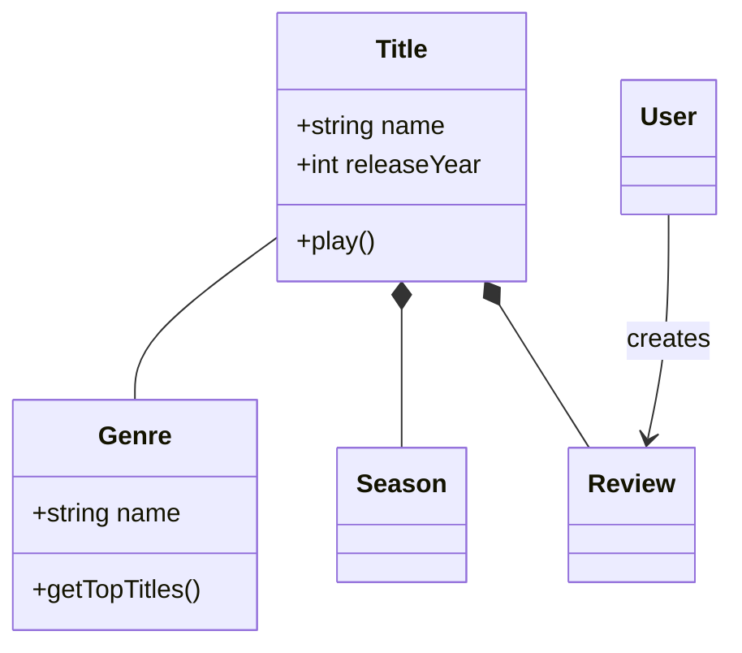
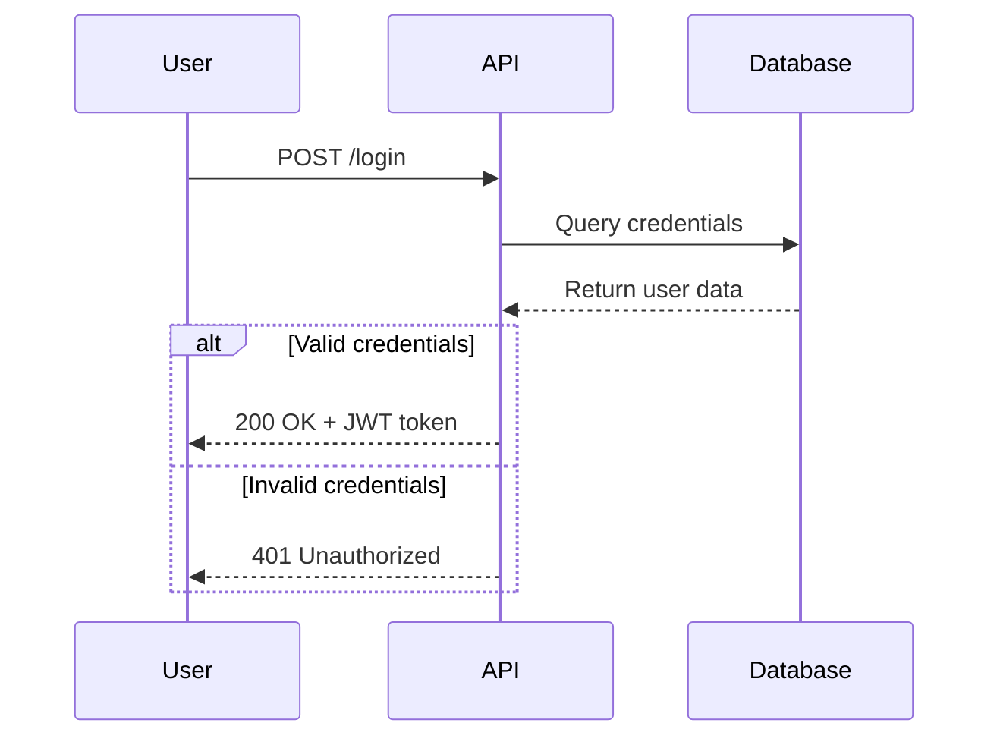
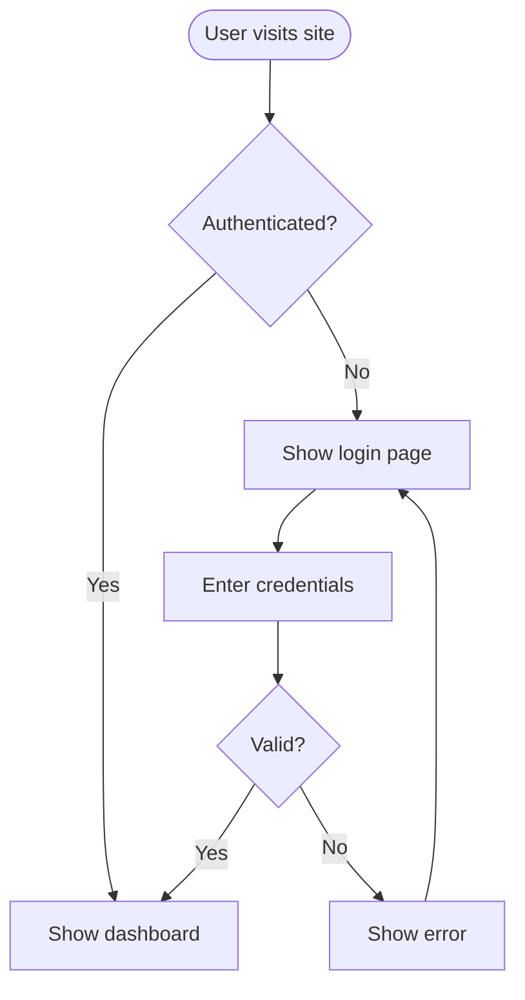
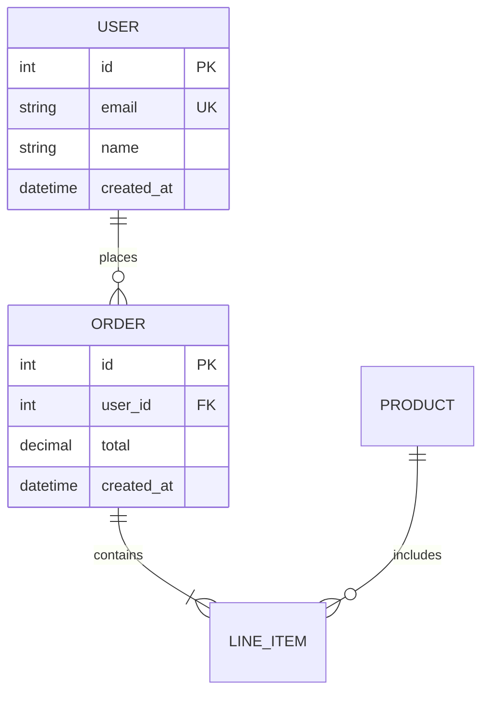
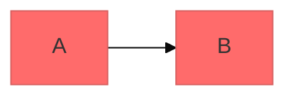

# Mermaid Diagramming

Create professional software diagrams using Mermaid's text-based syntax. Mermaid renders diagrams from simple text definitions, making diagrams version-controllable, easy to update, and maintainable alongside code.

## Core Syntax Structure

All Mermaid diagrams follow this pattern:

```mermaid
diagramType
  definition content
```

**Key principles:**
- First line declares diagram type (e.g., `classDiagram`, `sequenceDiagram`, `flowchart`)
- Use `%%` for comments
- Line breaks and indentation improve readability but aren't required
- Unknown words break diagrams; parameters fail silently

## Diagram Type Selection Guide

**22+ diagram types organized by category:**

### 構造・設計 (Structure & Design)

1. **Class Diagrams** - Domain modeling, OOP design, entity relationships
   - Domain-driven design documentation, object structures, dependencies
2. **ERD (Entity Relationship Diagrams)** - Database schemas
   - Table relationships, keys, data modeling
3. **C4 Diagrams** - Software architecture at multiple levels
   - System context, container, component, code-level views
4. **Architecture Diagrams** - Cloud services, infrastructure
   - AWS/Azure/GCP deployments, CI/CD, service topology
5. **Block Diagrams** - Component composition, nested structures
   - System modules, hierarchical views, composition relationships

### フロー・プロセス (Flow & Process)

6. **Flowcharts** - Processes, algorithms, decision trees
   - User journeys, business processes, algorithm logic, pipelines
7. **Sequence Diagrams** - Temporal interactions, message flows
   - API request/response, authentication flows, method calls
8. **State Diagrams** - State machines, lifecycle states
   - Application states, workflow transitions, FSM modeling
9. **User Journey** - Customer experience flows
   - Task sequences, satisfaction mapping, touchpoint analysis

### プロジェクト管理 (Project Management)

10. **Gantt Charts** - Project timelines, scheduling
    - Task dependencies, milestones, resource allocation
11. **Timeline** - Chronological events
    - Product roadmaps, historical events, version history
12. **Kanban** - Work-in-progress visualization
    - Task boards, sprint planning, workflow stages

### データ可視化 (Data Visualization)

13. **Pie Charts** - Proportional data
    - Market share, resource distribution, category breakdown
14. **XY Charts** - Numerical relationships
    - Time series, correlations, performance metrics
15. **Quadrant Charts** - Four-quadrant analysis
    - Priority matrices, risk assessment, strategic positioning
16. **Radar Charts** - Multi-dimensional comparison
    - Feature comparison, skill assessments, maturity models
17. **Sankey Diagrams** - Flow quantities
    - Energy flows, budget allocation, traffic analysis
18. **Treemap** - Hierarchical data as nested rectangles
    - Disk usage, portfolio allocation, taxonomies

### バージョン管理 (Version Control)

19. **Git Graphs** - Branch strategies
    - Gitflow, trunk-based development, merge history

### 思考整理 (Mind Organization)

20. **Mindmaps** - Brainstorming, concept mapping
    - Idea organization, knowledge structures, planning

### 専門用途 (Specialized)

21. **ZenUML** - UML sequence diagrams (alternative syntax)
    - Use for complex UML scenarios requiring advanced features
22. **Packet Diagrams** - Network protocol visualization
    - Protocol headers, data structure layouts, bit-level formats

## Quick Start Examples

### Class Diagram (Domain Model)


### Sequence Diagram (API Flow)


### Flowchart (User Journey)


### ERD (Database Schema)


## Detailed References

For in-depth guidance on specific diagram types, see:

### 構造・設計
- **[references/class-diagrams.md](references/class-diagrams.md)** - Domain modeling, relationships, multiplicity, methods/properties
- **[references/erd-diagrams.md](references/erd-diagrams.md)** - Entities, cardinality, keys, attributes
- **[references/c4-diagrams.md](references/c4-diagrams.md)** - System context, container, component, boundaries
- **[references/architecture-diagrams.md](references/architecture-diagrams.md)** - Cloud services, infrastructure, CI/CD
- **[references/block-diagrams.md](references/block-diagrams.md)** - Component composition, nested structures

### フロー・プロセス
- **[references/flowcharts.md](references/flowcharts.md)** - Node shapes, decision logic, subgraphs
- **[references/sequence-diagrams.md](references/sequence-diagrams.md)** - Messages, activations, loops, alt/opt/par blocks
- **[references/state-diagrams.md](references/state-diagrams.md)** - State transitions, FSM, lifecycle modeling
- **[references/user-journey-diagrams.md](references/user-journey-diagrams.md)** - Customer experience, satisfaction mapping

### プロジェクト管理
- **[references/gantt-charts.md](references/gantt-charts.md)** - Timelines, dependencies, milestones
- **[references/timeline-diagrams.md](references/timeline-diagrams.md)** - Chronological events, roadmaps
- **[references/kanban-diagrams.md](references/kanban-diagrams.md)** - Task boards, workflow stages

### データ可視化
- **[references/pie-charts.md](references/pie-charts.md)** - Proportional data, category breakdown
- **[references/xy-charts.md](references/xy-charts.md)** - Time series, correlations, metrics
- **[references/quadrant-charts.md](references/quadrant-charts.md)** - Four-quadrant analysis, matrices
- **[references/radar-charts.md](references/radar-charts.md)** - Multi-dimensional comparison, feature comparison
- **[references/sankey-diagrams.md](references/sankey-diagrams.md)** - Flow quantities, resource allocation
- **[references/treemap-diagrams.md](references/treemap-diagrams.md)** - Hierarchical data, nested rectangles

### バージョン管理
- **[references/git-graphs.md](references/git-graphs.md)** - Branch strategies, merge history

### 思考整理
- **[references/mindmaps.md](references/mindmaps.md)** - Brainstorming, concept mapping

### 専門用途
- **[references/zenuml-diagrams.md](references/zenuml-diagrams.md)** - Advanced UML sequence syntax
- **[references/packet-diagrams.md](references/packet-diagrams.md)** - Network protocol, bit-level formats

### 高度な機能
- **[references/advanced-features.md](references/advanced-features.md)** - Themes, styling, configuration, layout options

## Best Practices

1. **Start Simple** - Begin with core entities/components, add details incrementally
2. **Use Meaningful Names** - Clear labels make diagrams self-documenting
3. **Comment Extensively** - Use `%%` comments to explain complex relationships
4. **Keep Focused** - One diagram per concept; split large diagrams into multiple focused views
5. **Version Control** - Store `.mmd` files alongside code for easy updates
6. **Add Context** - Include titles and notes to explain diagram purpose
7. **Iterate** - Refine diagrams as understanding evolves

## Configuration and Theming

Configure diagrams using frontmatter:



**Available themes:** default, forest, dark, neutral, base

**Layout options:**
- `layout: dagre` (default) - Classic balanced layout
- `layout: elk` - Advanced layout for complex diagrams (requires integration)

**Look options:**
- `look: classic` - Traditional Mermaid style
- `look: handDrawn` - Sketch-like appearance

## Exporting and Rendering

**Native support in:**
- GitHub/GitLab - Automatically renders in Markdown
- VS Code - With Markdown Mermaid extension
- Notion, Obsidian, Confluence - Built-in support

**Export options:**
- [Mermaid Live Editor](https://mermaid.live) - Online editor with PNG/SVG export
- Mermaid CLI - `npm install -g @mermaid-js/mermaid-cli` then `mmdc -i input.mmd -o output.png`
- Docker - `docker run --rm -v $(pwd):/data minlag/mermaid-cli -i /data/input.mmd -o /data/output.png`

## Common Pitfalls

- **Breaking characters** - Avoid `{}` in comments, use proper escape sequences for special characters
- **Syntax errors** - Misspellings break diagrams; validate syntax in Mermaid Live
- **Overcomplexity** - Split complex diagrams into multiple focused views
- **Missing relationships** - Document all important connections between entities

## When to Create Diagrams

**Always diagram when:**
- Starting new projects or features
- Documenting complex systems
- Explaining architecture decisions
- Designing database schemas
- Planning refactoring efforts
- Onboarding new team members

**Use diagrams to:**
- Align stakeholders on technical decisions
- Document domain models collaboratively
- Visualize data flows and system interactions
- Plan before coding
- Create living documentation that evolves with code
