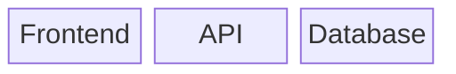
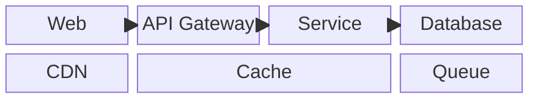
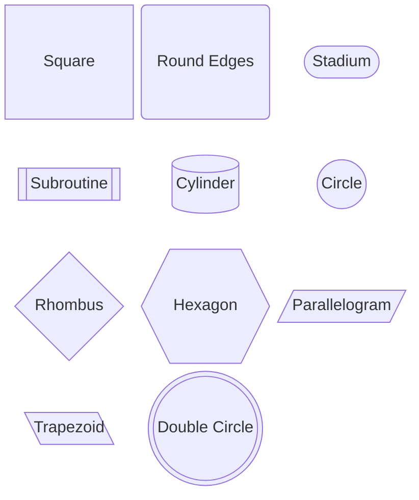
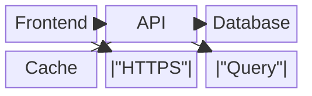
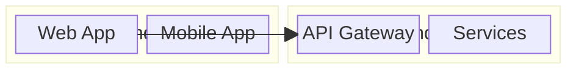
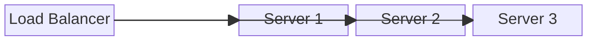
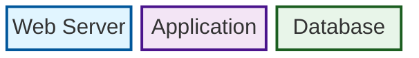
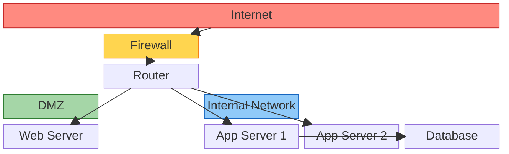
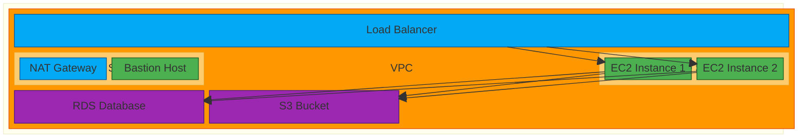

# Block Diagrams

Block diagrams allow precise control over layout and positioning of components. They are ideal for representing system architectures, network topologies, and infrastructure designs where spatial relationships matter.

## Basic Syntax



## Columns and Layout

Control the grid layout using `columns` directive:



**Spanning multiple columns:**
- `id["Label"]:N` - Block spans N columns

## Block Shapes



**Shape syntax:**
- `["Label"]` - Square (default)
- `("Label")` - Round edges
- `(["Label"])` - Stadium
- `[["Label"]]` - Subroutine
- `[("Label")]` - Cylinder
- `(("Label"))` - Circle
- `{"Label"}` - Rhombus
- `{{"Label"}}` - Hexagon
- `[/"Label"/]` - Parallelogram
- `[\"Label"\]` - Trapezoid
- `((("Label")))` - Double circle

## Connections



**Connection types:**
- `-->` - Arrow
- `---` - Line (no arrow)
- `-->|"label"|` - Arrow with label

## Nested Blocks

Create hierarchical structures using indentation:



## Spaces

Use `space` to create empty cells for layout control:



**Space width:**
- `space` - 1 column
- `space:N` - N columns

## Styling

Apply custom styles to blocks:



**Style properties:**
- `fill` - Background color
- `stroke` - Border color
- `stroke-width` - Border width

## Class-Based Styling

Define reusable styles:

```mermaid
block-beta
    columns 3

    classDef frontend fill:#e1f5ff,stroke:#01579b
    classDef backend fill:#f3e5f5,stroke:#4a148c
    classDef database fill:#e8f5e9,stroke:#1b5e20

    a["React App"]:::frontend
    b["Node.js API"]:::backend
    c["PostgreSQL"]:::database

    a --> b
    b --> c
```

## Comprehensive Example: Microservices Architecture

```mermaid
block-beta
    columns 5

    %% Client layer
    block:clients["Client Layer"]
        columns 2
        web["Web App"]
        mobile["Mobile App"]
    end

    space

    %% Gateway
    gateway["API Gateway"]:2

    space

    %% Service layer
    block:services["Service Layer"]
        columns 3
        auth["Auth Service"]
        user["User Service"]
        order["Order Service"]
    end

    %% Infrastructure
    cache["Redis Cache"]:2
    db1["User DB"]
    db2["Order DB"]

    queue["Message Queue"]
    monitor["Monitoring"]

    %% Connections
    web --> gateway
    mobile --> gateway

    gateway --> auth
    gateway --> user
    gateway --> order

    auth --> cache
    user --> cache
    user --> db1
    order --> db2
    order --> queue

    classDef clientStyle fill:#e1f5ff,stroke:#01579b
    classDef serviceStyle fill:#f3e5f5,stroke:#4a148c
    classDef dataStyle fill:#e8f5e9,stroke:#1b5e20
    classDef infraStyle fill:#fff3e0,stroke:#e65100

    class web,mobile clientStyle
    class auth,user,order serviceStyle
    class db1,db2 dataStyle
    class cache,queue,monitor infraStyle
```



## Network Topology Example



## Cloud Infrastructure Example



## Tips for Effective Block Diagrams

1. **Use columns strategically** - Plan your grid layout before adding blocks
2. **Leverage spaces** - Create visual separation between logical groups
3. **Nest for hierarchy** - Use nested blocks to show system layers or boundaries
4. **Choose appropriate shapes** - Cylinder for databases, rhombus for decision points
5. **Style by category** - Use classDef to distinguish component types
6. **Label connections** - Add context with edge labels for important flows
7. **Think spatially** - Block diagrams give you full control - use it to convey structure

## Common Use Cases

### System Architecture
- Show component relationships
- Illustrate data flow
- Document deployment topology

### Network Design
- Map network segments
- Show firewall rules
- Document routing

### Infrastructure as Code
- Visualize Terraform/CloudFormation resources
- Show resource dependencies
- Document security groups and subnets
