# Gantt Charts

Gantt charts visualize project schedules, showing tasks, durations, dependencies, and milestones. Essential for project planning and tracking.

## Basic Syntax

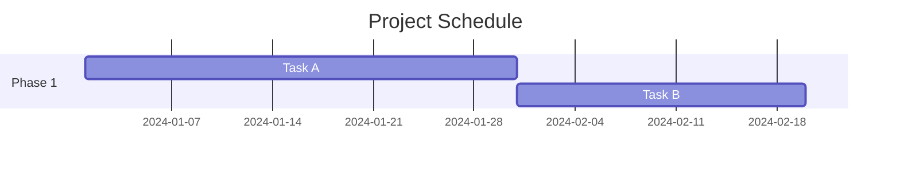

## Task Definition

### Basic Task Syntax

```
taskName : [tags], [startDate], [endDate or duration]
```

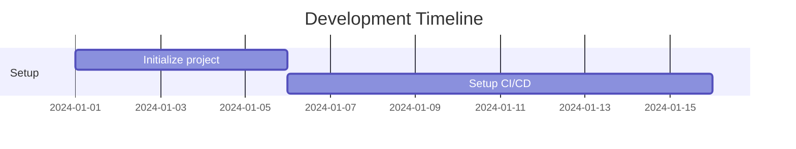

### Task with ID

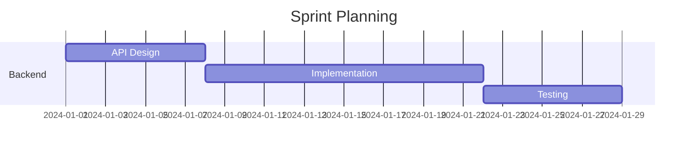

## Task States and Tags

### Active Tasks

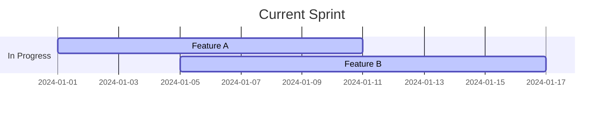

### Completed Tasks

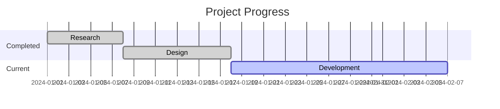

### Critical Path

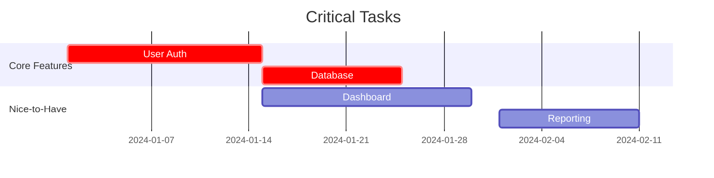

### Milestones

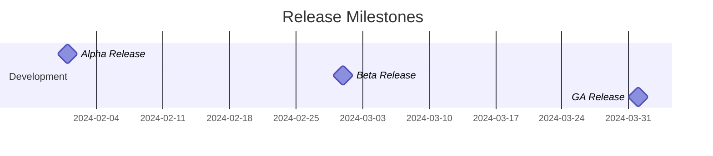

## Dependencies

### Sequential Tasks

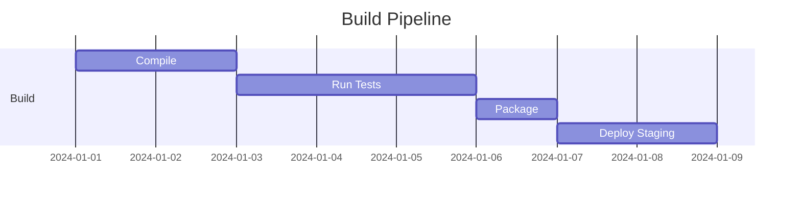

### Multiple Dependencies

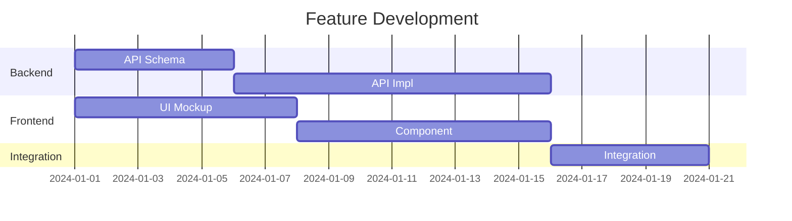

### Until Keyword

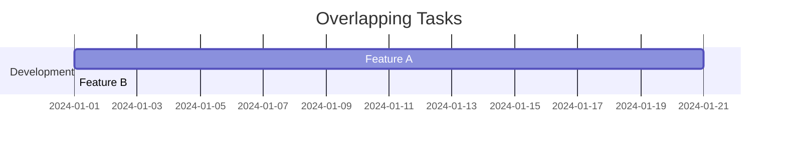

## Sections

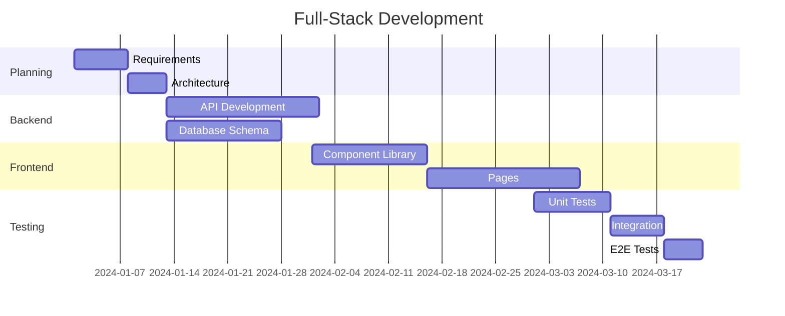

## Date Formats

### Custom Date Format

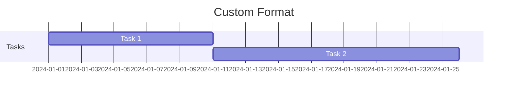

### Axis Format

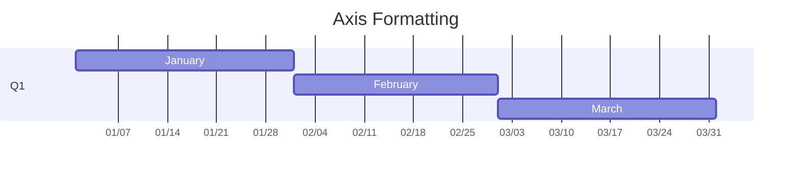

### Tick Intervals

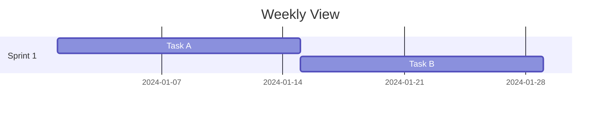

## Excluding Days

### Weekends

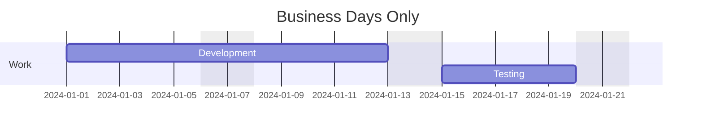

### Specific Dates

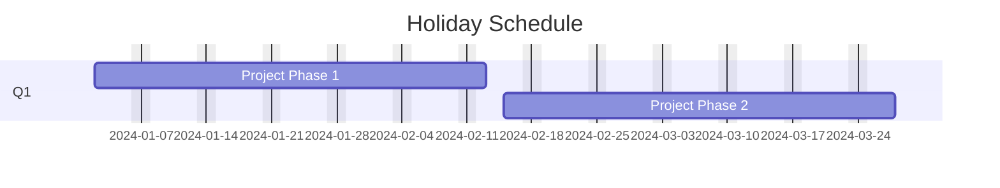

## Today Marker

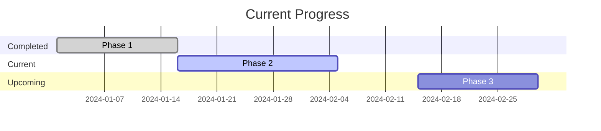

### Hiding Today Marker


## Display Modes

### Compact Mode

```mermaid
gantt
    title Compact View
    dateFormat YYYY-MM-DD
    displayMode compact

    section Backend
    Task 1 :2024-01-01, 10d
    Task 2 :2024-01-11, 10d
    Task 3 :2024-01-21, 10d

    section Frontend
    Task 4 :2024-01-01, 15d
    Task 5 :2024-01-16, 15d
```

## Interactive Features

### Click Events

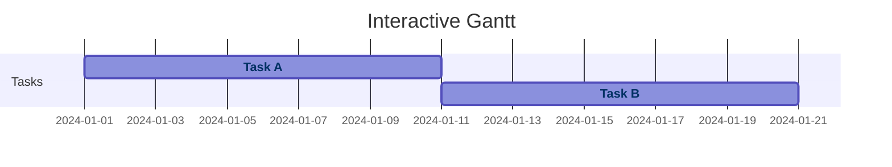

## Use Cases

### Sprint Planning

```mermaid
gantt
    title Sprint 42 - Two Week Sprint
    dateFormat YYYY-MM-DD
    excludes weekends

    section Planning
    Sprint Planning :milestone, 2024-01-15, 0d

    section Backend Stories
    User Authentication :crit, auth, 2024-01-15, 5d
    API Rate Limiting   :after auth, 3d

    section Frontend Stories
    Login UI         :crit, ui, 2024-01-15, 4d
    Dashboard Layout :after ui, 4d

    section Testing
    Unit Tests       :2024-01-22, 2d
    Integration Tests:2024-01-24, 2d

    section Review
    Sprint Review    :milestone, 2024-01-26, 0d
```

### Product Launch Roadmap

```mermaid
gantt
    title Product Launch Roadmap
    dateFormat YYYY-MM-DD

    section Alpha
    MVP Development  :crit, 2024-01-01, 60d
    Internal Testing :2024-03-01, 20d
    Alpha Release    :milestone, 2024-03-20, 0d

    section Beta
    Feature Complete  :crit, 2024-03-20, 40d
    Beta Testing      :2024-04-29, 30d
    Bug Fixes         :crit, 2024-05-29, 15d
    Beta Release      :milestone, 2024-05-29, 0d

    section GA
    Performance Tuning:2024-06-13, 15d
    Documentation     :2024-06-13, 20d
    Marketing Prep    :2024-06-28, 10d
    GA Release        :milestone, crit, 2024-07-08, 0d
```

### Migration Project

```mermaid
gantt
    title Database Migration
    dateFormat YYYY-MM-DD
    excludes weekends

    section Planning
    Impact Analysis    :done, 2024-01-01, 10d
    Migration Strategy :done, 2024-01-15, 7d

    section Preparation
    Schema Design      :crit, schema, 2024-01-22, 14d
    Test Environment   :after schema, 5d
    Migration Scripts  :crit, after schema, 10d

    section Testing
    Test Run 1         :2024-02-19, 3d
    Fix Issues         :2024-02-22, 5d
    Test Run 2         :2024-02-27, 3d
    Go/No-Go           :milestone, 2024-03-01, 0d

    section Execution
    Backup Production  :crit, 2024-03-02, 1d
    Run Migration      :crit, 2024-03-03, 1d
    Verify Data        :crit, 2024-03-04, 2d
    Rollback Plan      :2024-03-02, 4d

    section Post-Migration
    Monitoring         :2024-03-06, 7d
    Cleanup            :2024-03-13, 3d
```

### Dependency Resolution Example

```mermaid
gantt
    title Microservices Deployment
    dateFormat YYYY-MM-DD

    section Infrastructure
    Provision Cluster :infra, 2024-01-01, 5d
    Setup Monitoring  :mon, after infra, 3d

    section Core Services
    Auth Service      :crit, auth, after infra, 7d
    User Service      :user, after auth, 7d

    section Feature Services
    Payment Service   :pay, after user, 10d
    Notification Svc  :notif, after user, 8d

    section Integration
    API Gateway       :after auth, after mon, 5d
    E2E Tests         :after pay, after notif, 5d

    section Deployment
    Staging Deploy    :milestone, after pay, after notif, 0d
    Production Deploy :milestone, crit, 2024-02-15, 0d
```

## Tips for Effective Gantt Charts

1. **Use sections** - Group related tasks logically
2. **Mark critical path** - Highlight must-complete tasks with `crit`
3. **Show milestones** - Mark important dates with `milestone`
4. **Exclude non-working days** - Use `excludes weekends` for realism
5. **Task dependencies** - Use `after` to show relationships
6. **Appropriate granularity** - Don't over-detail; focus on key activities
7. **Progress tracking** - Use `done` and `active` tags to show status
