# Git Graphs

Git graphs visualize version control history, showing branches, commits, merges, and tags. Useful for documenting branching strategies and release workflows.

## Basic Syntax

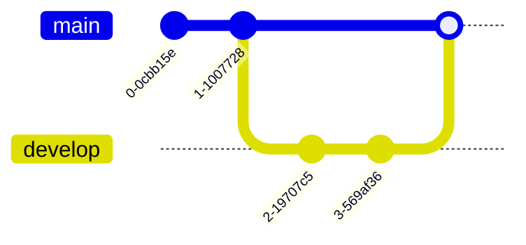

## Commits

### Simple Commits

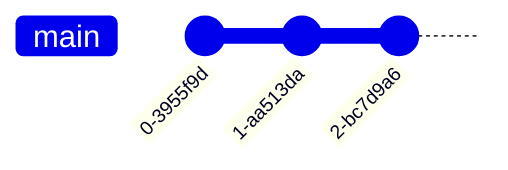

### Commits with IDs

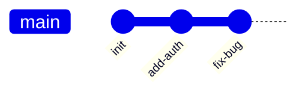

### Commits with Tags

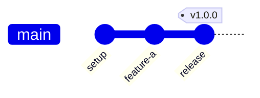

### Commit Types

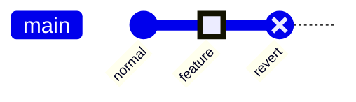

**Commit types:**
- `NORMAL` - Solid circle (default)
- `HIGHLIGHT` - Filled rectangle
- `REVERSE` - Circle with X (for reverts)

## Branches

### Creating Branches

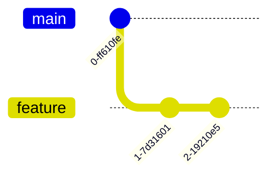

### Branch Names with Spaces

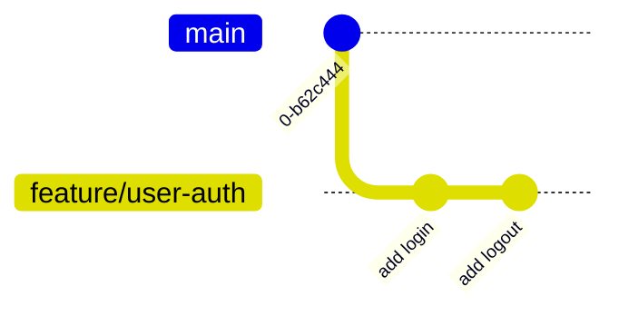

### Multiple Branches

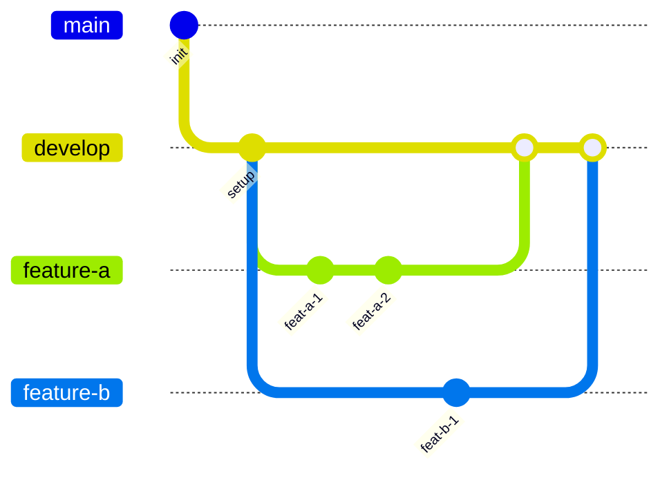

## Merges

### Basic Merge

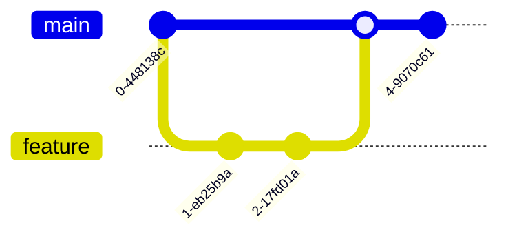

### Merge with ID and Tag

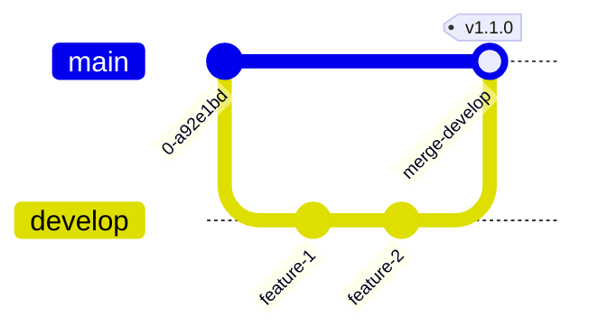

### Merge with Type

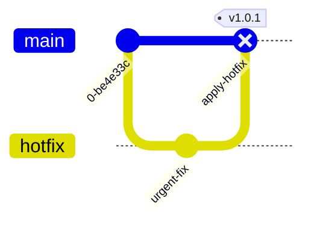

## Cherry-Pick

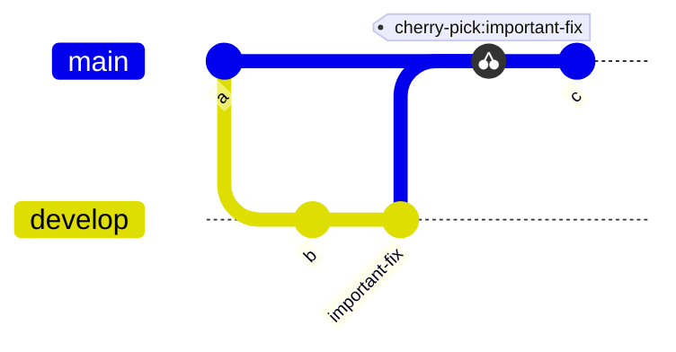

## Checkout / Switch

Both `checkout` and `switch` work identically:

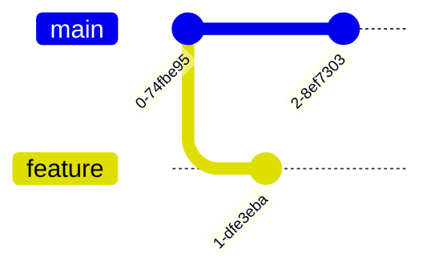

## Branch Order

Control visual positioning of branches:

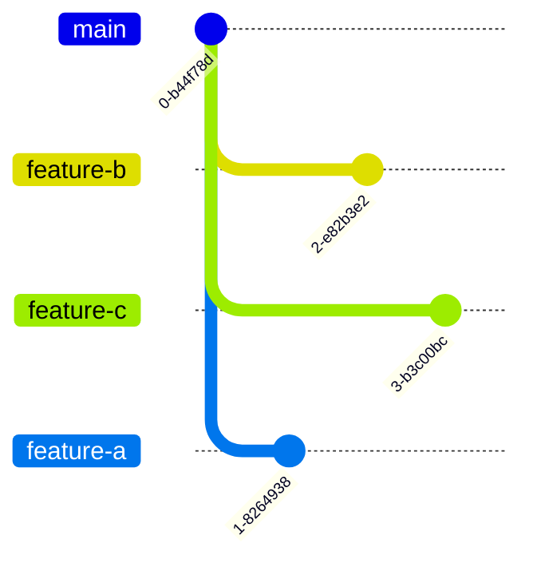

## Direction

### Left-to-Right (Default)

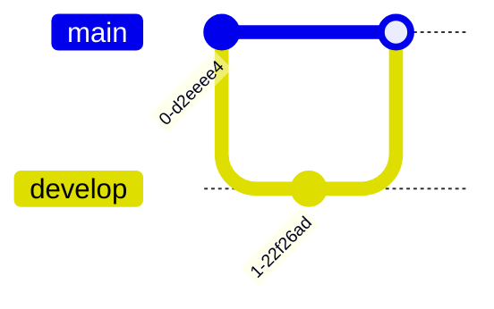

### Top-to-Bottom

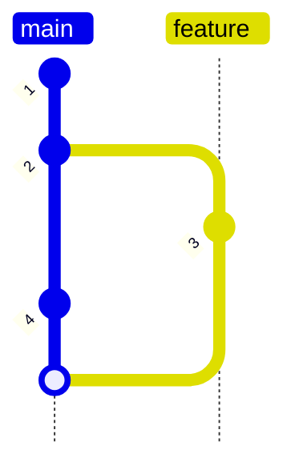

### Bottom-to-Top

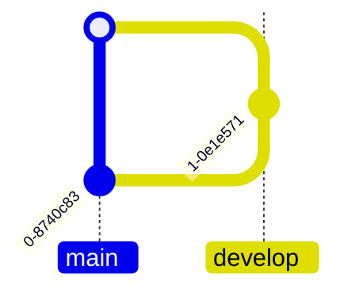

## Configuration

### Theme Settings

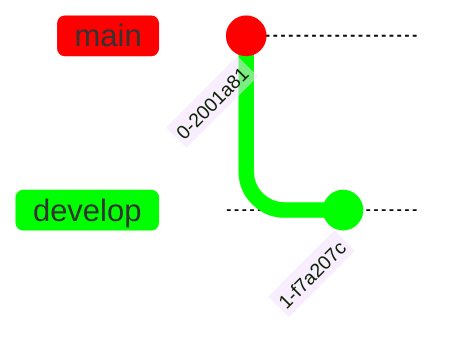

### Available Themes

- `base` - Clean, minimal
- `forest` - Green tones
- `dark` - Dark background
- `default` - Standard colors
- `neutral` - Grayscale

## Use Cases

### Feature Branch Workflow

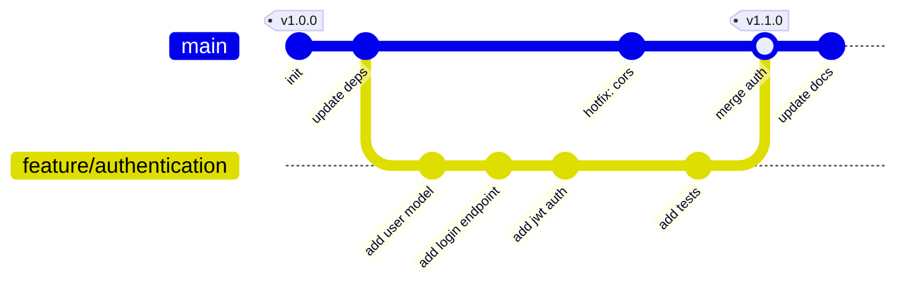

### Gitflow Workflow

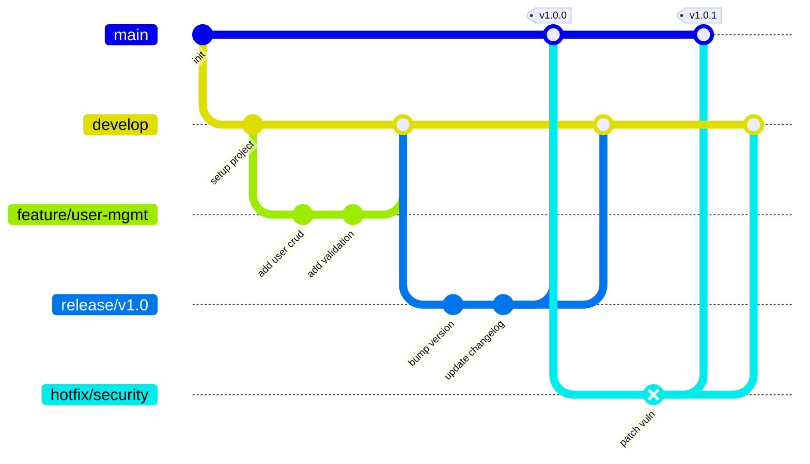

### Release Train

```mermaid
gitGraph
    commit id: "v1.0.0" tag: "v1.0.0"

    branch release/v1.1
    checkout release/v1.1
    commit id: "feat: add search"
    commit id: "feat: add filters"
    checkout main
    merge release/v1.1 tag: "v1.1.0"

    branch release/v1.2
    checkout release/v1.2
    commit id: "feat: export csv"
    commit id: "feat: dashboard"
    checkout main
    merge release/v1.2 tag: "v1.2.0"

    branch release/v1.3
    checkout release/v1.3
    commit id: "feat: notifications"
    commit id: "perf: caching"
    checkout main
    merge release/v1.3 tag: "v1.3.0"
```

### Cherry-Pick Example

```mermaid
gitGraph
    commit id: "a"
    commit id: "b"

    branch develop
    checkout develop
    commit id: "feat-1"
    commit id: "critical-fix"
    commit id: "feat-2"

    checkout main
    cherry-pick id: "critical-fix"
    commit id: "release" tag: "v1.0.1"

    checkout develop
    merge main
    commit id: "feat-3"
```

### Trunk-Based Development

```mermaid
gitGraph
    commit id: "stable" tag: "v1.0.0"

    branch short-lived-1
    checkout short-lived-1
    commit id: "quick feature"
    checkout main
    merge short-lived-1

    commit id: "integrate"

    branch short-lived-2
    checkout short-lived-2
    commit id: "small fix"
    checkout main
    merge short-lived-2

    commit id: "release prep"
    commit id: "deploy" tag: "v1.1.0"
```

### Multi-Environment Deployment

```mermaid
gitGraph
    commit id: "code"
    branch staging
    checkout staging
    commit id: "deploy staging" type: HIGHLIGHT
    commit id: "smoke test"

    checkout main
    merge staging id: "promote to prod" tag: "production"

    branch hotfix
    checkout hotfix
    commit id: "urgent fix" type: REVERSE

    checkout main
    merge hotfix tag: "hotfix-prod"

    checkout staging
    merge main
```

### Parallel Feature Development

```mermaid
gitGraph
    commit id: "base"

    branch feature/payments order: 1
    branch feature/notifications order: 2
    branch feature/analytics order: 3

    checkout feature/payments
    commit id: "stripe integration"
    commit id: "payment ui"

    checkout feature/notifications
    commit id: "email service"
    commit id: "push notifications"

    checkout feature/analytics
    commit id: "tracking setup"
    commit id: "dashboard charts"

    checkout main
    merge feature/payments
    merge feature/notifications
    merge feature/analytics tag: "v2.0.0"
```

### Rollback Scenario

```mermaid
gitGraph
    commit id: "v1.0" tag: "v1.0.0"
    commit id: "v1.1" tag: "v1.1.0"
    commit id: "v1.2-broken" tag: "v1.2.0"
    commit id: "revert v1.2" type: REVERSE
    commit id: "v1.2.1-fixed" tag: "v1.2.1"
```

## Tips for Effective Git Graphs

1. **Keep it focused** - Show only relevant branches and commits
2. **Use meaningful IDs** - Describe what each commit does
3. **Tag releases** - Mark version releases clearly
4. **Highlight important commits** - Use `HIGHLIGHT` type for key changes
5. **Show reverts** - Use `REVERSE` type for rollbacks
6. **Branch ordering** - Use `order` to keep related branches together
7. **Document strategy** - Use git graphs to communicate branching workflow
8. **Cherry-pick sparingly** - Show when fixes are backported
