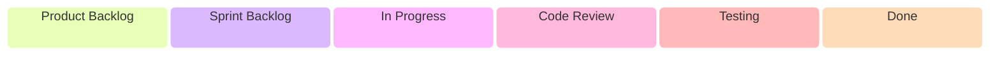

# Kanban Diagrams

Kanban diagrams visualize workflow states and work items. They help teams track tasks through stages from backlog to completion.

## Basic Syntax

## Columns and Tasks with IDs

Use unique IDs for columns and tasks:

```mermaid
kanban
    todoColumn[📋 Todo]
        task1[Design login page]
        task2[Create API spec]
    inProgressColumn[🔨 In Progress]
        task3[Implement authentication]
    reviewColumn[👀 Code Review]
        task4[Add input validation]
    doneColumn[✅ Done]
        task5[Setup CI/CD pipeline]
```

**Syntax:**
- `columnId[Column Title]` - Define a column with unique ID
- `taskId[Task Description]` - Define a task (indented under column)
- IDs must be unique across the entire diagram

## Task Metadata

Add assignee, ticket, and priority information:

**Metadata fields:**
- `assigned` - Assignee name
- `ticket` - Ticket or issue number
- `priority` - `Very High`, `High`, `Low`, `Very Low`

## Ticket Links

Configure base URL for automatic ticket linking:

The `#TICKET#` placeholder is replaced with the ticket number from metadata.

## Real-World Example: Sprint Board

```mermaid
kanban
    backlog[📥 Backlog]
        userStory1[As a user, I want to reset my password]@{assigned: Alice, ticket: FEAT-201, priority: High}
        userStory2[As an admin, I want to view user analytics]@{assigned: Bob, ticket: FEAT-202, priority: Low}

    todo[📋 Sprint To Do]
        task1[Design password reset flow]@{assigned: Alice, ticket: TASK-301}
        task2[Create email templates]@{assigned: Carol, ticket: TASK-302}

    inProgress[🔨 In Progress]
        task3[Implement password reset API]@{assigned: Alice, ticket: TASK-303, priority: High}
        task4[Add rate limiting]@{assigned: Dave, ticket: TASK-304}

    review[👀 Code Review]
        task5[Token validation logic]@{assigned: Bob, ticket: TASK-305}

    testing[🧪 Testing]
        task6[Integration tests for auth]@{assigned: Carol, ticket: TASK-306}

    done[✅ Done]
        task7[Setup CI/CD for staging]@{ticket: TASK-307}
        task8[Update API documentation]@{ticket: TASK-308}
```

## Typical Column Structures

### Basic Software Development

### Agile Sprint Board

### Bug Tracking

### Feature Development

```mermaid
kanban
    ideation[💡 Ideation]
    design[🎨 Design]
    development[⚙️ Development]
    qa[🧪 QA]
    staging[🚀 Staging]
    production[✅ Production]
```

## Use Cases

1. **Sprint Planning** - Visualize sprint tasks and their progress
2. **Bug Triage** - Track bugs through resolution workflow
3. **Feature Development** - Show feature status from idea to production
4. **Incident Management** - Track incidents through investigation and resolution
5. **Release Management** - Visualize deployment pipeline stages
6. **Support Tickets** - Track customer support requests
7. **Technical Debt** - Organize and prioritize refactoring tasks

## Tips for Effective Kanban Boards

1. **Limit work in progress (WIP)** - Cap tasks per column to prevent bottlenecks
2. **Use meaningful column names** - Clear labels like "Code Review" vs "CR"
3. **Add visual indicators** - Use emojis or icons in column titles
4. **Include metadata** - Always add assignee and ticket numbers for traceability
5. **Set priority levels** - Distinguish urgent vs routine tasks
6. **Keep tasks atomic** - Each task should be completable within a few days
7. **Regular grooming** - Move tasks promptly to reflect actual status
8. **Visualize blockers** - Use priority flags or dedicated "Blocked" column
