# Mindmaps

Mindmaps visualize hierarchical information radiating from a central concept. Useful for brainstorming, organizing ideas, and documenting system architectures.

## Basic Syntax

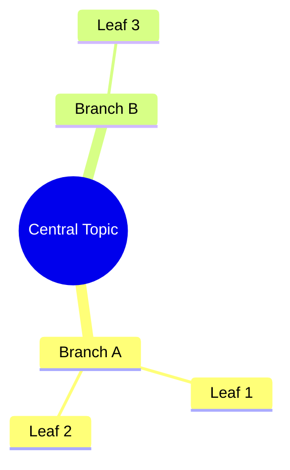

## Indentation-Based Hierarchy

Mindmaps use indentation to define parent-child relationships:

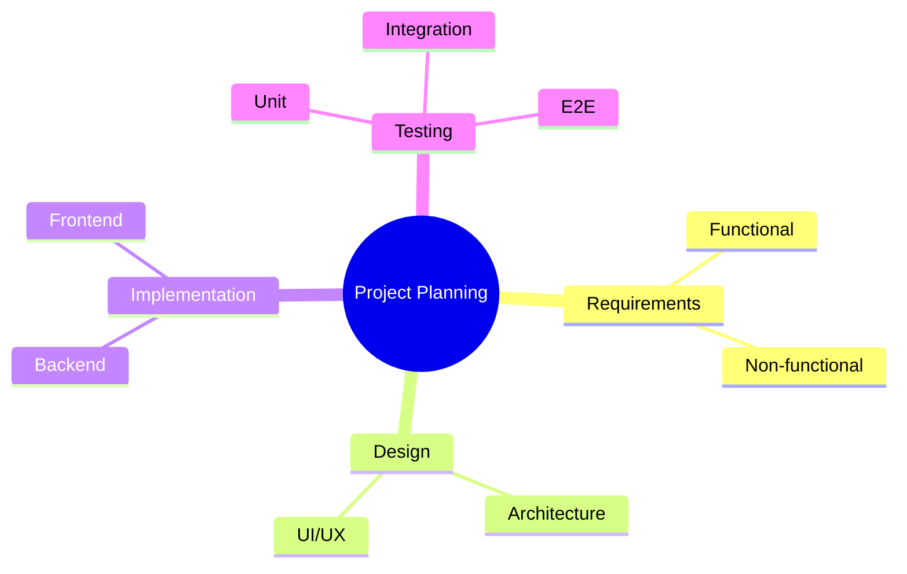

## Node Shapes

### Default (Rounded Rectangle)

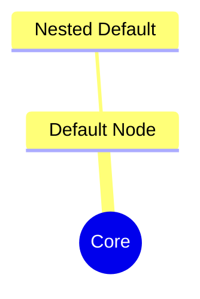

### Square Brackets

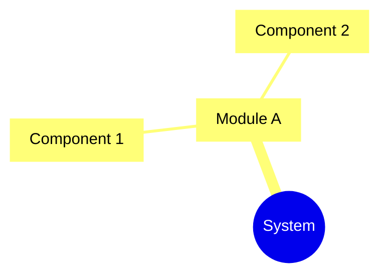

### Parentheses (Rounded)


### Double Parentheses (Circle)

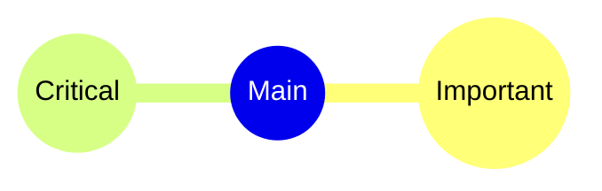

### Bang Shape


### Cloud Shape (Hexagon)


### Mixed Shapes

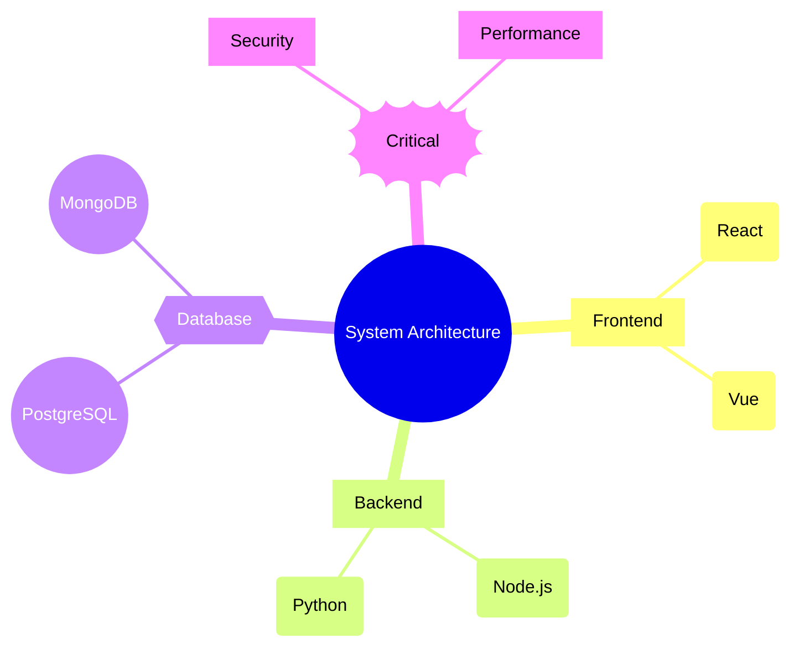

## Icons

Using Font Awesome:

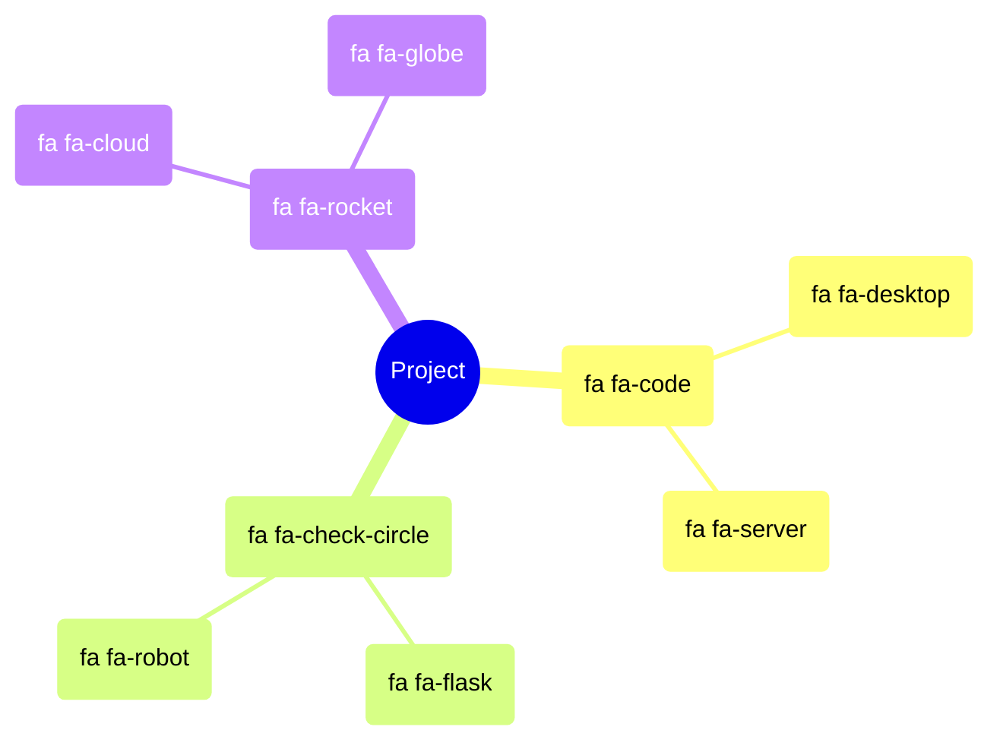

## Markdown Formatting

### Bold and Italic

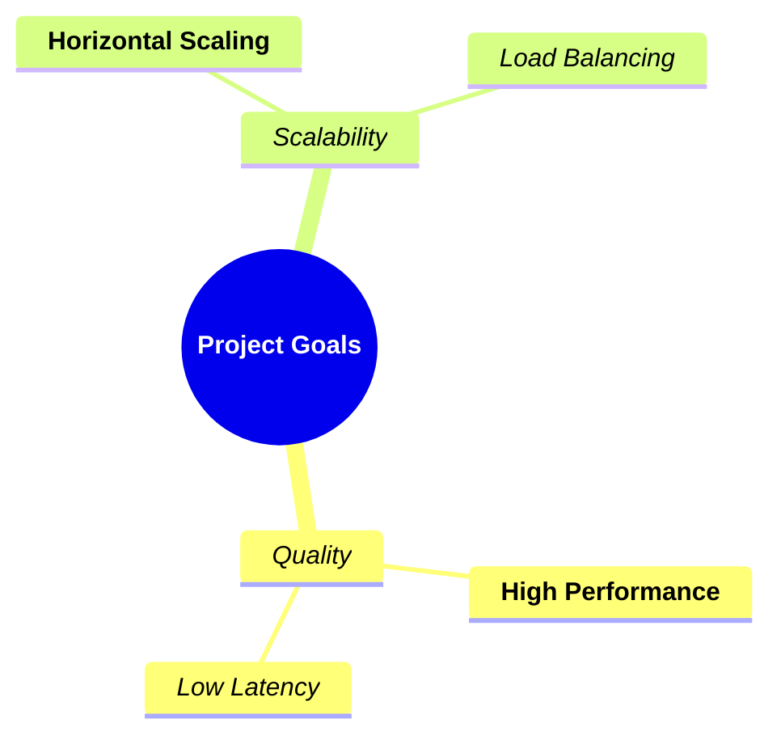

### Text Wrapping

Long text automatically wraps:

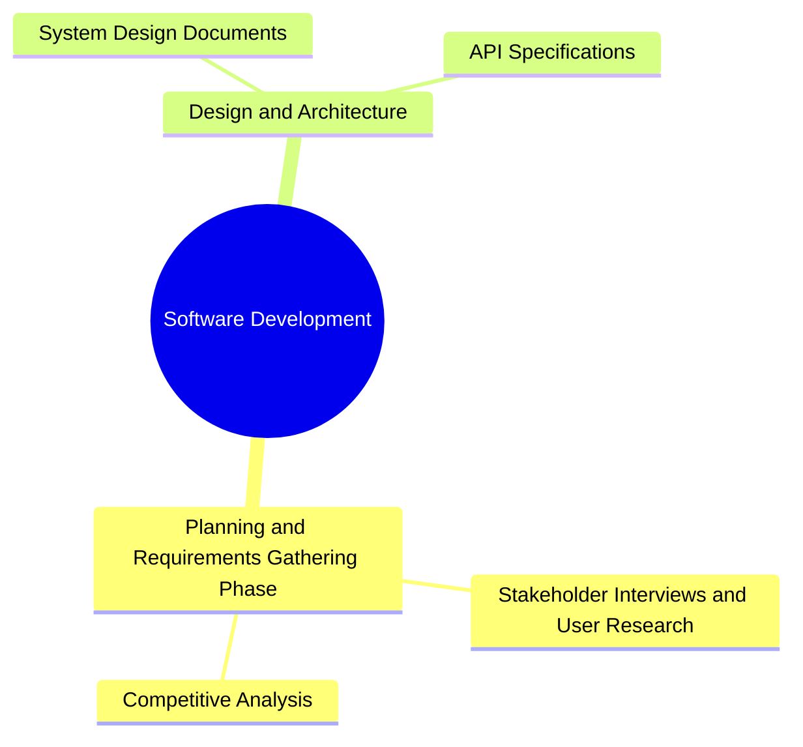

## Styling

### Class-Based Styling

```mermaid
mindmap
    root((Features))
        Core Features
            Authentication:::critical
            Authorization:::critical
        Optional Features
            Theming:::optional
            Export:::optional

classDef critical fill:#f66,stroke:#933,color:#fff
classDef optional fill:#6cf,stroke:#39c,color:#000
```

## Use Cases

### Software Architecture Overview

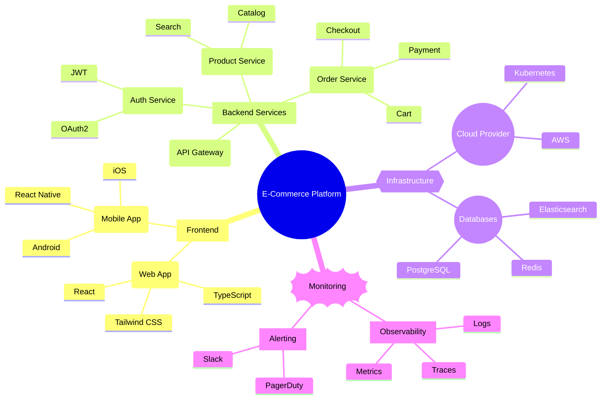

### Feature Planning

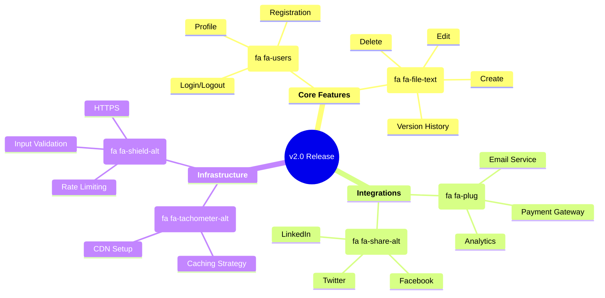

### Technology Stack

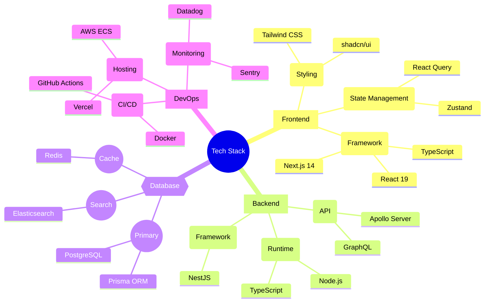

### API Design Brainstorm

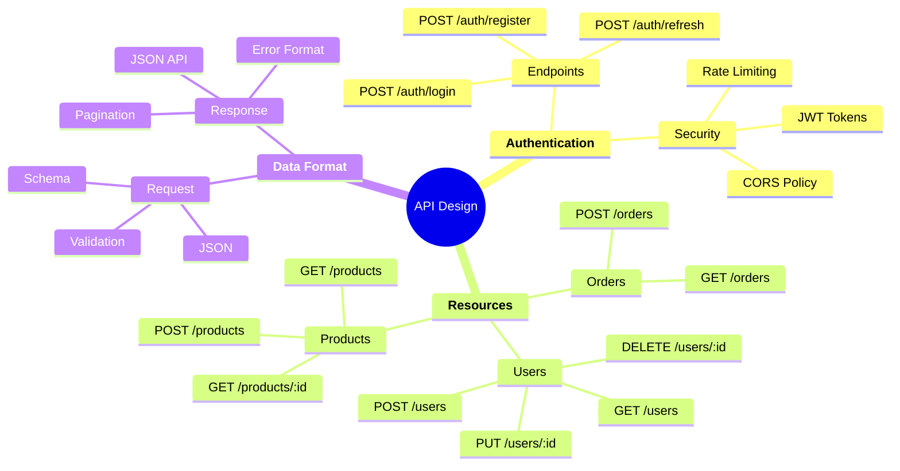

### Learning Path

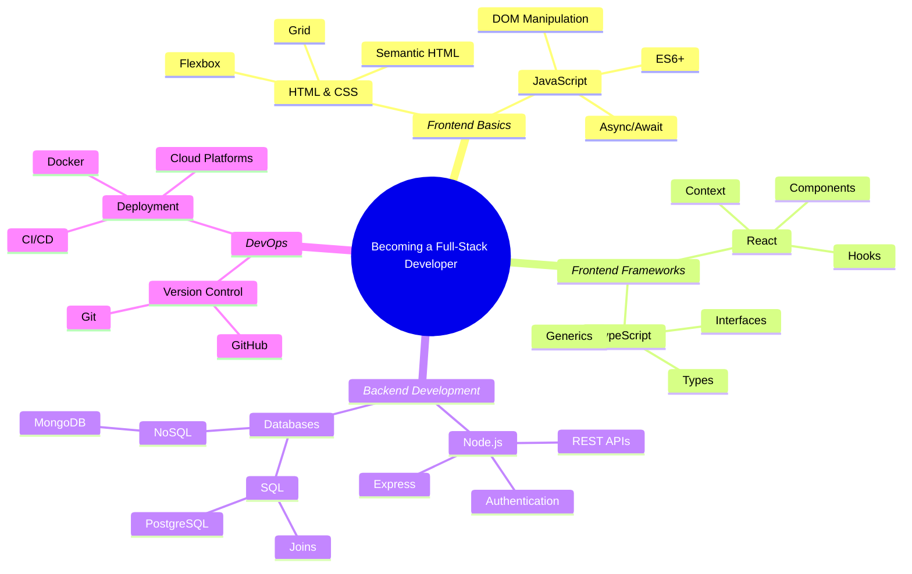

### Problem Analysis

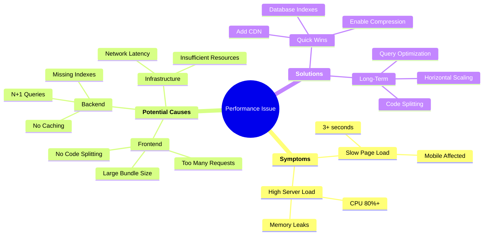

### Sprint Retrospective

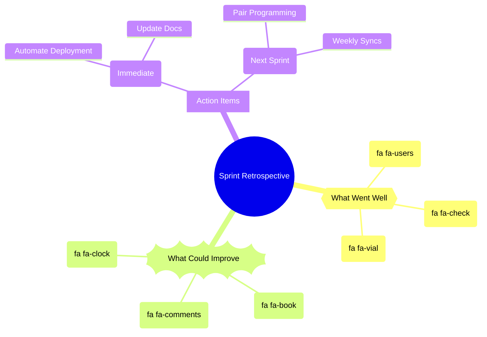

### Security Checklist

```mermaid
mindmap
    root((Security Audit))
        **Authentication**
            Implementation
                Password Hashing
                MFA Support
                Session Management
            Vulnerabilities
                Brute Force
                Session Fixation
        **Authorization**
            Access Control
                RBAC
                Resource Permissions
            Testing
                Privilege Escalation
                IDOR
        **Data Protection**
            In Transit
                HTTPS
                TLS 1.3
            At Rest
                Encryption
                Key Management
        **Code Security**
            Dependencies
                Audit npm packages
                Update regularly
            Input Validation
                XSS Prevention
                SQL Injection
```

## Tips for Effective Mindmaps

1. **Central concept** - Start with the core idea as root
2. **Logical grouping** - Group related concepts under parent nodes
3. **Consistent indentation** - Maintain clear hierarchy
4. **Use shapes meaningfully** - Different shapes for different types of nodes
5. **Add icons** - Visual cues improve readability
6. **Markdown formatting** - Emphasize important nodes with bold/italic
7. **Limit depth** - Keep to 3-4 levels for clarity
8. **Balance branches** - Distribute information evenly
