# Packet Diagrams

Packet diagrams visualize network packet structures and binary protocol layouts. They show bit-level field organization in protocol headers and data structures.

## Basic Syntax

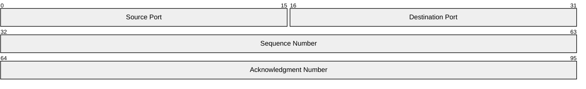

## Field Definition Syntax

### Classic Bit Range Syntax

Specify exact bit positions:

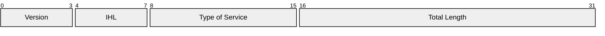

### Modern Increment Syntax (v11.7.0+)

Use `+N` to automatically increment from previous field:


**Advantages:**
- No manual bit calculation
- Automatically tracks position
- Easier to modify field sizes

### Single-Bit Fields

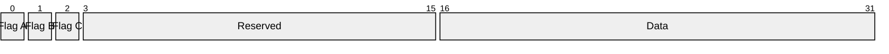

**Or with modern syntax:**


## Mixing Classic and Modern Syntax

Both syntaxes can be mixed in the same diagram:

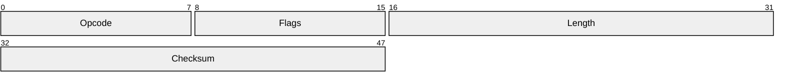

## Comments

Add explanatory notes:

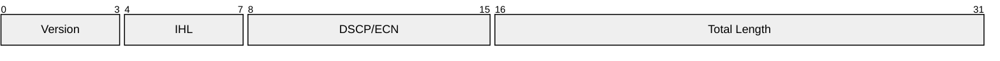

## Configuration

### Bits Per Row

Control how many bits are displayed per row (default: 32):

```javascript
%%{
  init: {
    'packet': {
      'bitsperrow': 16
    }
  }
}%%
```

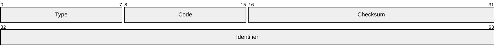

### Bit Width

Set pixel width per bit (default: 32):

```javascript
%%{init: {'packet': {'bitwidth': 24}}}%%
```

### Padding

Adjust horizontal and vertical padding:

```javascript
%%{init: {'packet': {'paddingx': 10, 'paddingy': 15}}}%%
```

### Row Height

Set row height in pixels (default: 32):

```javascript
%%{init: {'packet': {'rowheight': 40}}}%%
```

### Show Bit Numbers

Toggle bit position labels:

```javascript
%%{init: {'packet': {'showbits': false}}}%%
```

## Use Cases in Software Development

### TCP Header Structure

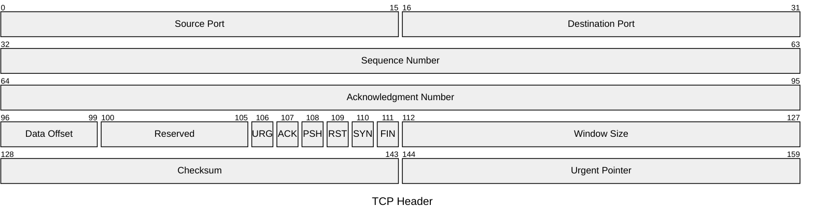

### IPv4 Packet Header

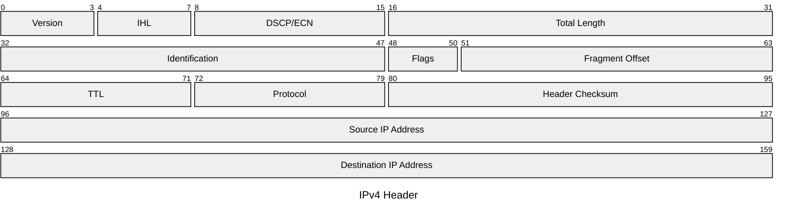

### UDP Datagram Header

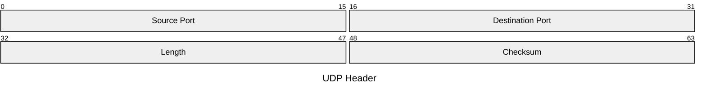

### Custom Application Protocol

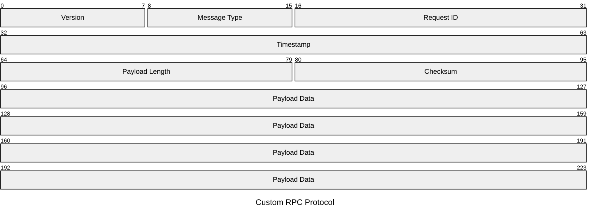

### WebSocket Frame Format

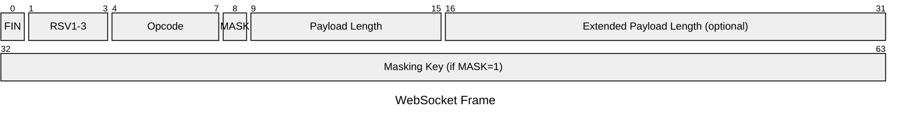

### Binary File Format Header

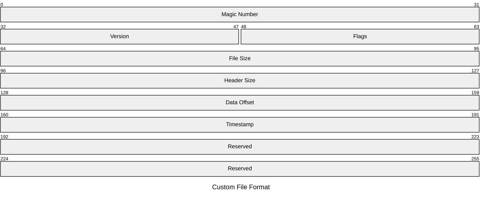

### DNS Query Header

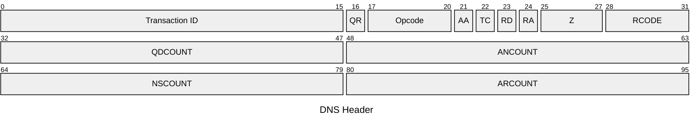

### TLS Record Layer

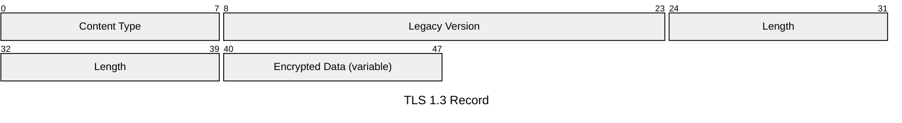

### Custom Bitfield Structure

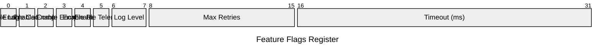

### Ethernet Frame Header

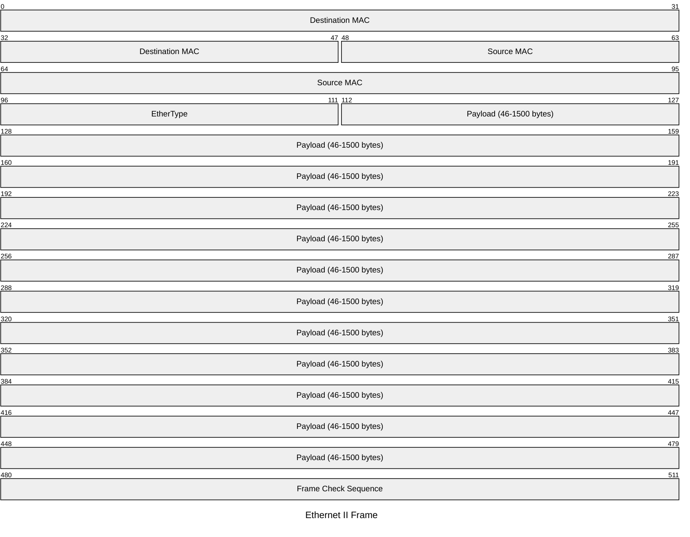

### HTTP/2 Frame Format

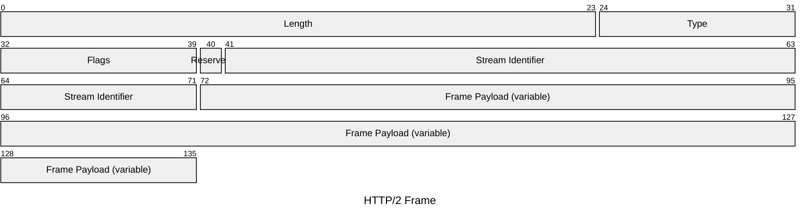

## Tips for Effective Packet Diagrams

1. **Use modern syntax** - `+N` syntax is easier to maintain than manual bit ranges
2. **Add title** - Use `title` keyword to identify the protocol or structure
3. **Group related fields** - Use comments (`%%`) to separate logical sections
4. **Document flags** - Single-bit flags benefit from clear labeling
5. **Show variable fields** - Indicate optional or variable-length fields in labels
6. **Match standard layouts** - For well-known protocols, follow RFC specifications
7. **Adjust bits per row** - Use 8, 16, or 32 bits per row for optimal readability
8. **Include reserved fields** - Show reserved/padding bits for completeness
9. **Use consistent naming** - Follow naming conventions from protocol specs
10. **Add bit positions** - Keep `showbits: true` for technical documentation

## Common Bit-Per-Row Settings

| Bits Per Row | Best For |
|--------------|----------|
| 8 | Byte-aligned structures, simple flags |
| 16 | Word-aligned protocols, compact display |
| 32 | Standard network protocols (IPv4, TCP, UDP) |
| 64 | 64-bit architectures, timestamps |

## Configuration Example

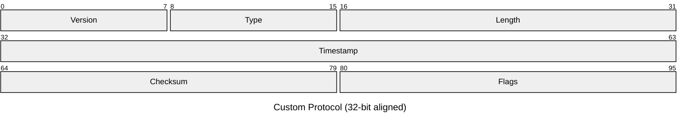

## Styling Considerations

- Packet diagrams inherit theme colors from Mermaid
- Field labels automatically wrap if they exceed available width
- Bit position numbers appear above each row by default
- Reserved/unused fields are visually identical to named fields
