# Pie Charts

Pie charts visualize proportional data as slices of a circle. They show relative sizes of parts to a whole, making it easy to compare categories at a glance.

## Basic Syntax

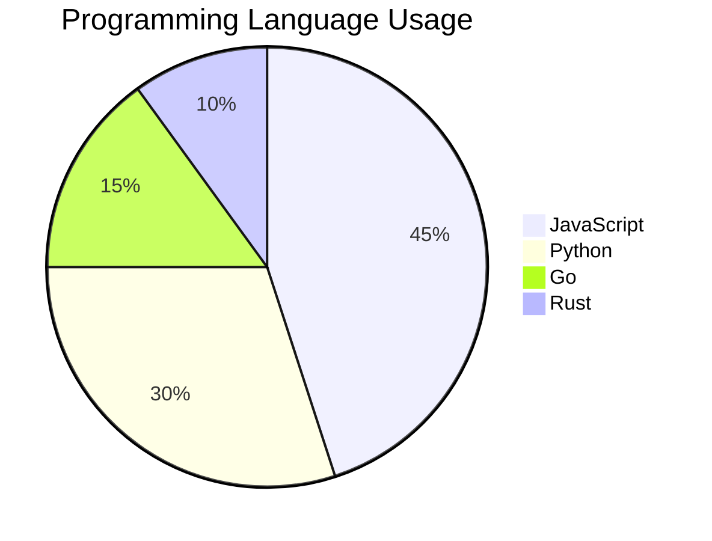

## Show Data Values

Add `showData` to display values in the legend:

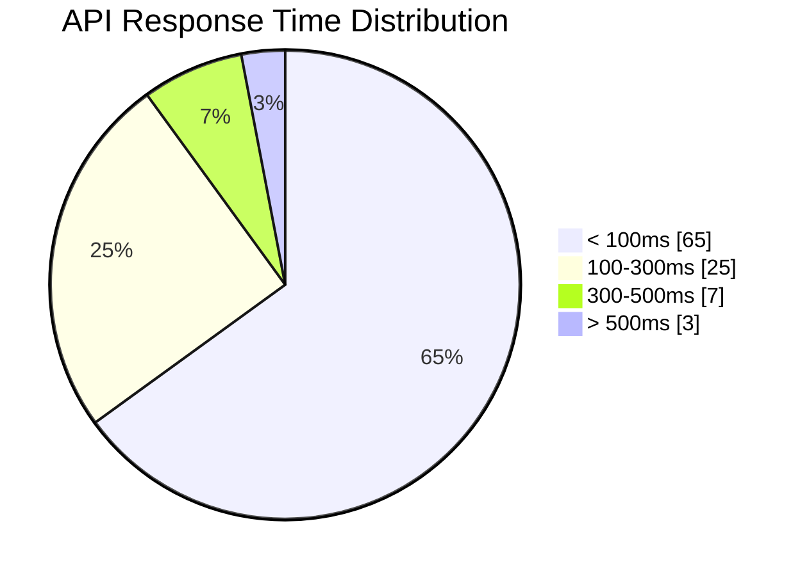

## Title Configuration

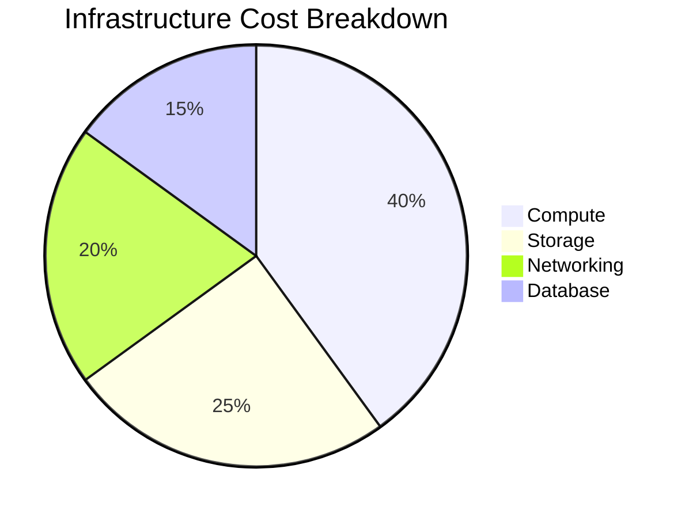

**Title syntax:** `title <text>` (not quoted)

## Real-World Example: Sprint Task Distribution

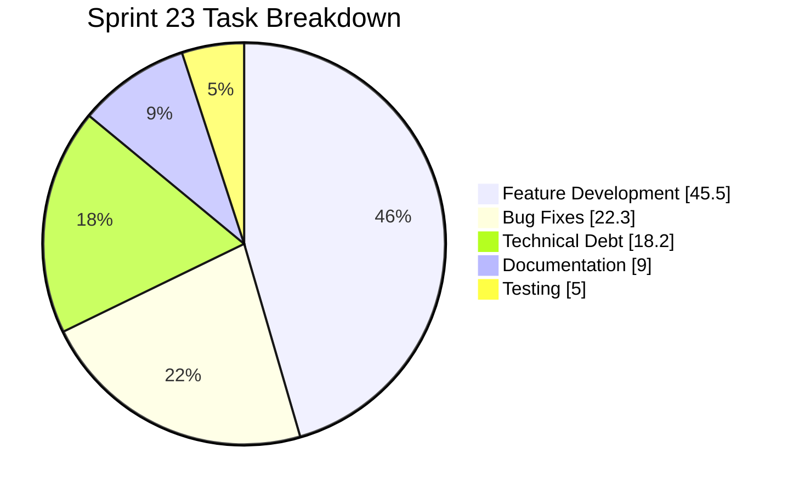

## Technical Metrics Example: Error Types

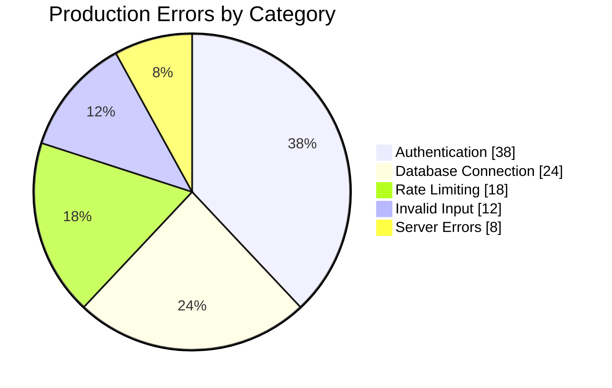

## Time Allocation Example

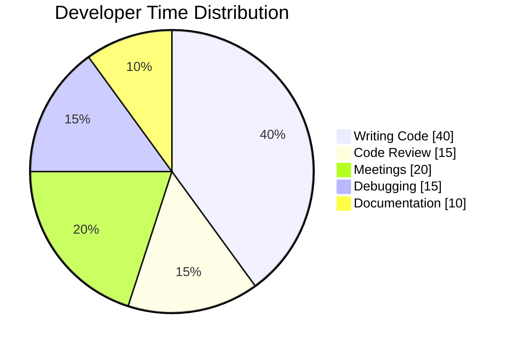

## Resource Usage Example

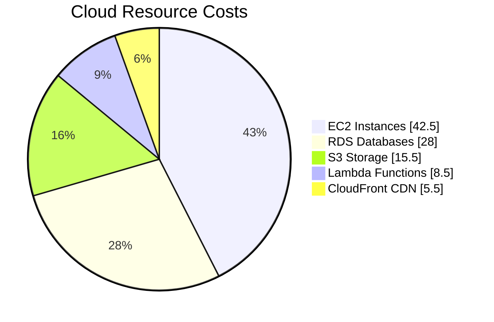

## Value Rules

- **Positive numbers only** - Values must be greater than 0
- **Decimal precision** - Up to 2 decimal places
- **No negative values** - Will cause rendering errors

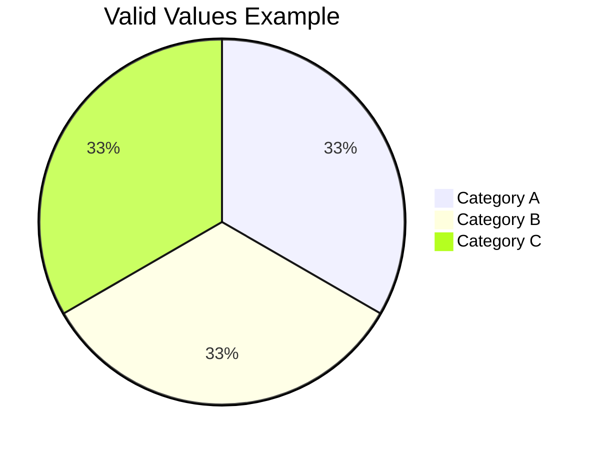

## Slice Order

Slices are rendered clockwise starting from the top, in the order defined:

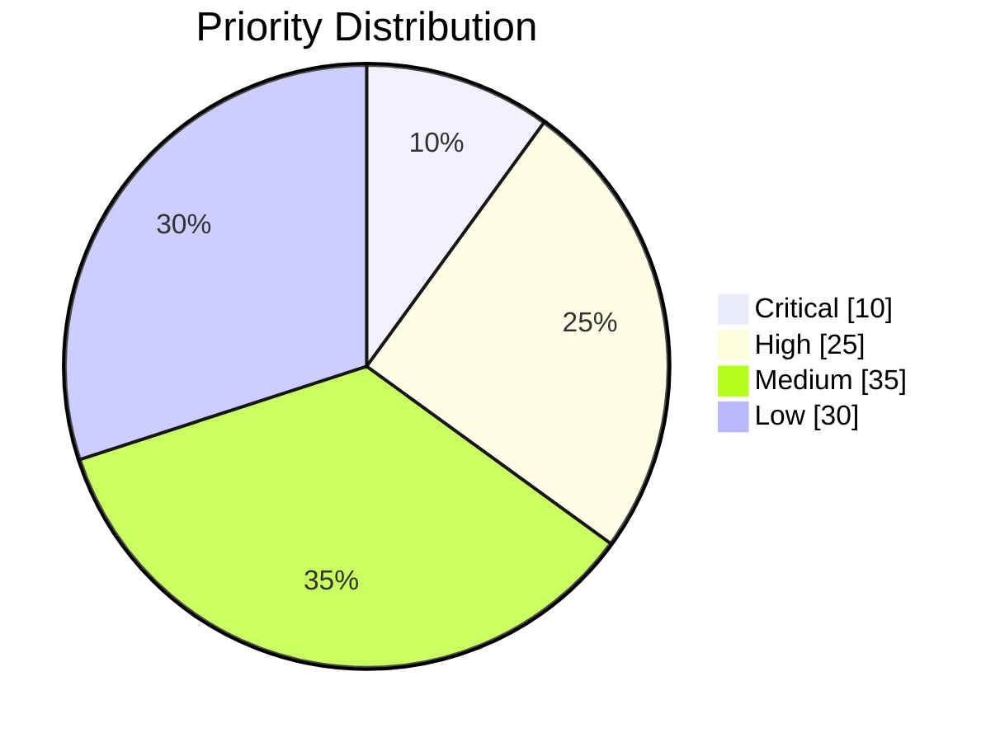

First defined category ("Critical") appears at 12 o'clock position.

## Configuration Options

### Text Position

Adjust label position with `textPosition` (0.0 = center, 1.0 = outer edge, default 0.75):

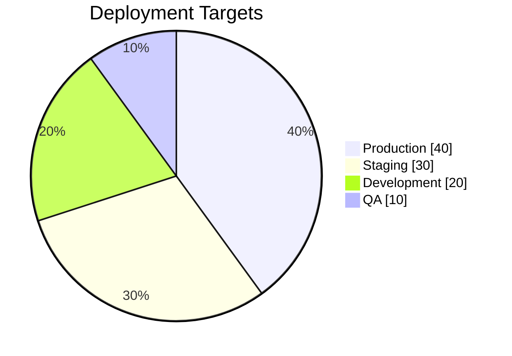

## Use Cases

1. **Resource Allocation** - Visualize budget, time, or compute distribution
2. **Technology Stack** - Show language, framework, or library usage
3. **Error Analysis** - Display error types or failure categories
4. **Performance Metrics** - Represent response time buckets
5. **User Segmentation** - Show user distribution by plan, region, or behavior
6. **Test Coverage** - Illustrate coverage by module or component
7. **Technical Debt** - Categorize debt by type or severity
8. **Sprint Metrics** - Breakdown of task types or story points
9. **API Usage** - Endpoint call distribution
10. **Infrastructure Costs** - Cloud service cost breakdown

## Real-World Scenarios

### Test Coverage by Module

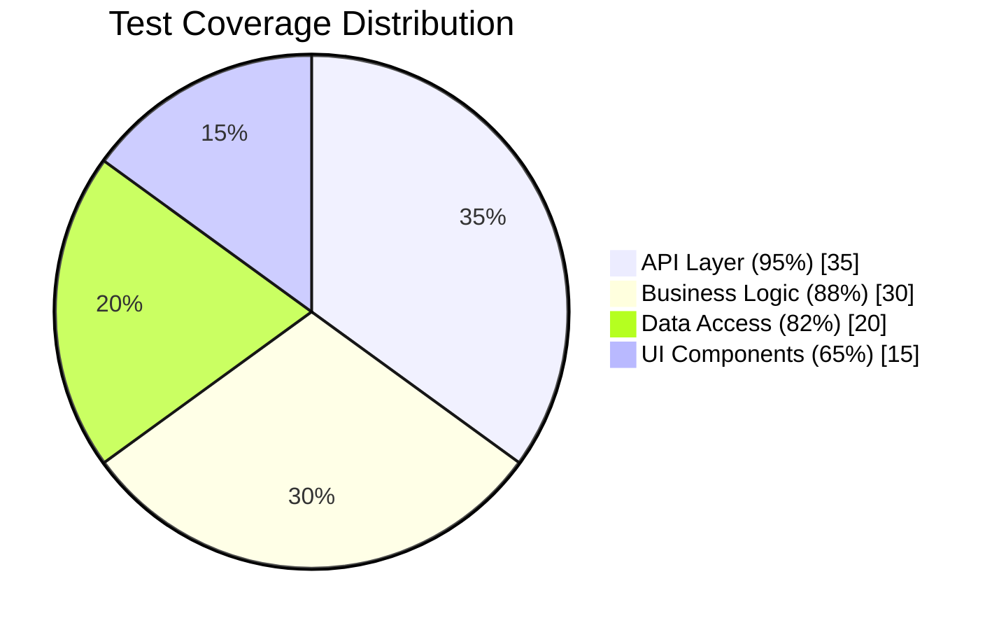

### CI/CD Pipeline Time

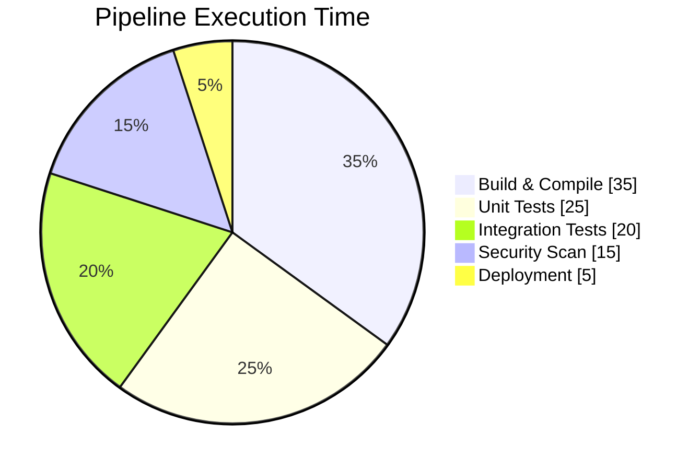

### Issue Priority Backlog

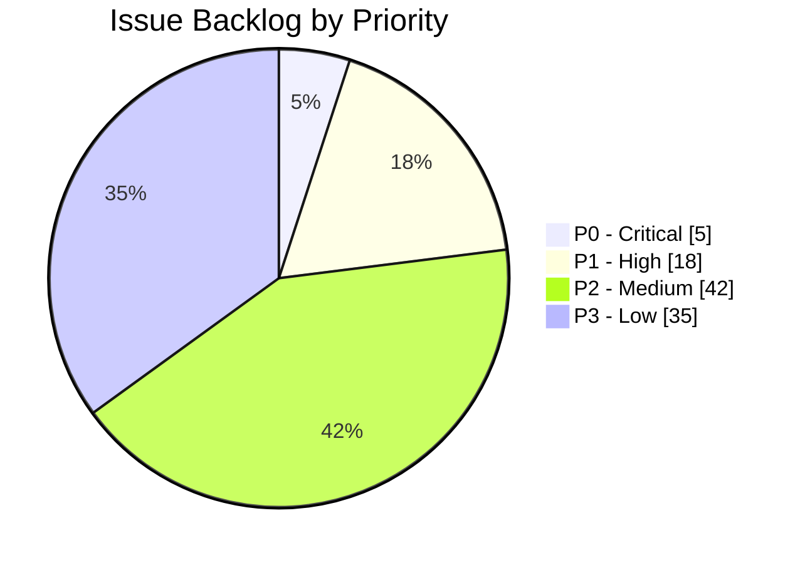

### Database Query Types

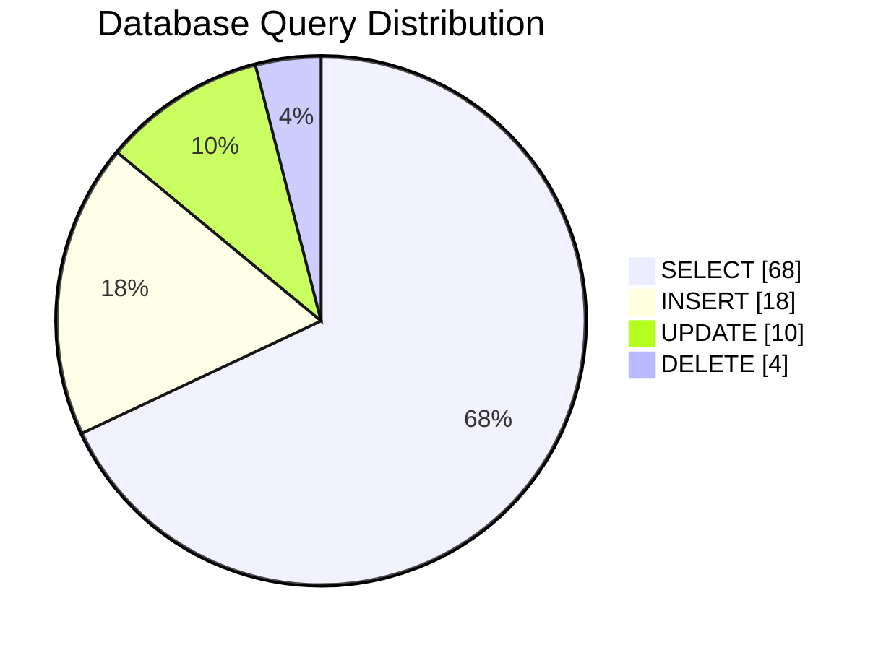

## Tips for Effective Pie Charts

1. **Limit categories** - 5-7 slices maximum for readability
2. **Combine small slices** - Merge categories under 5% into "Other"
3. **Order by size** - Largest to smallest (or by priority)
4. **Use showData** - Display exact percentages for precision
5. **Clear labels** - Use descriptive category names
6. **Avoid 3D effects** - Keep it simple and flat (Mermaid does this by default)
7. **Total should make sense** - Ensure values represent parts of a whole
8. **Compare with caution** - Pie charts are best for showing proportions, not comparing absolute values

## When NOT to Use Pie Charts

- **Too many categories** (> 7) - Use bar chart instead
- **Similar values** - Hard to distinguish slice sizes; use table or bar chart
- **Trends over time** - Use line or area chart
- **Precise comparisons** - Use bar chart for easier comparison
- **Negative values** - Not supported; use different chart type

## Alternatives for Common Scenarios

| Scenario | Better Alternative |
|----------|-------------------|
| Many categories (> 7) | Bar chart or table |
| Time series data | Line or area chart |
| Comparing magnitudes | Bar chart |
| Showing trends | Line chart |
| Multiple dimensions | Stacked bar or grouped bar |
