# Quadrant Charts

Quadrant charts plot items on a 2x2 matrix, ideal for prioritization, strategic planning, and decision-making frameworks. Each point is positioned based on two independent criteria.

## Basic Syntax

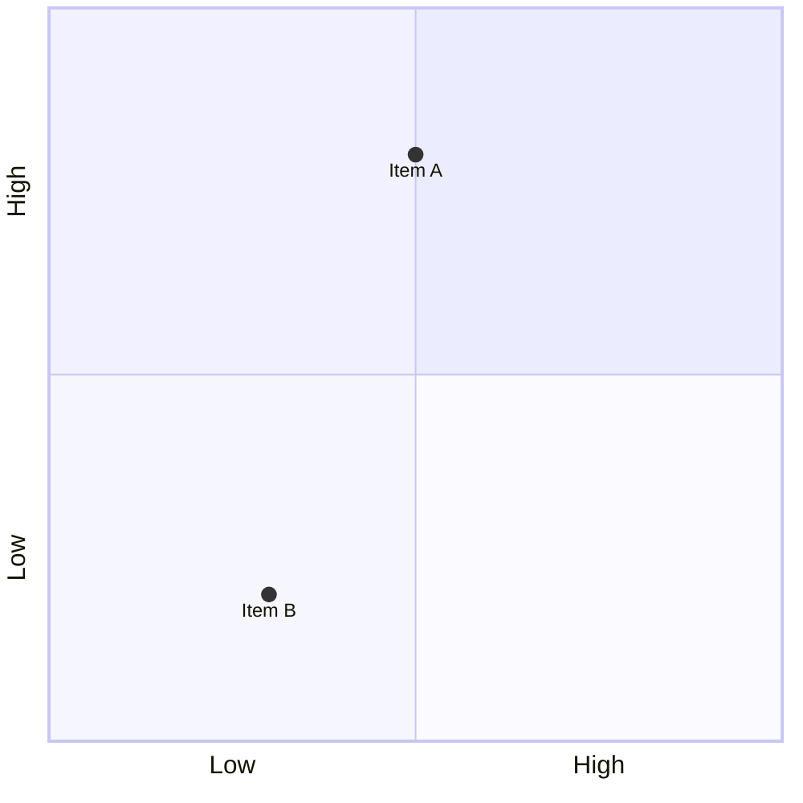
```mermaid
quadrantChart
    x-axis Low --> High
    y-axis Low --> High
    Item A: [0.5, 0.8]
    Item B: [0.3, 0.2]
```

## Chart Title

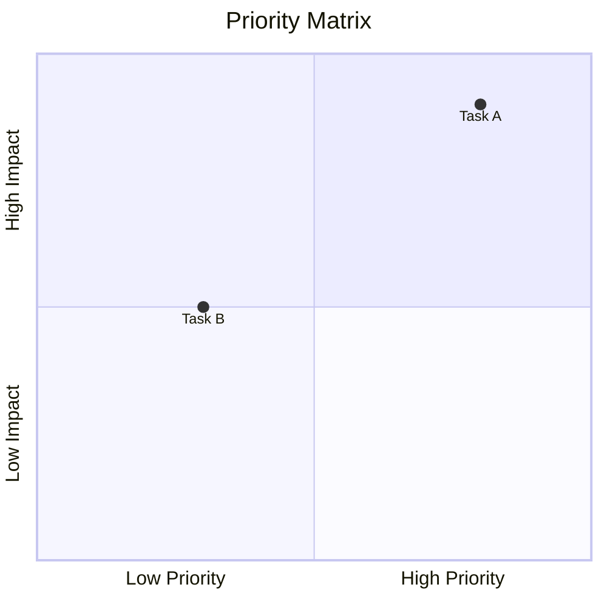
```mermaid
quadrantChart
    title Priority Matrix
    x-axis Low Priority --> High Priority
    y-axis Low Impact --> High Impact
    Task A: [0.8, 0.9]
    Task B: [0.3, 0.5]
```

## Axes Labels

Define meaningful axis labels for context:

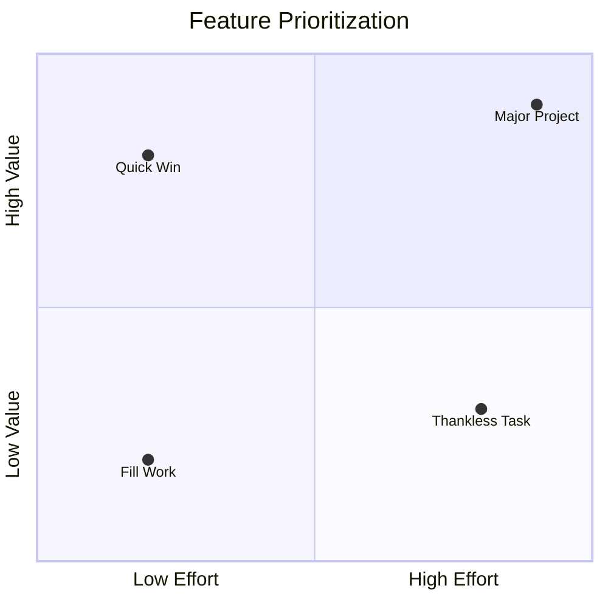
```mermaid
quadrantChart
    title Feature Prioritization
    x-axis Low Effort --> High Effort
    y-axis Low Value --> High Value
    Quick Win: [0.2, 0.8]
    Major Project: [0.9, 0.9]
    Fill Work: [0.2, 0.2]
    Thankless Task: [0.8, 0.3]
```

## Quadrant Labels

Label each quadrant to provide meaning:

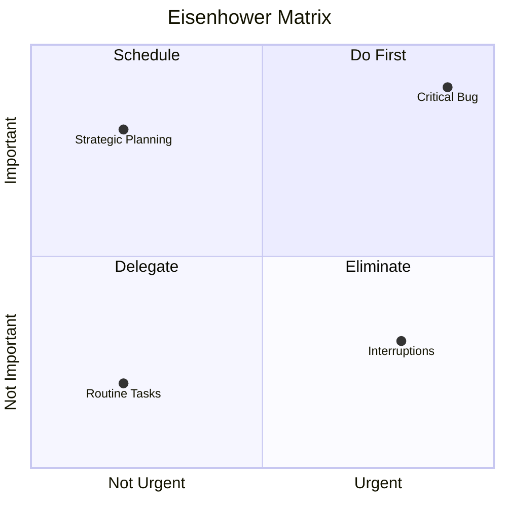
```mermaid
quadrantChart
    title Eisenhower Matrix
    x-axis Not Urgent --> Urgent
    y-axis Not Important --> Important
    quadrant-1 Do First
    quadrant-2 Schedule
    quadrant-3 Delegate
    quadrant-4 Eliminate
    Critical Bug: [0.9, 0.9]
    Strategic Planning: [0.2, 0.8]
    Routine Tasks: [0.2, 0.2]
    Interruptions: [0.8, 0.3]
```

**Quadrant numbering:**
- `quadrant-1` - Top right (high X, high Y)
- `quadrant-2` - Top left (low X, high Y)
- `quadrant-3` - Bottom left (low X, low Y)
- `quadrant-4` - Bottom right (high X, low Y)

## Point Positioning

Points use normalized coordinates (0 to 1):

```mermaid
quadrantChart
    title Positioning Examples
    x-axis Left --> Right
    y-axis Bottom --> Top
    Bottom Left: [0.0, 0.0]
    Top Left: [0.0, 1.0]
    Center: [0.5, 0.5]
    Top Right: [1.0, 1.0]
    Bottom Right: [1.0, 0.0]
```

**Coordinate system:**
- `[0.0, 0.0]` - Bottom left
- `[1.0, 0.0]` - Bottom right
- `[0.0, 1.0]` - Top left
- `[1.0, 1.0]` - Top right
- `[0.5, 0.5]` - Center

## Point Styling

### Custom Radius

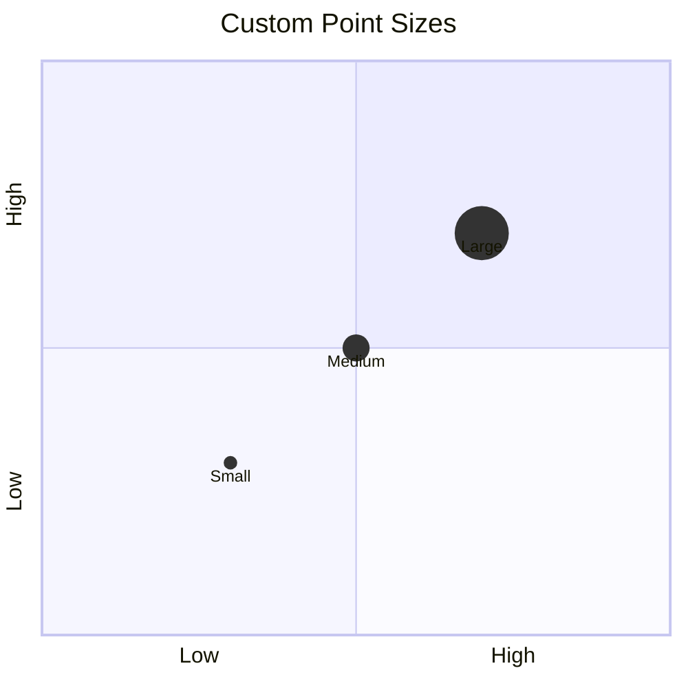
```mermaid
quadrantChart
    title Custom Point Sizes
    x-axis Low --> High
    y-axis Low --> High
    Small: [0.3, 0.3] radius: 5
    Medium: [0.5, 0.5] radius: 10
    Large: [0.7, 0.7] radius: 20
```

### Custom Colors

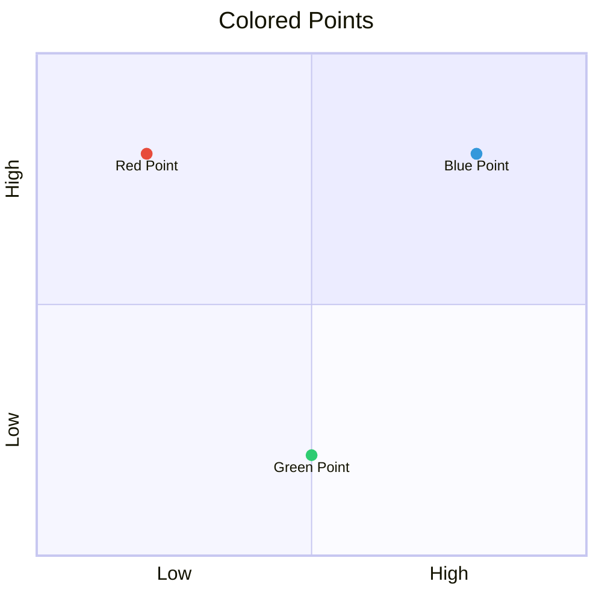
```mermaid
quadrantChart
    title Colored Points
    x-axis Low --> High
    y-axis Low --> High
    Red Point: [0.2, 0.8] color: #e74c3c
    Blue Point: [0.8, 0.8] color: #3498db
    Green Point: [0.5, 0.2] color: #2ecc71
```

### Combined Styling

```mermaid
quadrantChart
    title Styled Points
    x-axis Low --> High
    y-axis Low --> High
    Critical: [0.9, 0.9] radius: 15 color: #e74c3c
    Important: [0.7, 0.7] radius: 12 color: #f39c12
    Normal: [0.5, 0.5] radius: 8 color: #3498db
```

## Class-Based Styling

Define reusable styles for groups of points:

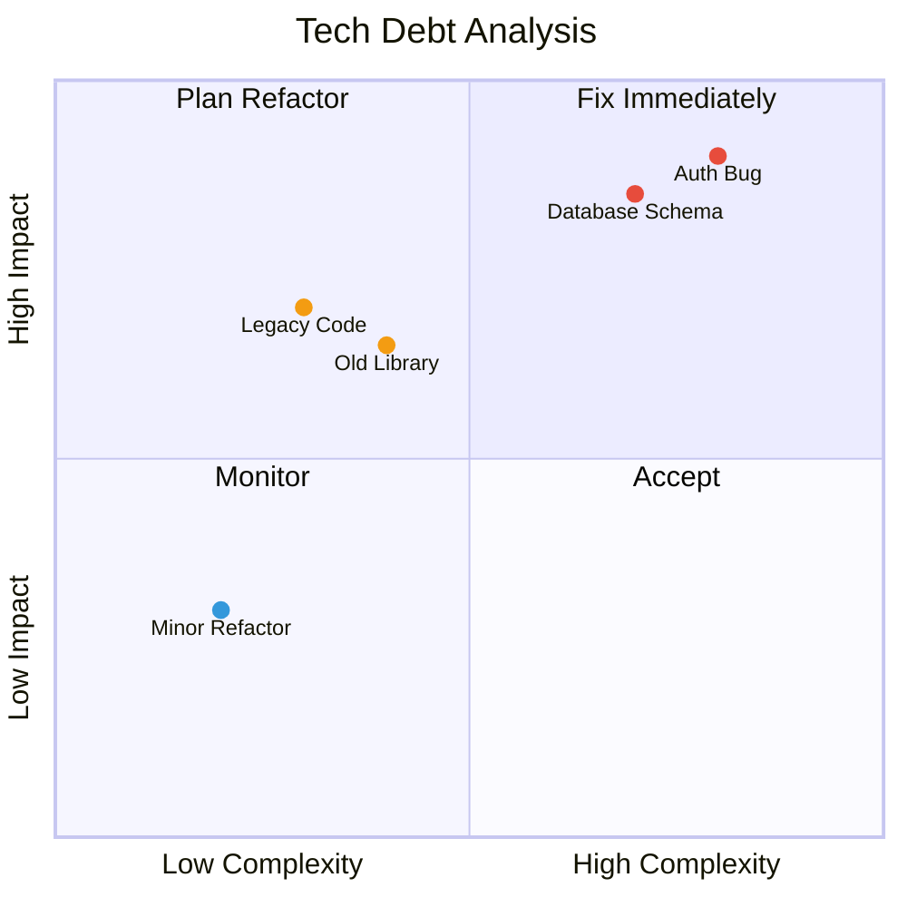
```mermaid
quadrantChart
    title Tech Debt Analysis
    x-axis Low Complexity --> High Complexity
    y-axis Low Impact --> High Impact
    quadrant-1 Fix Immediately
    quadrant-2 Plan Refactor
    quadrant-3 Monitor
    quadrant-4 Accept

    classDef critical color: #e74c3c
    classDef warning color: #f39c12
    classDef info color: #3498db

    Auth Bug:::critical: [0.8, 0.9]
    Database Schema:::critical: [0.7, 0.85]
    Legacy Code:::warning: [0.3, 0.7]
    Old Library:::warning: [0.4, 0.65]
    Minor Refactor:::info: [0.2, 0.3]
```

## Comprehensive Example: Product Backlog Prioritization

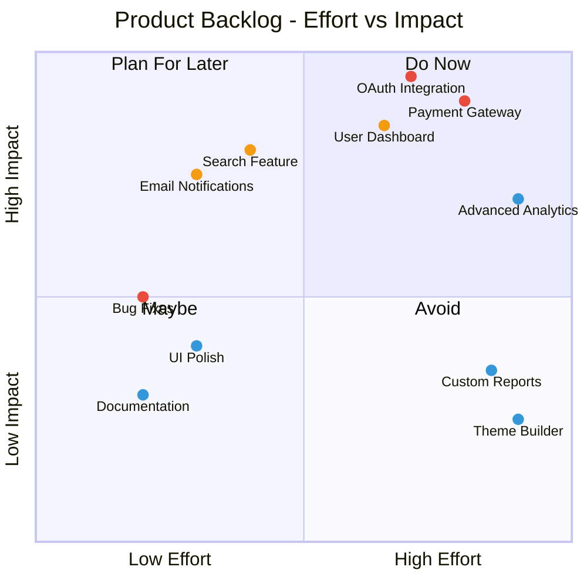
```mermaid
quadrantChart
    title Product Backlog - Effort vs Impact
    x-axis Low Effort --> High Effort
    y-axis Low Impact --> High Impact
    quadrant-1 Do Now
    quadrant-2 Plan For Later
    quadrant-3 Maybe
    quadrant-4 Avoid

    classDef p0 color: #e74c3c
    classDef p1 color: #f39c12
    classDef p2 color: #3498db

    OAuth Integration:::p0: [0.7, 0.95]
    Payment Gateway:::p0: [0.8, 0.9]
    User Dashboard:::p1: [0.65, 0.85]

    Search Feature:::p1: [0.4, 0.8]
    Email Notifications:::p1: [0.3, 0.75]
    Advanced Analytics:::p2: [0.9, 0.7]

    Bug Fixes:::p0: [0.2, 0.5]
    UI Polish:::p2: [0.3, 0.4]
    Documentation:::p2: [0.2, 0.3]

    Custom Reports:::p2: [0.85, 0.35]
    Theme Builder:::p2: [0.9, 0.25]
```

## Risk Assessment Example

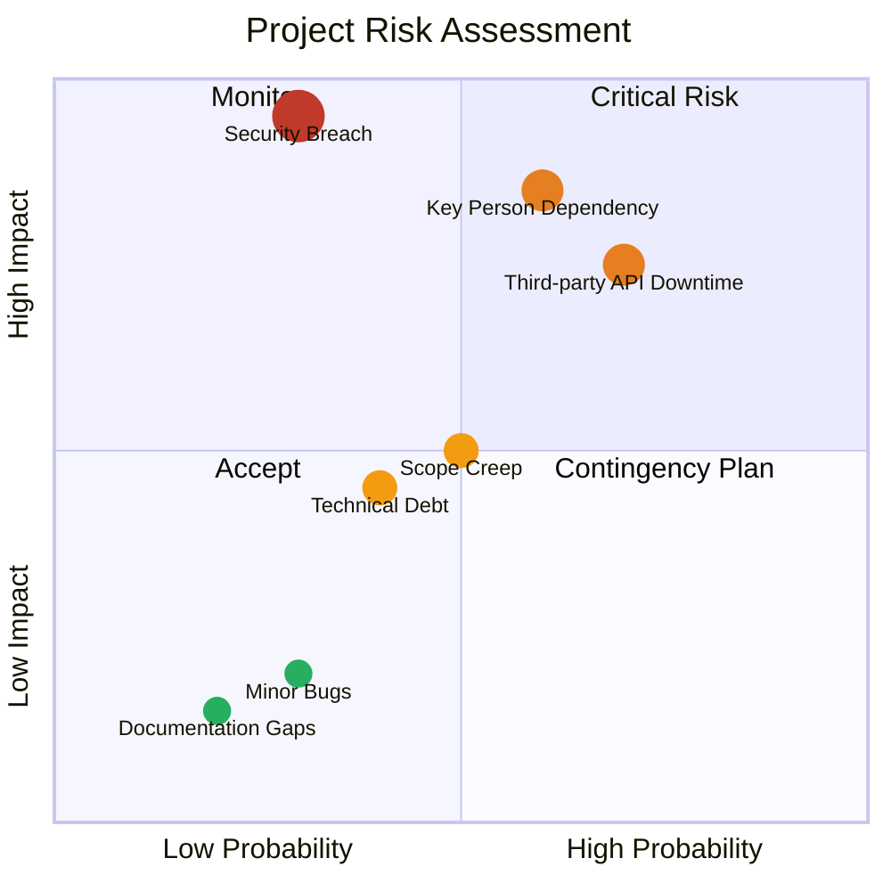
```mermaid
quadrantChart
    title Project Risk Assessment
    x-axis Low Probability --> High Probability
    y-axis Low Impact --> High Impact
    quadrant-1 Critical Risk
    quadrant-2 Monitor
    quadrant-3 Accept
    quadrant-4 Contingency Plan

    classDef critical color: #c0392b, radius: 15
    classDef high color: #e67e22, radius: 12
    classDef medium color: #f39c12, radius: 10
    classDef low color: #27ae60, radius: 8

    Security Breach:::critical: [0.3, 0.95]
    Key Person Dependency:::high: [0.6, 0.85]
    Third-party API Downtime:::high: [0.7, 0.75]

    Scope Creep:::medium: [0.5, 0.5]
    Technical Debt:::medium: [0.4, 0.45]

    Minor Bugs:::low: [0.3, 0.2]
    Documentation Gaps:::low: [0.2, 0.15]
```

## Competitive Analysis Example

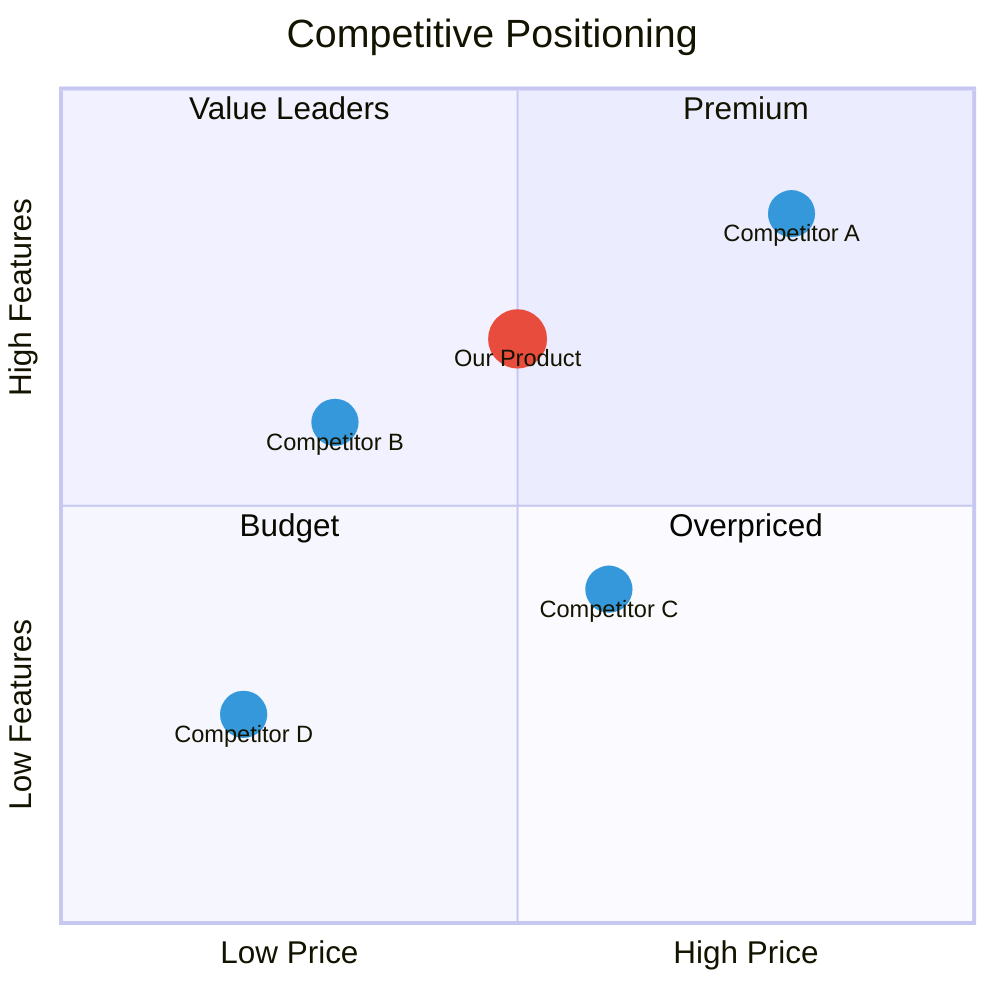
```mermaid
quadrantChart
    title Competitive Positioning
    x-axis Low Price --> High Price
    y-axis Low Features --> High Features
    quadrant-1 Premium
    quadrant-2 Value Leaders
    quadrant-3 Budget
    quadrant-4 Overpriced

    Our Product: [0.5, 0.7] color: #e74c3c, radius: 15
    Competitor A: [0.8, 0.85] color: #3498db, radius: 12
    Competitor B: [0.3, 0.6] color: #3498db, radius: 12
    Competitor C: [0.6, 0.4] color: #3498db, radius: 12
    Competitor D: [0.2, 0.25] color: #3498db, radius: 12
```

## Technical Debt Portfolio

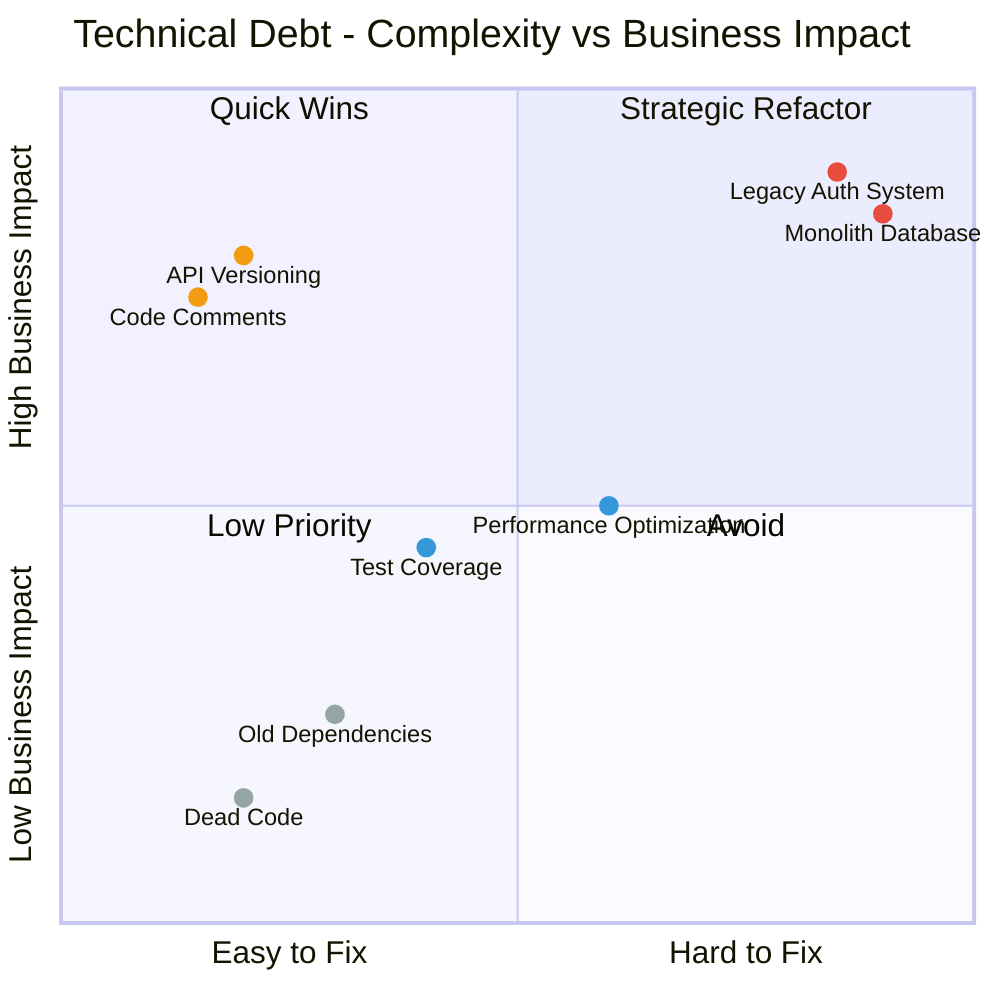
```mermaid
quadrantChart
    title Technical Debt - Complexity vs Business Impact
    x-axis Easy to Fix --> Hard to Fix
    y-axis Low Business Impact --> High Business Impact
    quadrant-1 Strategic Refactor
    quadrant-2 Quick Wins
    quadrant-3 Low Priority
    quadrant-4 Avoid

    Legacy Auth System: [0.85, 0.9] color: #e74c3c
    Monolith Database: [0.9, 0.85] color: #e74c3c
    API Versioning: [0.2, 0.8] color: #f39c12
    Code Comments: [0.15, 0.75] color: #f39c12

    Performance Optimization: [0.6, 0.5] color: #3498db
    Test Coverage: [0.4, 0.45] color: #3498db

    Old Dependencies: [0.3, 0.25] color: #95a5a6
    Dead Code: [0.2, 0.15] color: #95a5a6
```

## Skill Matrix Example

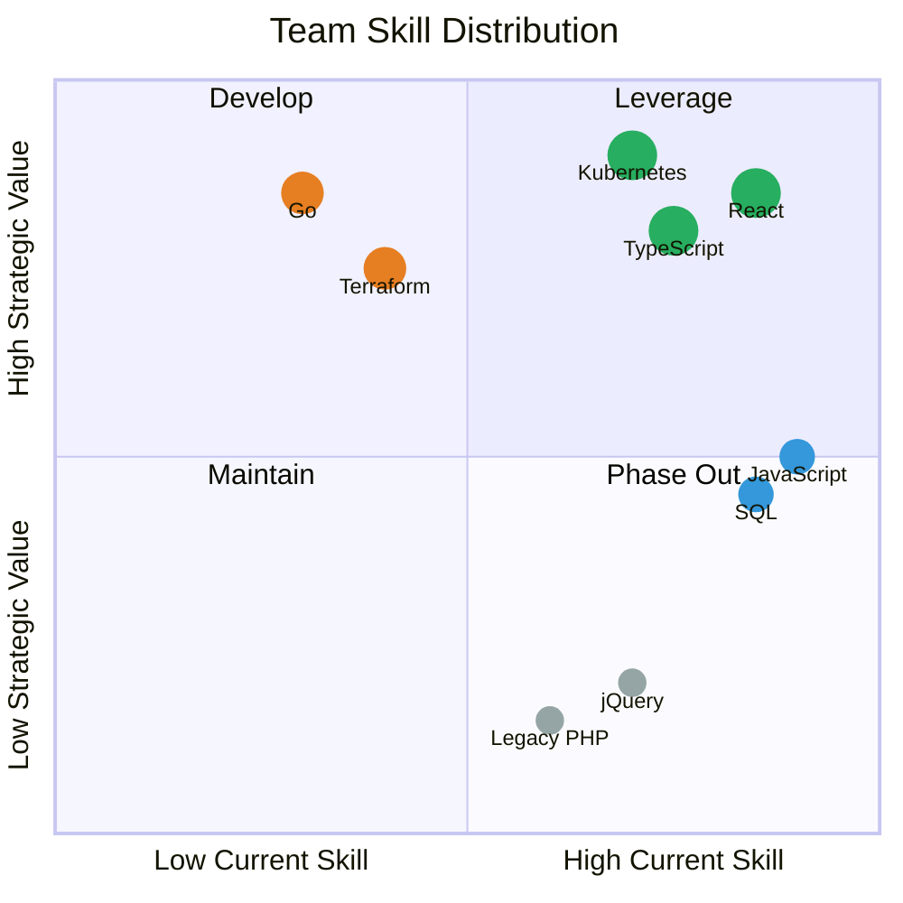
```mermaid
quadrantChart
    title Team Skill Distribution
    x-axis Low Current Skill --> High Current Skill
    y-axis Low Strategic Value --> High Strategic Value
    quadrant-1 Leverage
    quadrant-2 Develop
    quadrant-3 Maintain
    quadrant-4 Phase Out

    Kubernetes: [0.7, 0.9] color: #27ae60, radius: 14
    React: [0.85, 0.85] color: #27ae60, radius: 14
    TypeScript: [0.75, 0.8] color: #27ae60, radius: 14

    Go: [0.3, 0.85] color: #e67e22, radius: 12
    Terraform: [0.4, 0.75] color: #e67e22, radius: 12

    JavaScript: [0.9, 0.5] color: #3498db, radius: 10
    SQL: [0.85, 0.45] color: #3498db, radius: 10

    jQuery: [0.7, 0.2] color: #95a5a6, radius: 8
    Legacy PHP: [0.6, 0.15] color: #95a5a6, radius: 8
```

## Feature Request Analysis

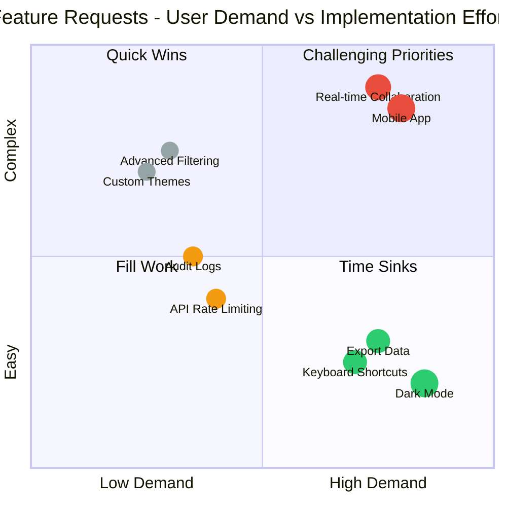
```mermaid
quadrantChart
    title Feature Requests - User Demand vs Implementation Effort
    x-axis Low Demand --> High Demand
    y-axis Easy --> Complex
    quadrant-1 Challenging Priorities
    quadrant-2 Quick Wins
    quadrant-3 Fill Work
    quadrant-4 Time Sinks

    Dark Mode: [0.85, 0.2] color: #2ecc71, radius: 14
    Export Data: [0.75, 0.3] color: #2ecc71, radius: 12
    Keyboard Shortcuts: [0.7, 0.25] color: #2ecc71, radius: 12

    Mobile App: [0.8, 0.85] color: #e74c3c, radius: 14
    Real-time Collaboration: [0.75, 0.9] color: #e74c3c, radius: 13

    API Rate Limiting: [0.4, 0.4] color: #f39c12, radius: 10
    Audit Logs: [0.35, 0.5] color: #f39c12, radius: 10

    Custom Themes: [0.25, 0.7] color: #95a5a6, radius: 9
    Advanced Filtering: [0.3, 0.75] color: #95a5a6, radius: 9
```

## Configuration Options

### Chart Dimensions
```javascript
%%{init: {'theme':'base', 'themeVariables': {
    'quadrant': {
        'chartWidth': 800,
        'chartHeight': 600
    }
}}}%%
```

### Point Appearance
```javascript
%%{init: {'theme':'base', 'themeVariables': {
    'quadrant': {
        'pointRadius': 8,
        'quadrantPointFill': '#3498db'
    }
}}}%%
```

### Axis Positioning
```javascript
%%{init: {'theme':'base', 'themeVariables': {
    'quadrant': {
        'xAxisPosition': 0.5,
        'yAxisPosition': 0.5
    }
}}}%%
```

### Quadrant Colors
```javascript
%%{init: {'theme':'base', 'themeVariables': {
    'quadrant': {
        'quadrant1Fill': '#f8f9fa',
        'quadrant2Fill': '#e9ecef',
        'quadrant3Fill': '#dee2e6',
        'quadrant4Fill': '#ced4da'
    }
}}}%%
```

## Tips for Effective Quadrant Charts

1. **Choose meaningful axes** - Both dimensions should be independent and relevant
2. **Label quadrants clearly** - Descriptive labels help interpretation
3. **Use size for emphasis** - Larger points draw attention to critical items
4. **Color by category** - Group related items with consistent colors
5. **Avoid overcrowding** - Too many points reduce readability (max 15-20)
6. **Position strategically** - Place items accurately based on actual assessment
7. **Add context with title** - Clear title explains the evaluation criteria

## Common Use Cases

### Strategic Planning
- Portfolio management
- Feature prioritization
- Investment decisions

### Risk Management
- Risk matrices
- Threat assessment
- Mitigation prioritization

### Resource Allocation
- Project prioritization
- Skill development planning
- Budget allocation

### Product Management
- Backlog prioritization
- Feature value assessment
- Technical debt evaluation
