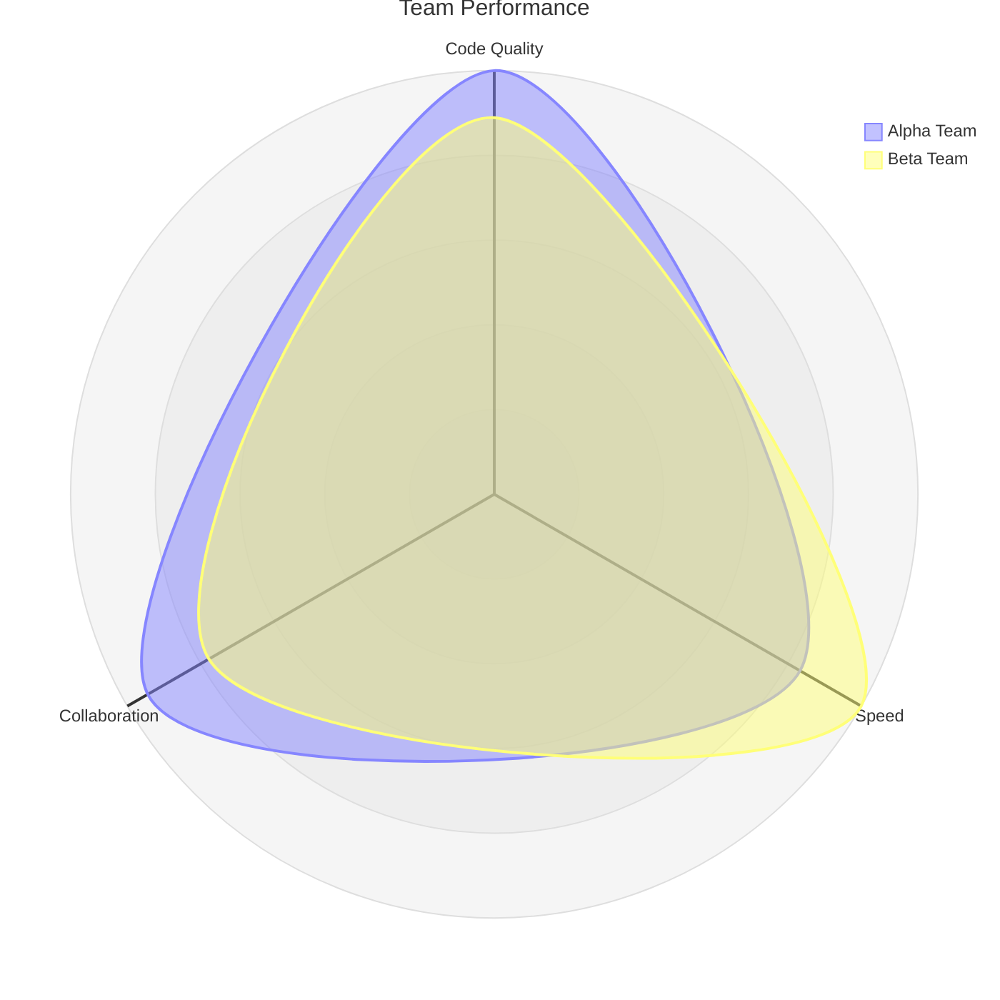

# Radar Charts

Radar charts (also called spider charts or web charts) visualize multi-dimensional data with multiple axes radiating from a center point. They're useful for comparing multiple entities across the same set of metrics.

## Basic Syntax


## Axis Definition

### Simple Axis Labels


### Axis with Custom IDs and Labels


## Data Curves

### Sequential Values

Provide values in the same order as axes:


### Key-Value Mapping

Explicitly map values to specific axes:



## Display Configuration

### Legend and Scale


### Graticule Type and Ticks


**Options:**
- `graticule`: `circle` (default) or `polygon`
- `ticks`: Number of concentric divisions (default: 5)

## Size and Margin


## Advanced Styling

### Axis Scaling


### Curve Tension

Adjust smoothness of curves:


## Theme Customization

Radar charts support theme variables for customization:

```javascript
%%{
  init: {
    'themeVariables': {
      'cScale0': '#ff6384',
      'cScale1': '#36a2eb',
      'cScale2': '#ffce56',
      'axisColor': '#666',
      'axisStrokeWidth': '2',
      'curveOpacity': '0.3',
      'graticuleColor': '#ccc'
    }
  }
}%%
```

**Available theme variables:**
- `cScale0` to `cScale12`: Curve colors
- `axisColor`: Axis line color
- `axisStrokeWidth`: Thickness of axis lines
- `curveOpacity`: Transparency of curve fill
- `curveStrokeWidth`: Thickness of curve outline
- `graticuleColor`: Background grid color
- `graticuleStrokeWidth`: Grid line thickness

## Use Cases in Software Development

### Team Skill Gap Analysis

Compare team members' proficiency across technical areas to identify training needs:


### Architecture Quality Evaluation

Assess different service architectures against quality attributes:


### Sprint Health Metrics

Track agile team health across multiple dimensions:


### Technology Stack Comparison

Evaluate competing technology stacks for a project:


### Code Quality Dashboard

Monitor multiple quality metrics across services:


### Security Posture Assessment

Compare security metrics across different environments:


## Tips for Effective Radar Charts

1. **Limit axes to 5-7** - Too many dimensions make the chart hard to read
2. **Use consistent scales** - Ensure all axes use the same scale range
3. **Compare 2-4 entities** - More curves create visual clutter
4. **Normalize data** - Convert different units to a common scale (e.g., 0-100)
5. **Order axes logically** - Group related metrics together
6. **Label clearly** - Use descriptive axis names
7. **Show legend** - Enable `showLegend: true` when comparing multiple curves
8. **Consider polygon graticule** - Works well for symmetrical data
