# Sankey Diagrams

Sankey diagrams visualize flow and quantity distribution through a system. Width of arrows represents magnitude, making them ideal for resource flow, data pipelines, and budget allocation visualization.

## Basic Syntax

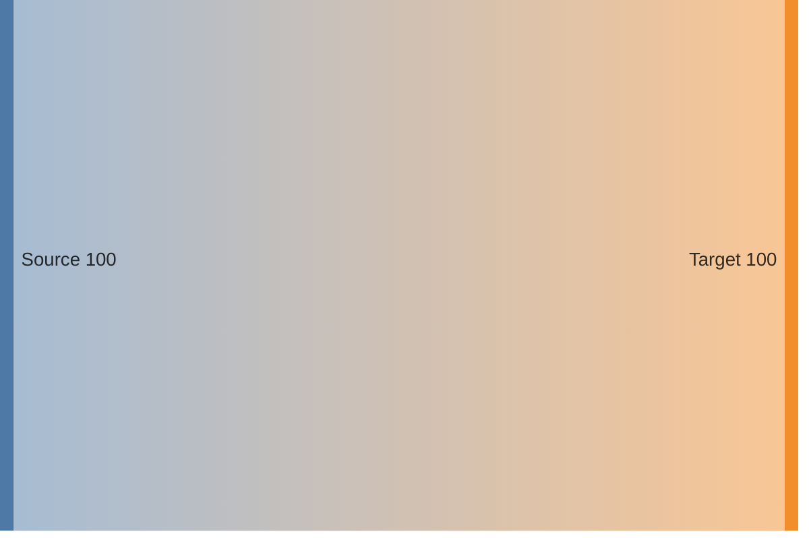

## CSV Format

Sankey diagrams use CSV format: `source,target,value`

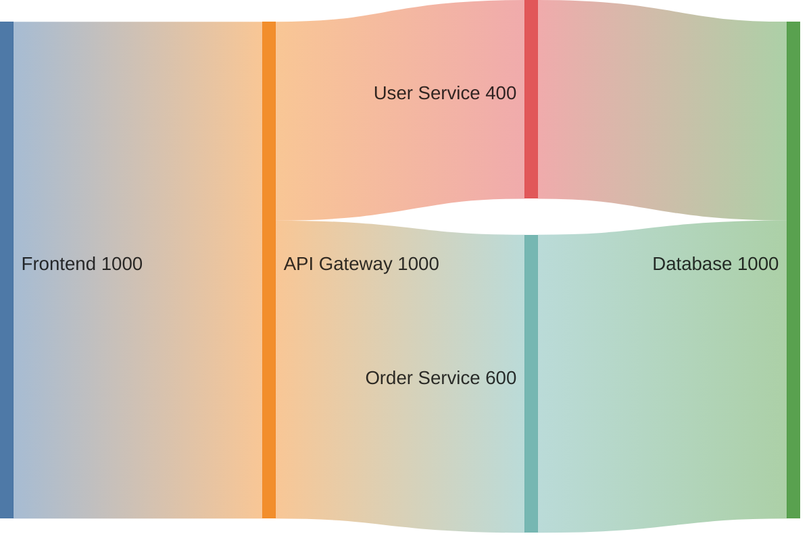

## Handling Commas and Quotes

**Values with commas:**
```mermaid
sankey-beta
    "Source, with comma",Target,150
    Another Source,"Target, with comma",200
```

**Escaping quotes:**
```mermaid
sankey-beta
    "Node with ""quotes""",Target,100
```

## Multiple Flows

Create complex flow networks:

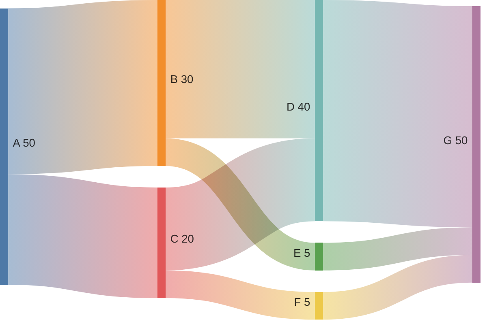

## Readable Formatting

Use blank lines to group related flows:

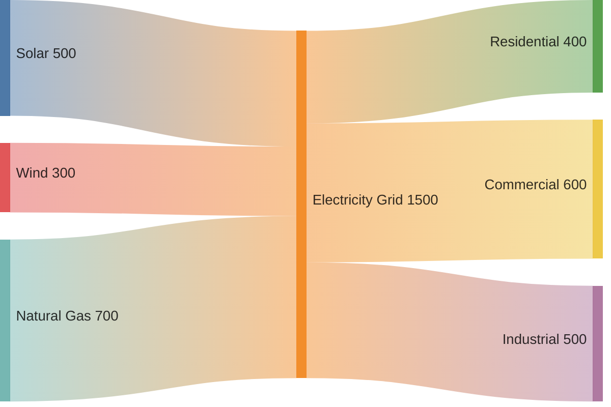

## Link Colors

### Source Color
Links inherit color from source node:

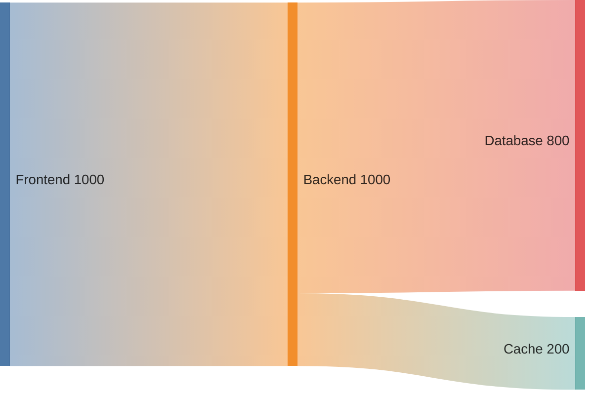

### Target Color
Links inherit color from target node:


### Gradient
Links use gradient from source to target:


### Custom Color
Set specific hex color:


## Node Alignment

### Justify (Default)
Nodes spread across full width:

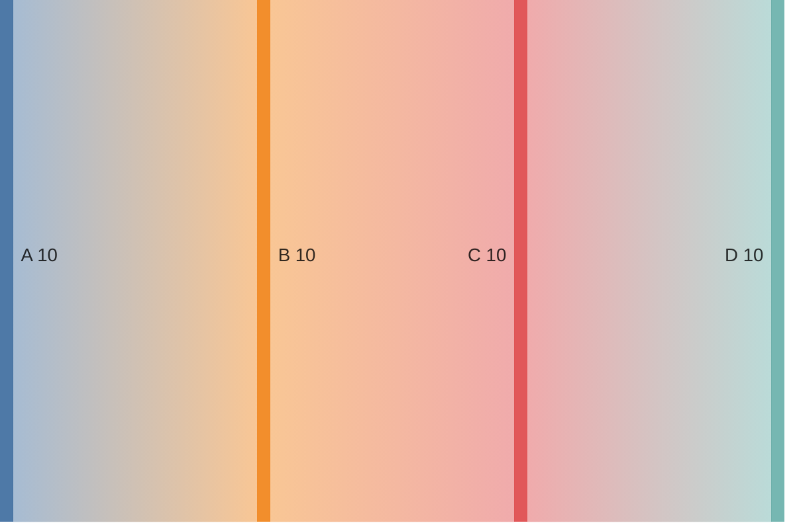

### Left Alignment
All nodes aligned to left:


### Center Alignment
Nodes centered:


### Right Alignment
All nodes aligned to right:


## Comprehensive Example: Data Pipeline

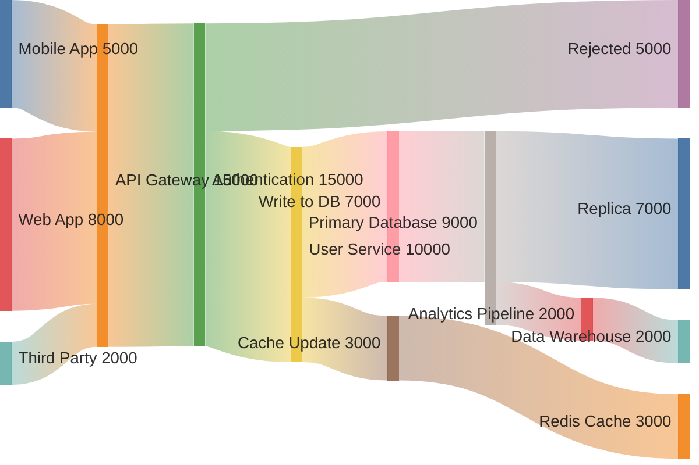

## Budget Allocation Example

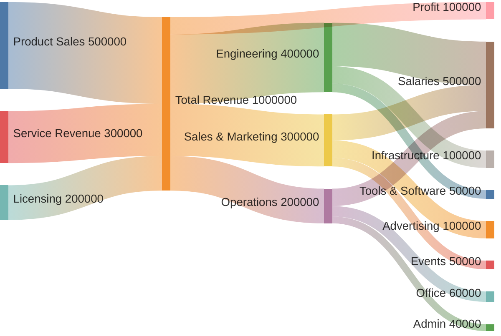

## Energy Flow Example

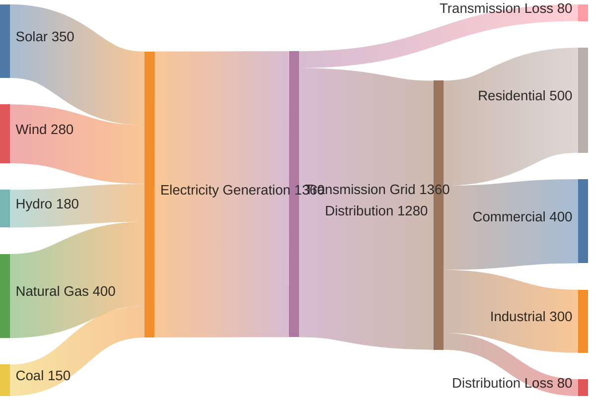

## Traffic Flow Example

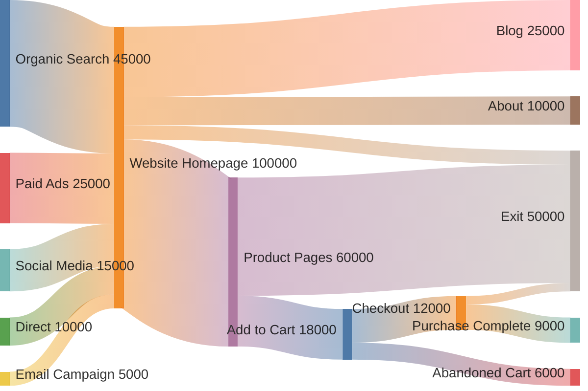

## Microservices Communication Example

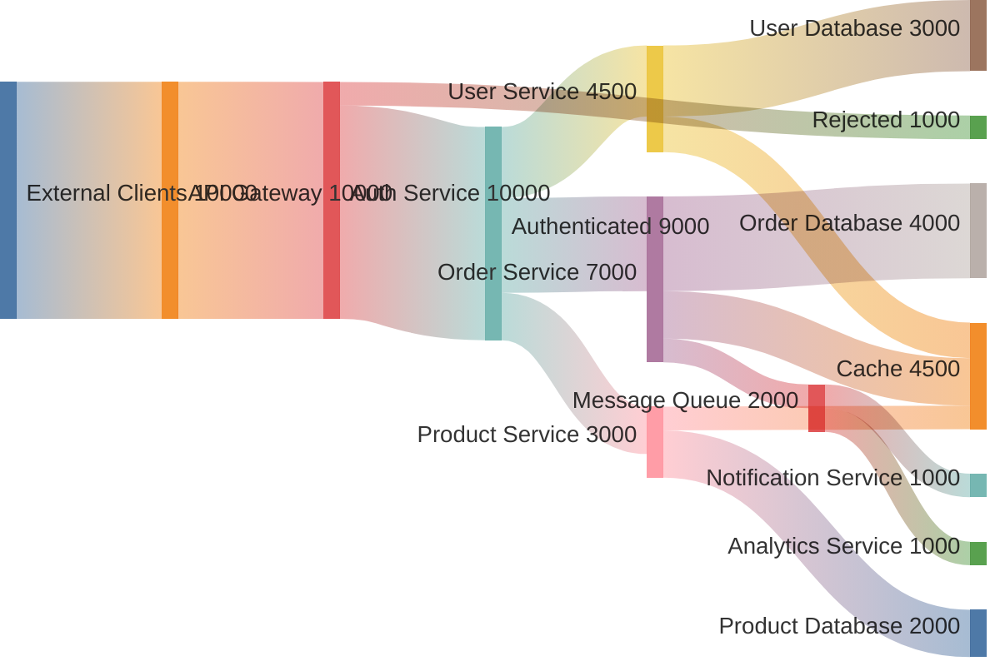

## Tips for Effective Sankey Diagrams

1. **Use consistent units** - All values should represent the same measurement
2. **Group related flows** - Use blank lines to improve readability
3. **Choose appropriate alignment** - Justify for process flows, left/right for hierarchies
4. **Color strategically** - Gradient shows transformation, source/target shows ownership
5. **Show conservation** - Total input should equal total output (unless showing loss)
6. **Label clearly** - Node names should be descriptive and consistent
7. **Aggregate small flows** - Too many thin flows create visual clutter

## Common Use Cases

### Resource Management
- Budget allocation and spending
- Energy production and consumption
- Material flow in manufacturing

### Data Analytics
- User journey through website
- Data pipeline processing volumes
- Customer funnel conversion

### System Monitoring
- Network traffic distribution
- API request routing
- Service communication patterns
