# State Diagrams

State diagrams visualize state machines, showing how systems transition between states based on events. Useful for modeling workflows, protocols, and application states.

## Basic Syntax

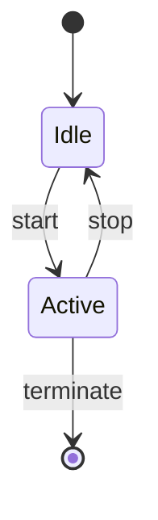

## States and Transitions

### Simple States

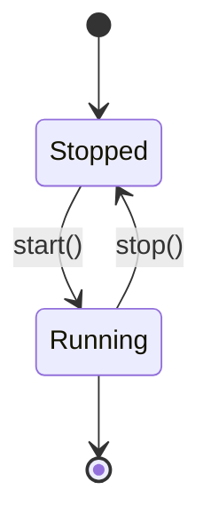

### States with Descriptions

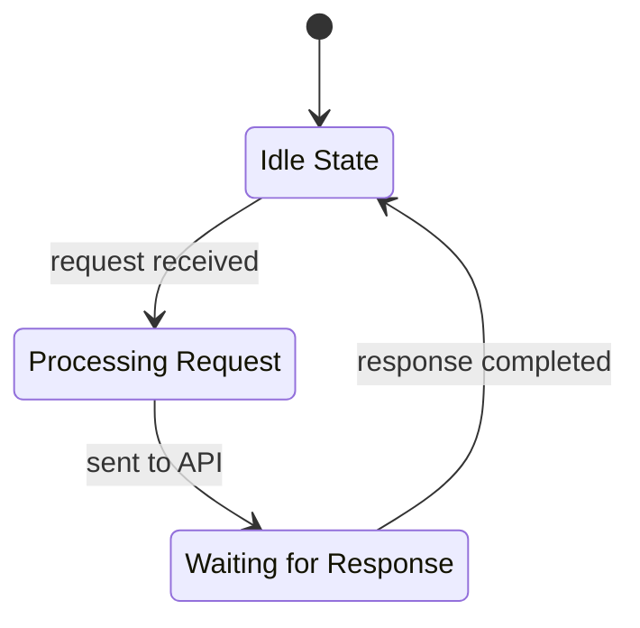

### Labeled Transitions

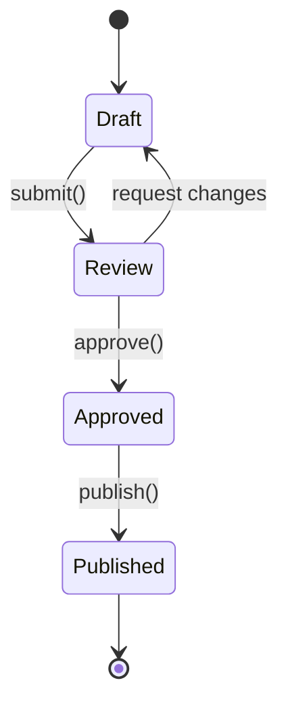

## Composite States

### Nested States

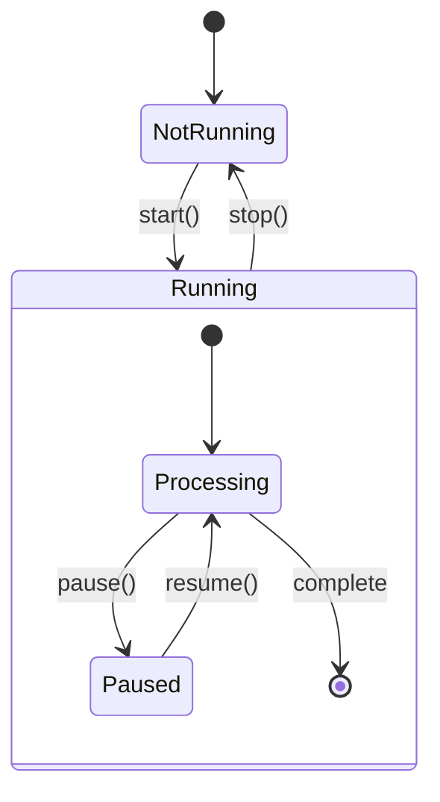

### Multi-Level Nesting

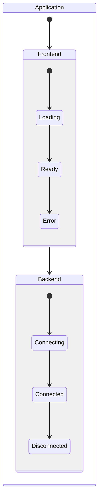

## Choice States

Conditional branching based on conditions:

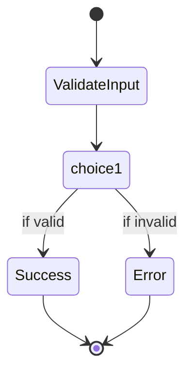

## Fork and Join States

### Parallel Execution (Fork)

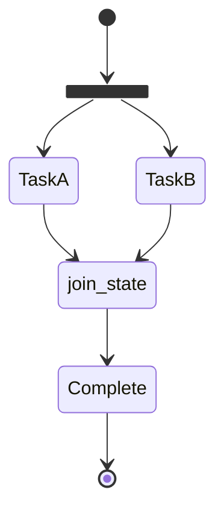

### Build Pipeline Example

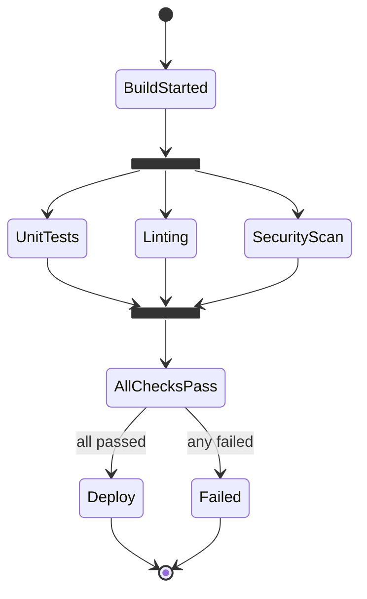

## Concurrent States

Parallel states using `--` separator:

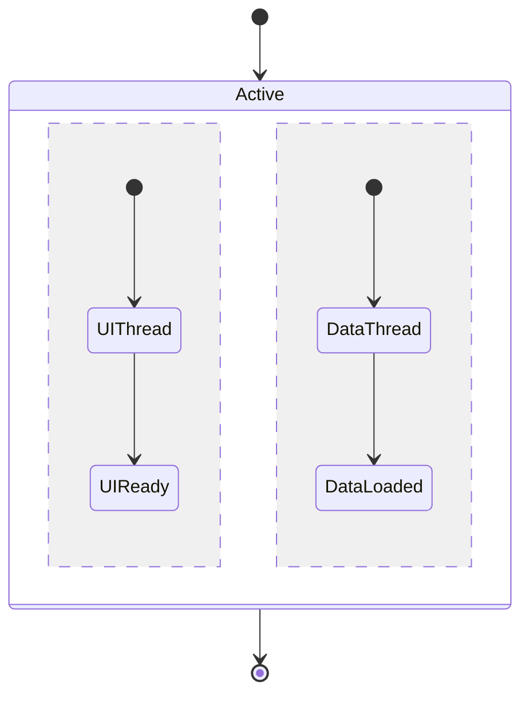

## Notes

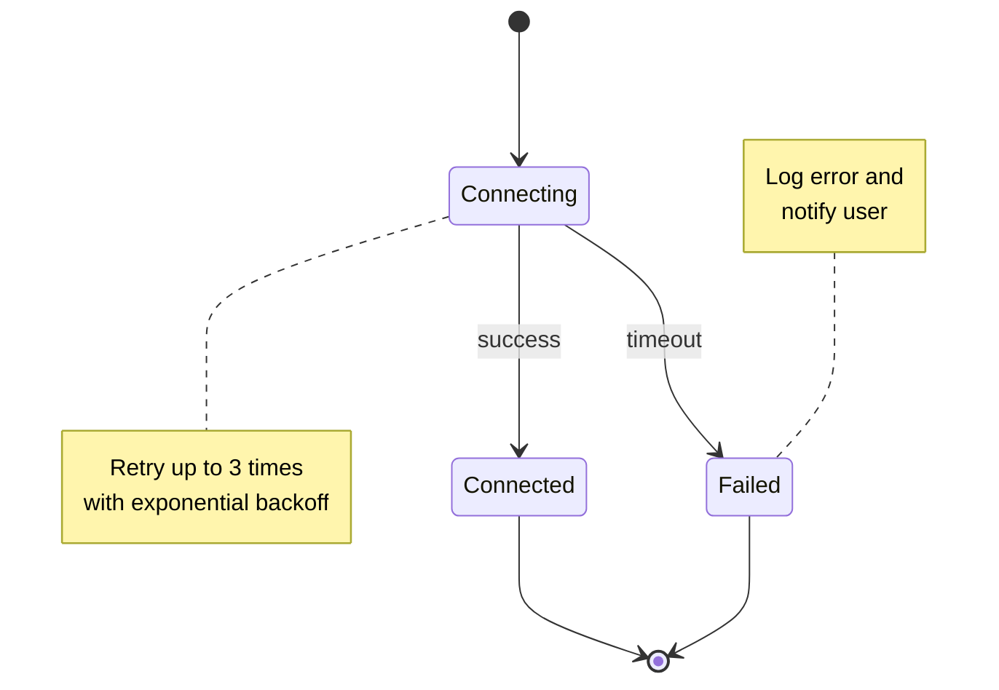

## Direction

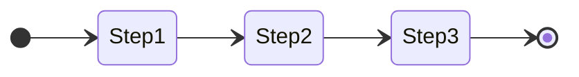

## Styling

### Class-Based Styling

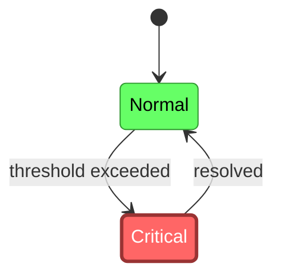

### Inline Styling

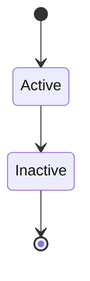

## Use Cases

### API Request Lifecycle

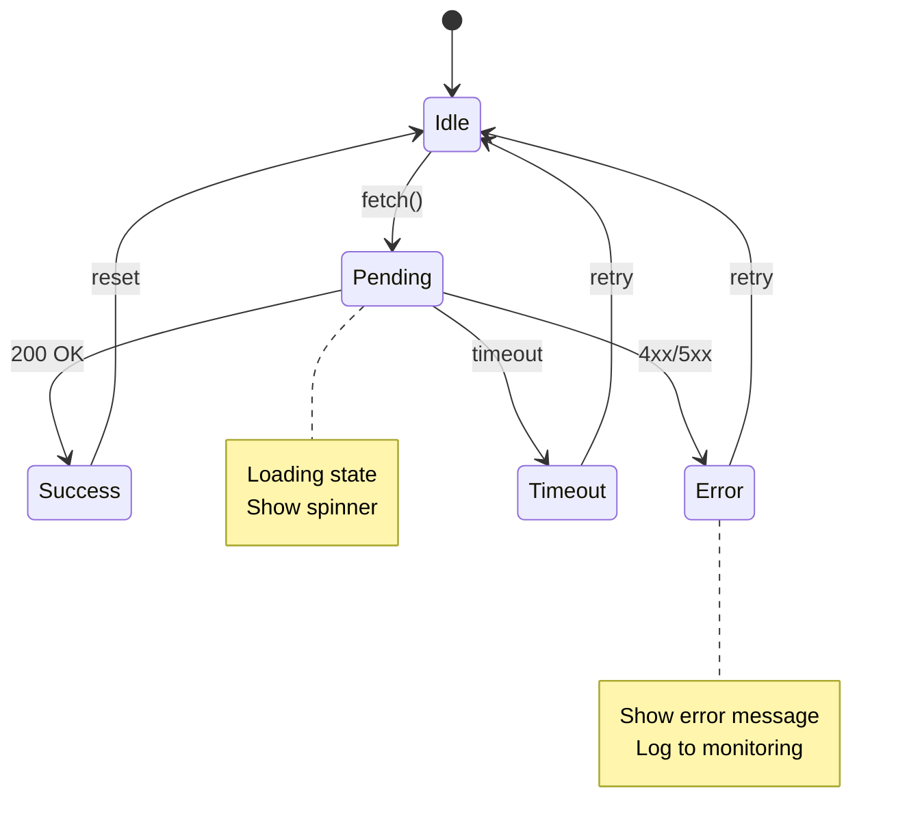

### User Authentication Flow

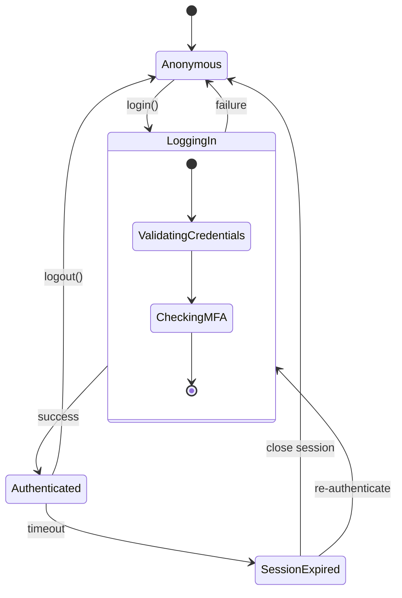

### Order Processing Workflow

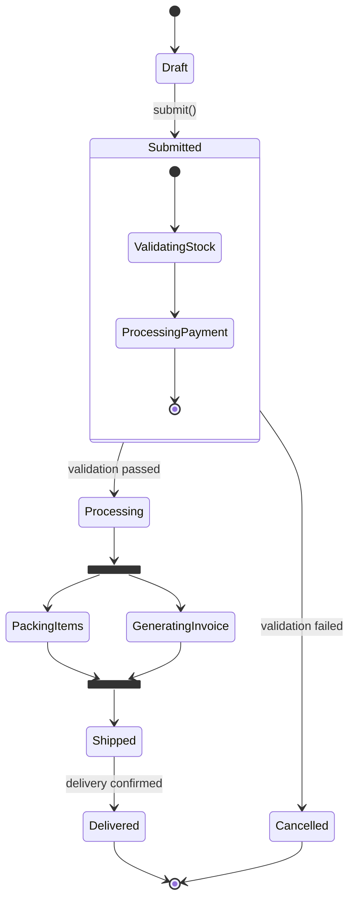

### WebSocket Connection States

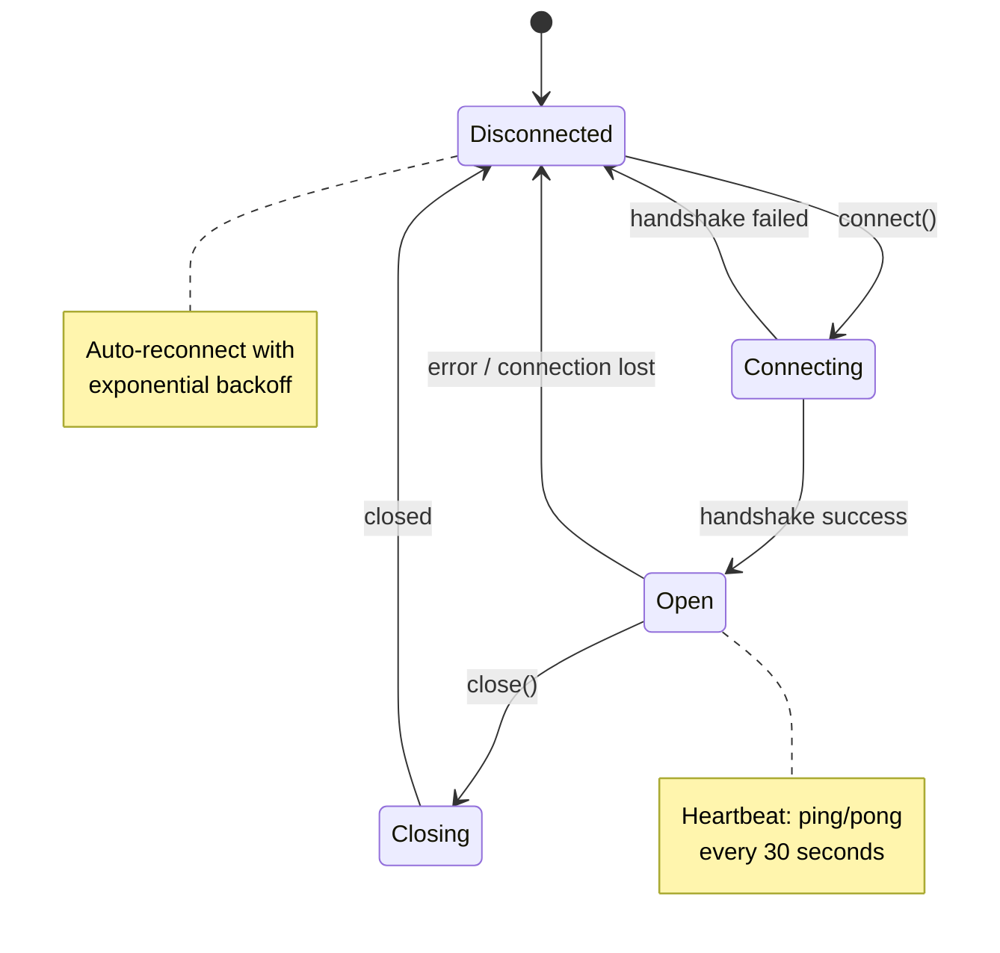

## Tips for Effective State Diagrams

1. **Start and end states** - Always include `[*]` for clarity
2. **Meaningful state names** - Use domain-specific terminology
3. **Label transitions** - Show events/conditions that trigger changes
4. **Use composite states** - Group related states to reduce complexity
5. **Document edge cases** - Use notes for error handling and timeouts
6. **Parallel states** - Use fork/join for concurrent operations
7. **Choice states** - Explicitly model conditional logic
