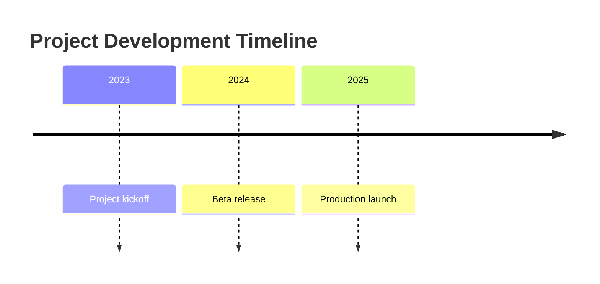
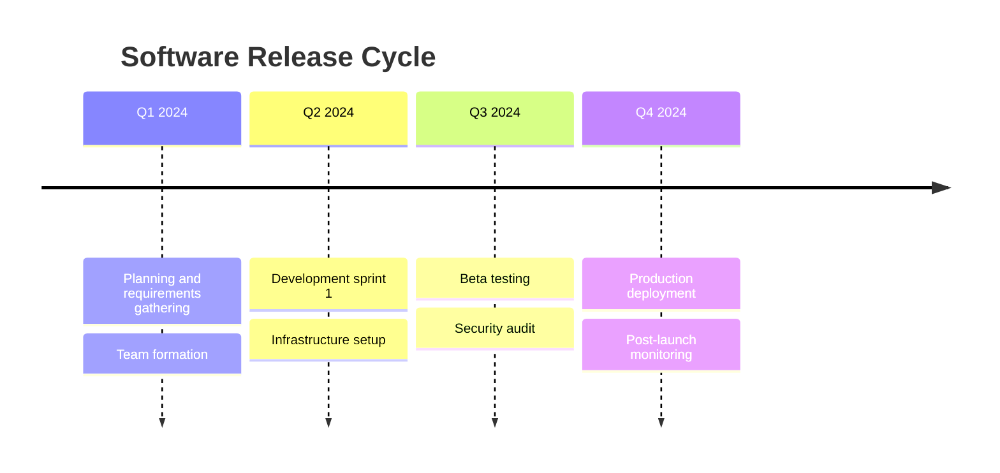
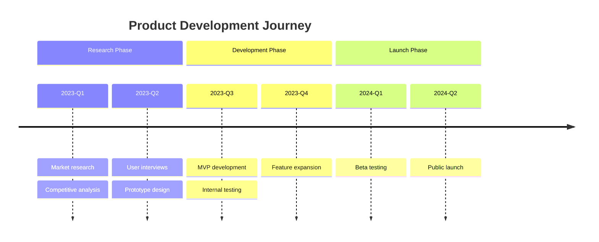
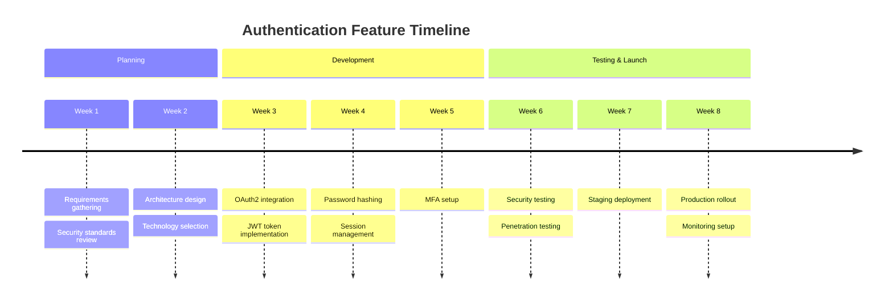
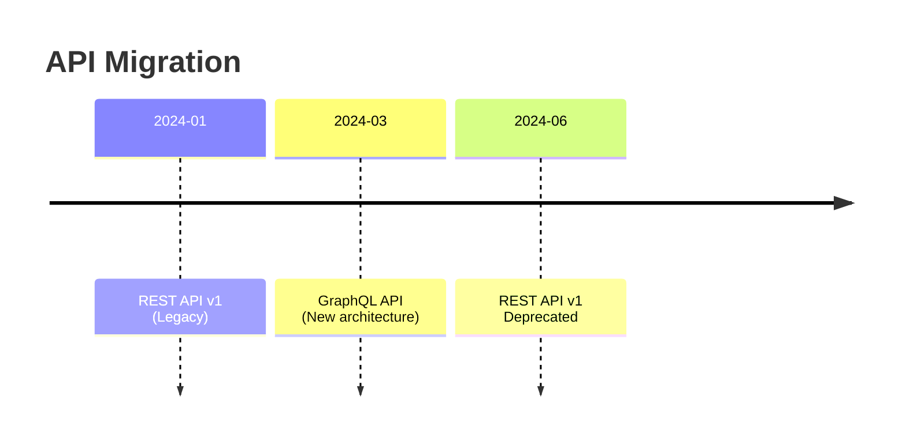
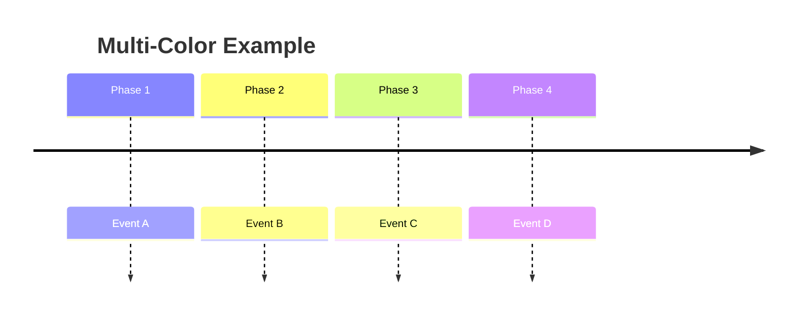
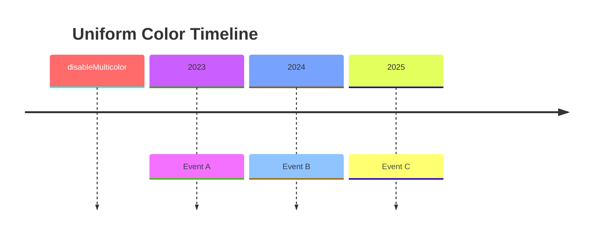
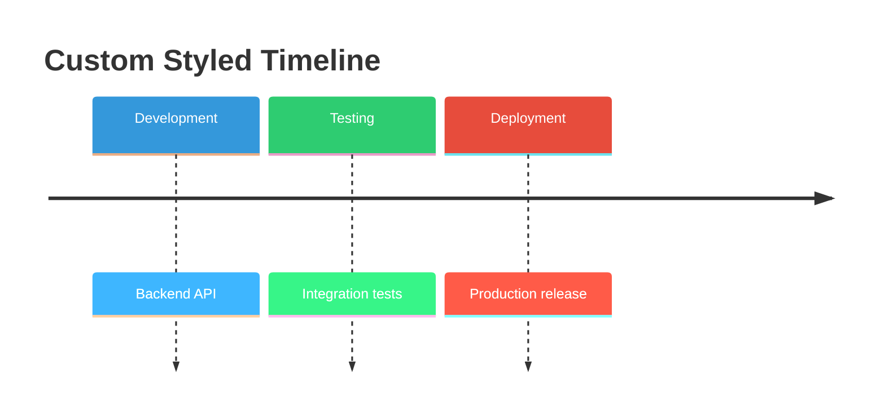
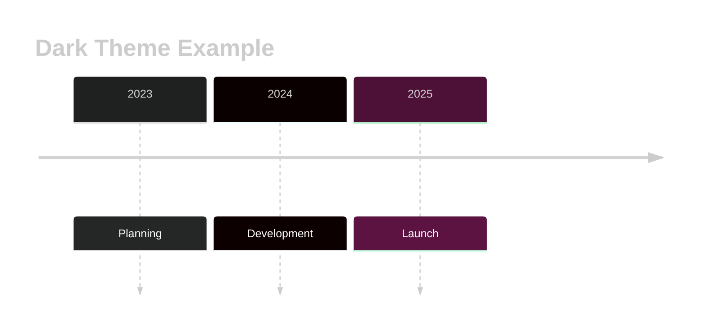

# Timeline Diagrams

Timeline diagrams visualize events across time periods. They help track project milestones, historical events, and roadmap phases in a clear chronological format.

## Basic Syntax

## Time Periods and Events

Each event is associated with a time period:

**Syntax:**
- `{time period} : {event}` - Single event
- Multiple events can be added with additional `:` or on new lines with leading `:`

## Sections

Group related time periods into sections:

## Real-World Example: Feature Development

## Text Formatting

Force line breaks with ` `:

## Styling

### Multi-Color Mode (Default)

Each time period automatically gets a different color:

### Uniform Color Mode

Disable multi-color for consistent appearance:

### Custom Colors

**Available custom variables:**
- `cScale0` to `cScale11` - Background colors for time periods
- `cScaleLabel0` to `cScaleLabel11` - Text colors for labels

## Themes

**Available themes:** `base`, `forest`, `dark`, `default`, `neutral`

## Use Cases

1. **Project Roadmaps** - Visualize quarterly or annual plans
2. **Sprint Planning** - Show sprint milestones and deliverables
3. **Release Schedules** - Track feature releases over time
4. **Migration Projects** - Display phased migration steps
5. **Team Onboarding** - Outline onboarding phases
6. **Technical Debt Reduction** - Plan incremental improvements
7. **API Versioning** - Show version lifecycle (active, deprecated, sunset)

## Tips for Effective Timelines

1. **Keep time periods consistent** - Use the same granularity (weeks, months, quarters)
2. **Group related events** - Use sections to organize complex timelines
3. **Limit events per period** - 2-4 events per time period for readability
4. **Use descriptive labels** - Clear, action-oriented event descriptions
5. **Include context** - Add section headers to explain phases
6. **Consider audience** - Adjust detail level based on stakeholders
