# Treemap Diagrams

Treemap diagrams visualize hierarchical data as nested rectangles, where each node's size represents a quantitative value. They're excellent for showing proportional relationships within hierarchies.

## Basic Syntax

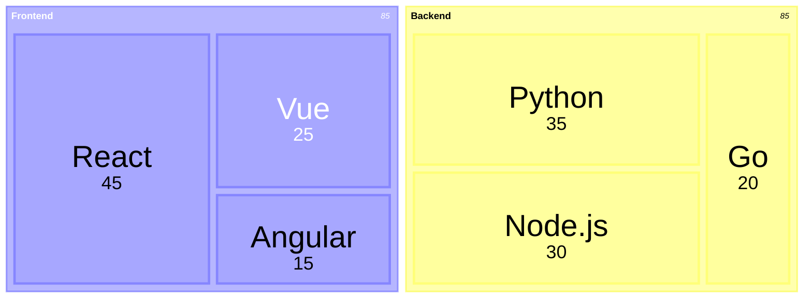

## Node Types

### Section/Parent Nodes

Section nodes group child nodes but have no value themselves:

```mermaid
treemap-beta
    "Web Application"
        "Client Side"
        "Server Side"
```

### Leaf Nodes

Leaf nodes have numeric values that determine their size:

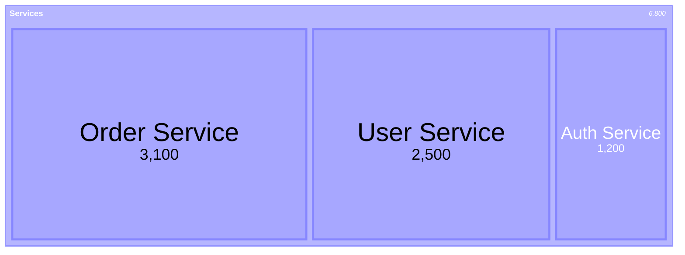

## Hierarchy with Indentation

Define hierarchy using spaces or tabs:

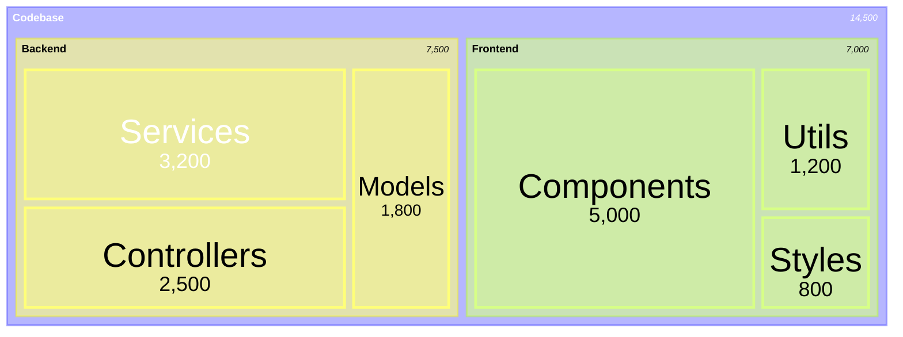

## Use Cases in Software Development

### Codebase Size Analysis

Visualize lines of code or file count across modules:

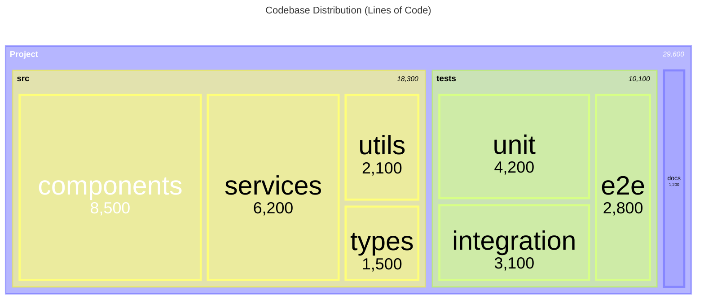

### Bundle Size Breakdown

Show JavaScript bundle composition:

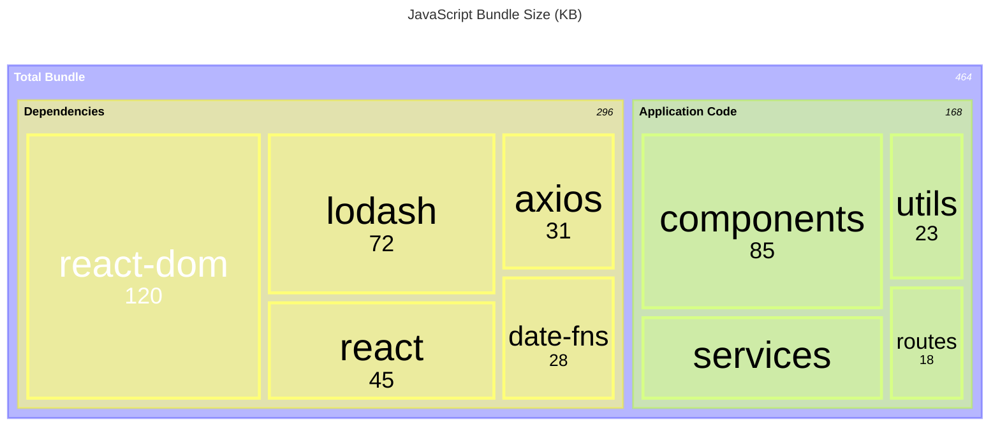

### API Request Distribution

Visualize API endpoint usage:

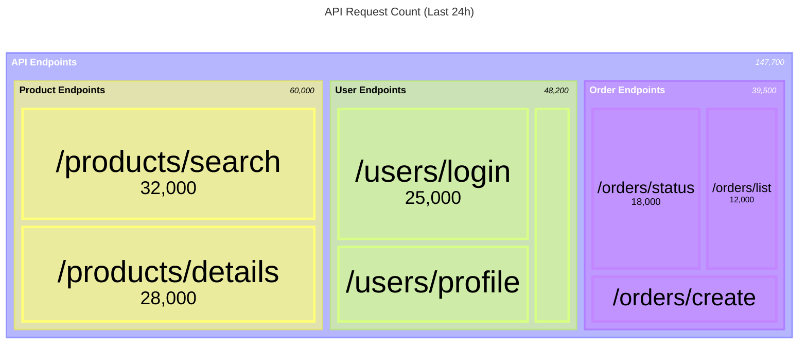

### Resource Allocation

Show cloud resource usage or cost:

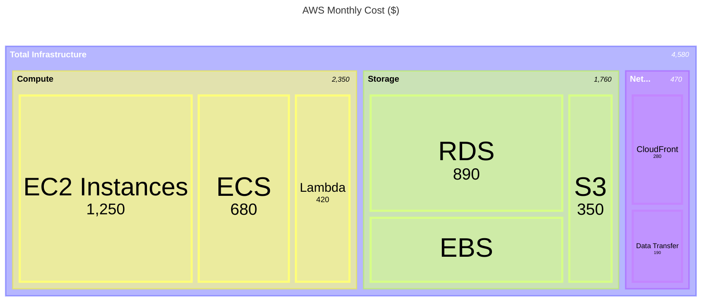

### Test Coverage

Visualize test coverage by module:

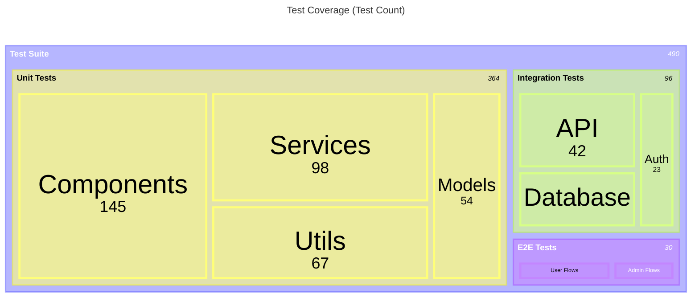

### Error Rate by Service

Monitor error distribution across microservices:

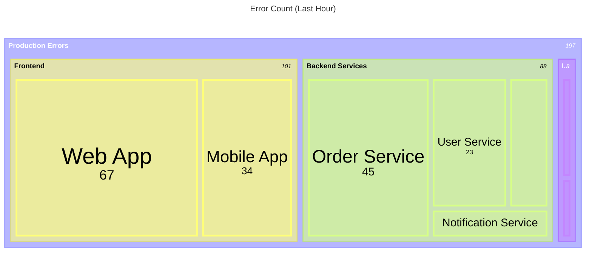

### Technical Debt

Quantify technical debt by category:

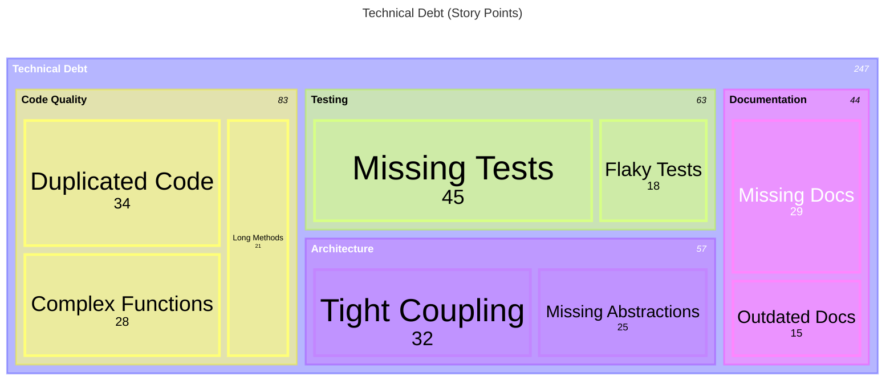

### Memory Usage by Component

Show runtime memory allocation:

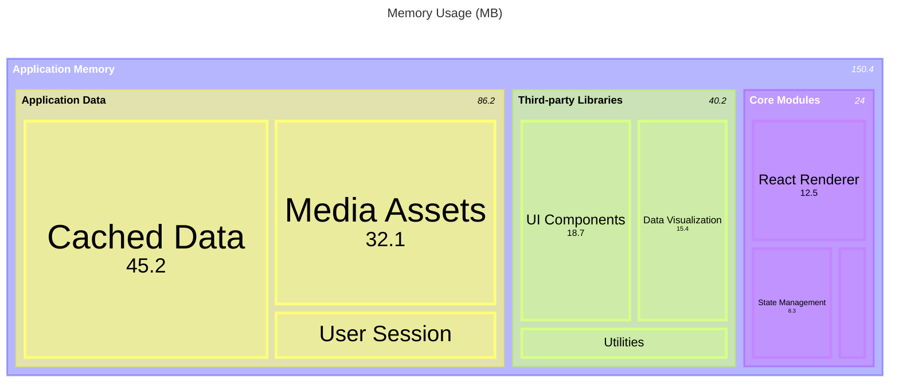

### Team Velocity

Compare team productivity across sprints:

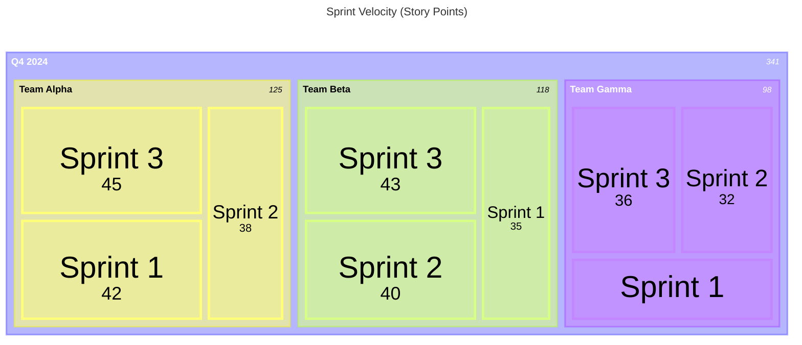

### Database Table Size

Visualize database storage usage:

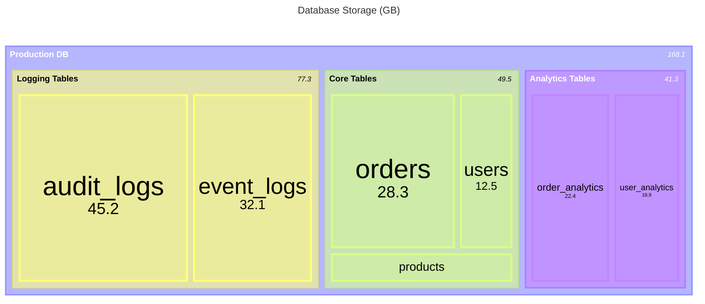

## Styling

### Custom Classes

Apply custom styles to specific nodes:

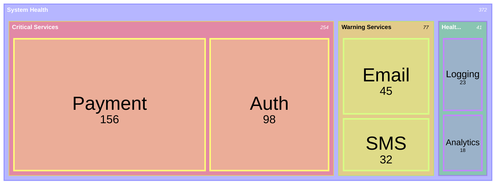

## Configuration

### Scale and Padding

```javascript
%%{
  init: {
    'treemap': {
      'useMaxWidth': true,
      'padding': 15,
      'diagramPadding': 10
    }
  }
}%%
```

**Options:**
- `useMaxWidth`: Scale to container width (default: `true`)
- `padding`: Internal padding between nodes (default: `10`)
- `diagramPadding`: Outer padding around diagram (default: `8`)

### Value Display

```javascript
%%{
  init: {
    'treemap': {
      'showValues': true,
      'valueFontSize': '14px',
      'labelFontSize': '16px'
    }
  }
}%%
```

**Options:**
- `showValues`: Display numeric values (default: `true`)
- `valueFontSize`: Font size for values
- `labelFontSize`: Font size for labels

### Value Formatting

Use D3 format specifiers for value display:

```javascript
%%{
  init: {
    'treemap': {
      'valueFormat': ',.2f'
    }
  }
}%%
```

**Common format specifiers:**
- `,` - Thousands separator: `1,234`
- `$,.2f` - Currency: `$1,234.56`
- `.1%` - Percentage: `45.2%`
- `.2s` - SI prefix: `1.23k`, `4.56M`

Example with currency formatting:

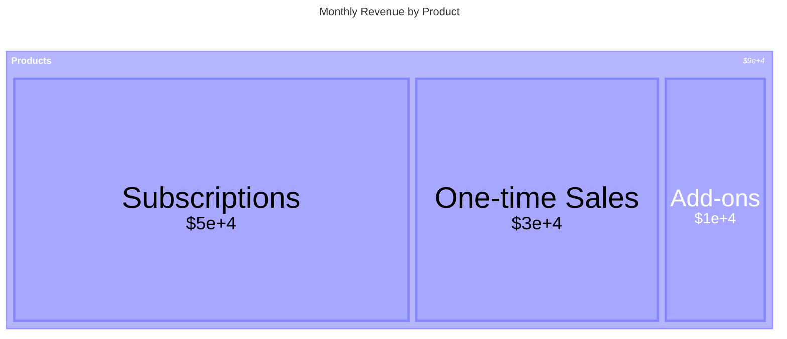

## Tips for Effective Treemap Diagrams

1. **Use meaningful values** - Values should represent the metric being analyzed (LOC, bytes, count, cost)
2. **Limit depth to 2-3 levels** - Deep hierarchies become hard to read
3. **Keep node count reasonable** - Too many small rectangles create clutter
4. **Use consistent units** - All leaf nodes should use the same unit of measurement
5. **Add titles** - Use `title` keyword to clarify what the treemap represents
6. **Color code by category** - Use custom classes to highlight different types of nodes
7. **Format large numbers** - Use D3 format specifiers for readability
8. **Group small items** - Combine tiny values into an "Other" category
9. **Compare similar data** - Multiple treemaps side-by-side work well for before/after comparisons
10. **Label clearly** - Ensure labels are descriptive enough without needing external context

## Comparison with Other Diagrams

| Use Treemap When | Use Instead When |
|-----------------|------------------|
| Showing proportional size within hierarchy | **Pie Chart**: Flat data, few categories |
| Comparing many items at once | **Bar Chart**: Emphasizing precise values |
| Visualizing nested part-to-whole relationships | **Sunburst**: Emphasizing hierarchical depth |
| Space efficiency is important | **Tree Diagram**: Showing connections/flow |

## Common Anti-patterns

❌ **Too many small nodes** - Below 1-2% of total, nodes become unreadable
❌ **Mixed units** - Combining different metrics in one treemap
❌ **Deep hierarchies** - More than 3 levels reduce clarity
❌ **No value differentiation** - All equal values produce a grid, not insights
❌ **Unlabeled sections** - Missing context makes data meaningless

## Advanced Example

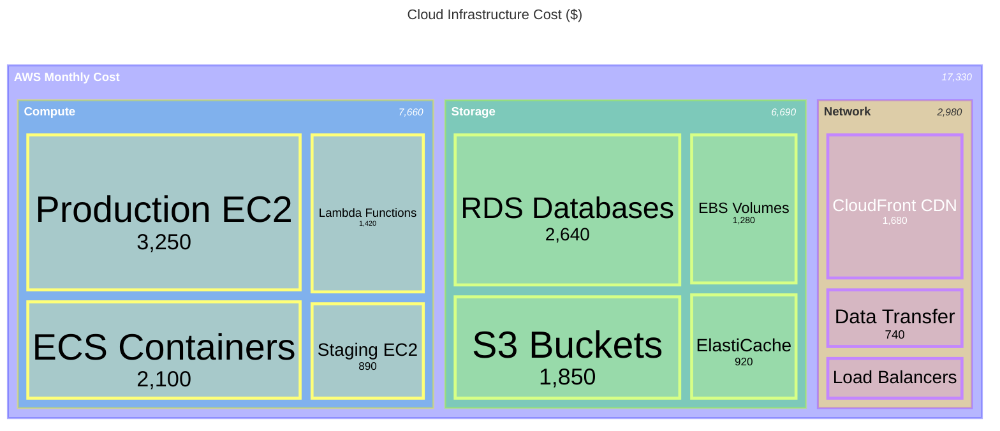

This produces a visually organized, color-coded breakdown of cloud costs with proper formatting and clear visual hierarchy.
