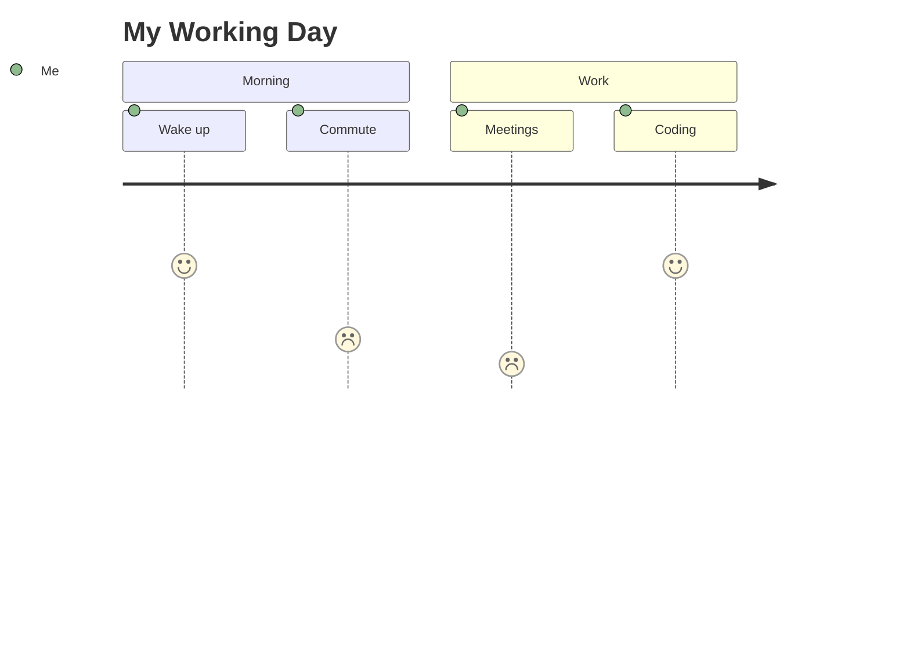
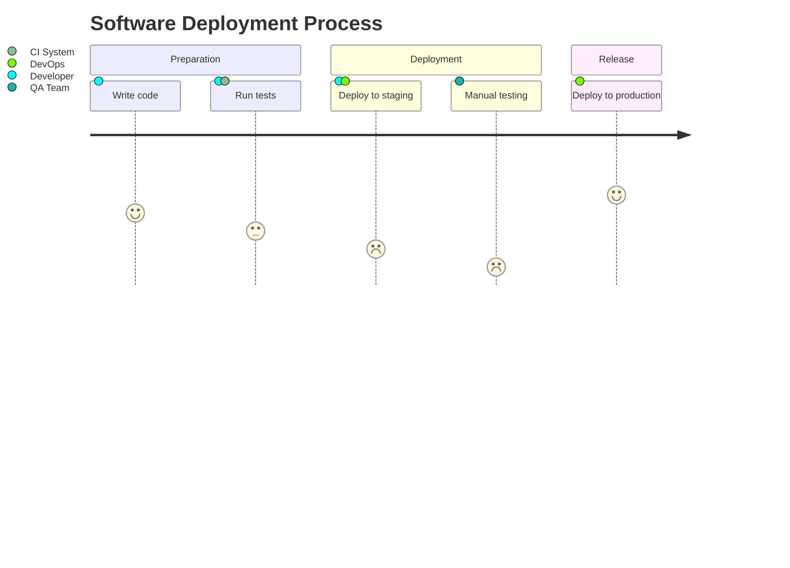
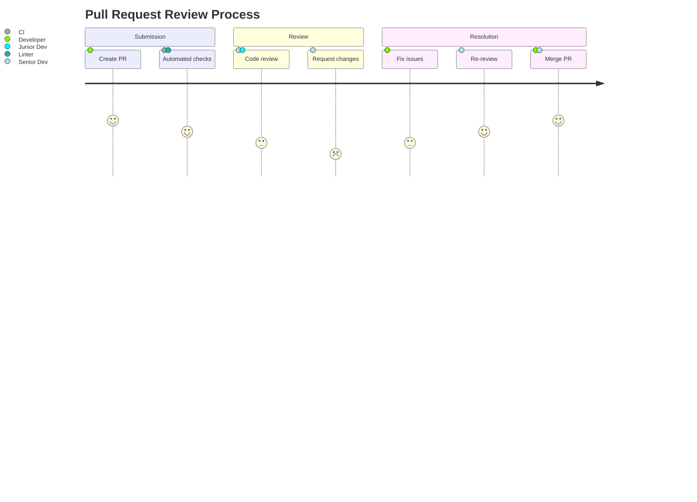
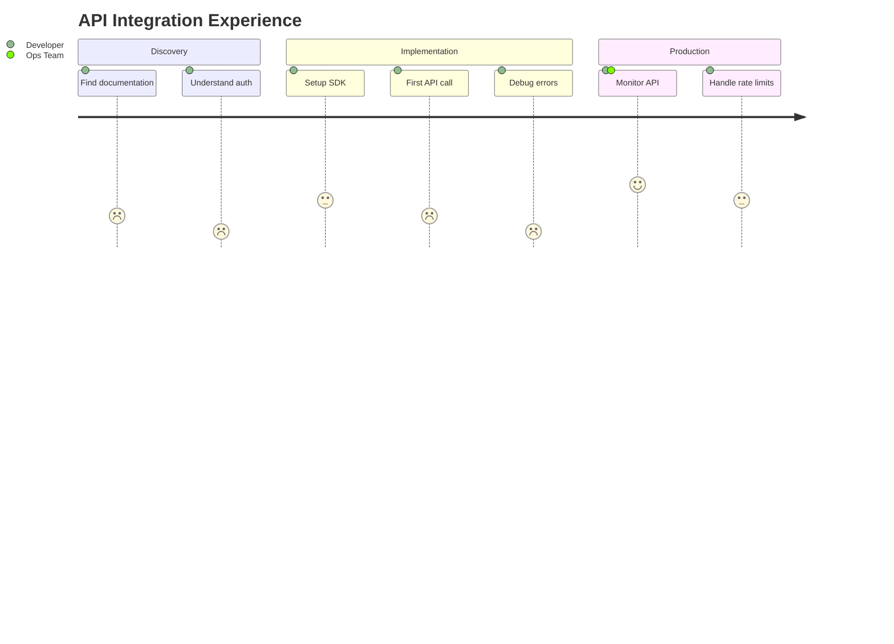
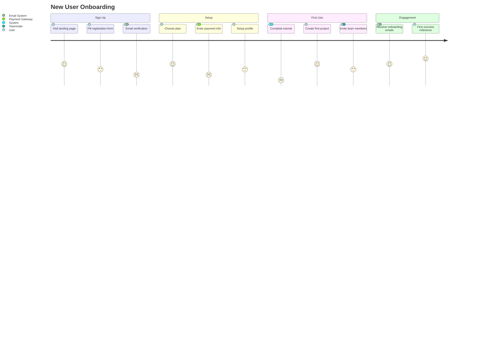
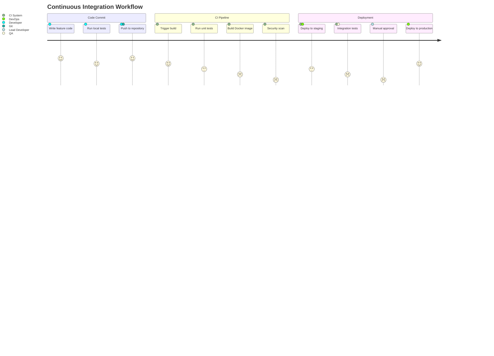
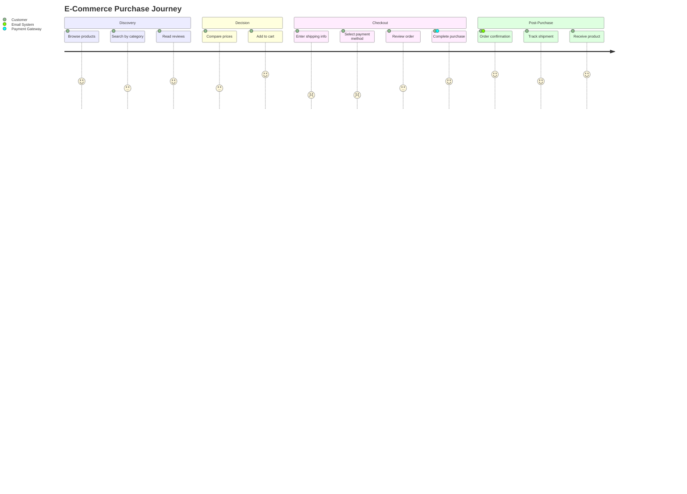

# User Journey Diagrams

User journey diagrams map user experiences through workflows and identify pain points. They combine tasks, satisfaction scores, and actors to reveal opportunities for improvement.

## Basic Syntax

## Task Syntax

Each task includes:
- **Task name** - Description of the action
- **Score** (1-5) - Satisfaction level (1 = poor, 5 = excellent)
- **Actors** - Comma-separated participants

## Multiple Actors

Multiple actors can participate in the same task:

## Scoring Guidelines

Use scores to highlight problem areas:

- **5 (Excellent)** - Smooth, efficient, satisfying experience
- **4 (Good)** - Generally positive with minor friction
- **3 (Neutral)** - Acceptable but room for improvement
- **2 (Poor)** - Frustrating, time-consuming, or error-prone
- **1 (Very Poor)** - Major pain point requiring immediate attention

**This journey reveals documentation and debugging as major pain points.**

## Real-World Example: User Onboarding

**Analysis:** Email verification (score 2) and tutorial (score 1) need improvement. First success milestone (score 5) is a highlight.

## Technical Workflow Example: CI/CD Pipeline

**Pain points:** Security scan (1), manual approval (1), and integration tests (2) slow down the pipeline.

## Use Cases

1. **User Experience Research** - Map user interactions to find friction points
2. **Process Optimization** - Identify bottlenecks in internal workflows
3. **Customer Support Analysis** - Track support ticket resolution experience
4. **Developer Experience** - Analyze developer workflows (CI/CD, code review, deployment)
5. **Product Onboarding** - Optimize new user activation flow
6. **API Usability** - Evaluate developer experience with APIs
7. **Incident Response** - Review and improve incident handling processes

## Sections for Structure

Organize journeys into logical phases:

## Tips for Effective Journey Maps

1. **Focus on real workflows** - Base journeys on actual user behavior, not ideal scenarios
2. **Be honest with scores** - Low scores reveal improvement opportunities
3. **Include all actors** - Show system components and team members involved
4. **Group related tasks** - Use sections to create narrative flow
5. **Identify patterns** - Look for consistently low scores across sections
6. **Prioritize improvements** - Address score 1-2 tasks first
7. **Combine with analytics** - Validate scores with data (error rates, completion time)
8. **Update regularly** - Revisit journeys after implementing improvements
9. **Share with stakeholders** - Use as communication tool for user experience issues
10. **Keep it actionable** - Each low score should lead to a concrete improvement task

## Common Anti-Patterns to Avoid

- **All high scores** - Not realistic; doesn't reveal problems
- **Too many actors** - Keep to 2-3 key participants per task
- **Vague task names** - Be specific (e.g., "Enter credit card" not "Pay")
- **Missing context** - Add sections to explain journey phases
