# XY Charts

XY charts visualize relationships between variables using line plots and bar charts. They support both categorical and numeric axes, making them ideal for trends, comparisons, and time series data.

## Basic Syntax

```mermaid
xychart-beta
    x-axis [Q1, Q2, Q3, Q4]
    y-axis "Revenue" 0 --> 100
    line [30, 45, 55, 70]
```

## Chart Orientation

### Vertical (Default)
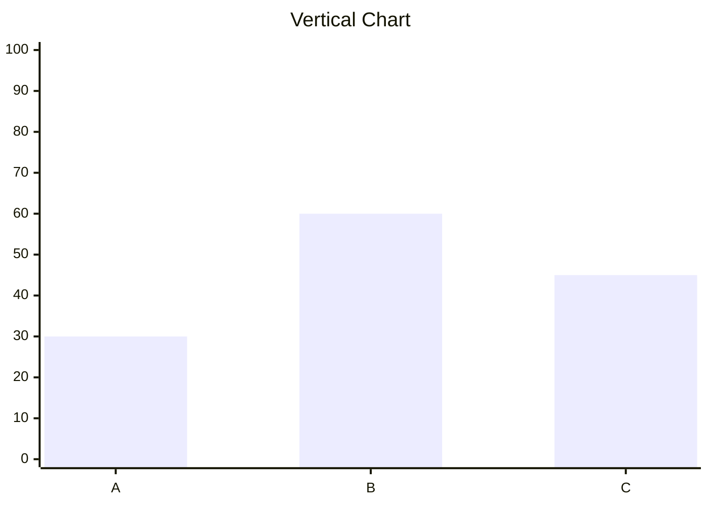

### Horizontal
```mermaid
xychart-beta horizontal
    title "Horizontal Chart"
    x-axis 0 --> 100
    y-axis [A, B, C]
    bar [30, 60, 45]
```

## Chart Title

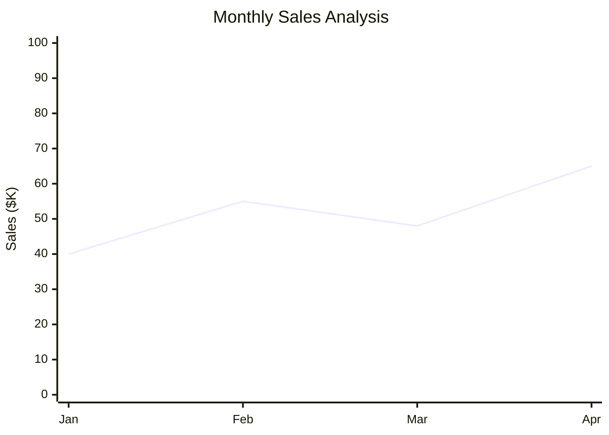

## Axes

### Categorical X-Axis
Labels with discrete categories:

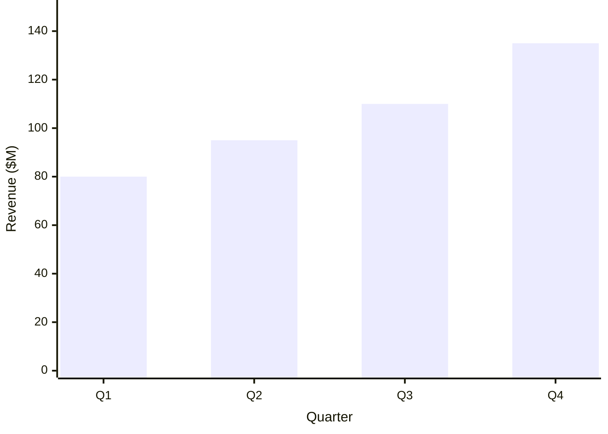

### Numeric X-Axis
Range with min and max values:

```mermaid
xychart-beta
    x-axis "Time (seconds)" 0 --> 10
    y-axis "Response (ms)" 0 --> 500
    line [100, 150, 120, 180, 200, 250, 220, 280, 300, 320]
```

### Auto-Range Y-Axis
Omit range for automatic scaling:

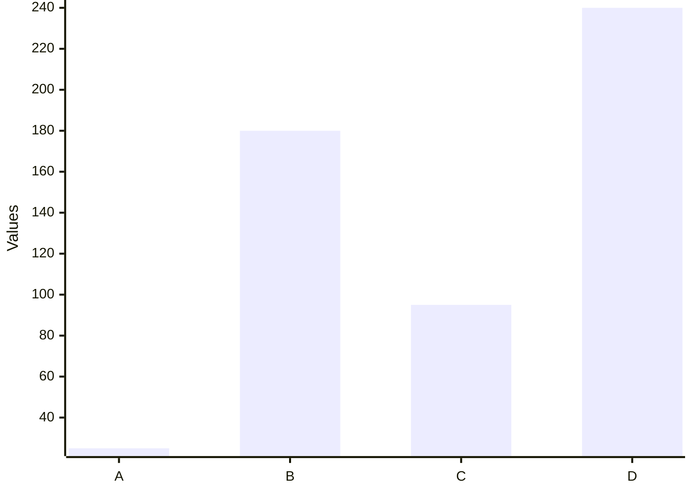

## Line Charts

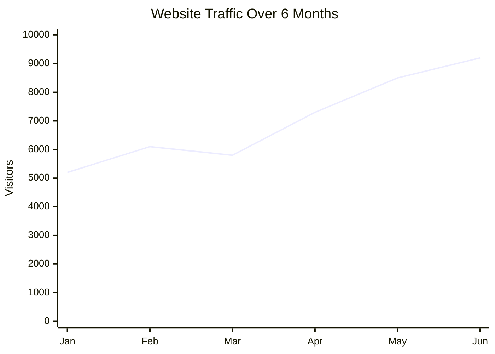

## Bar Charts

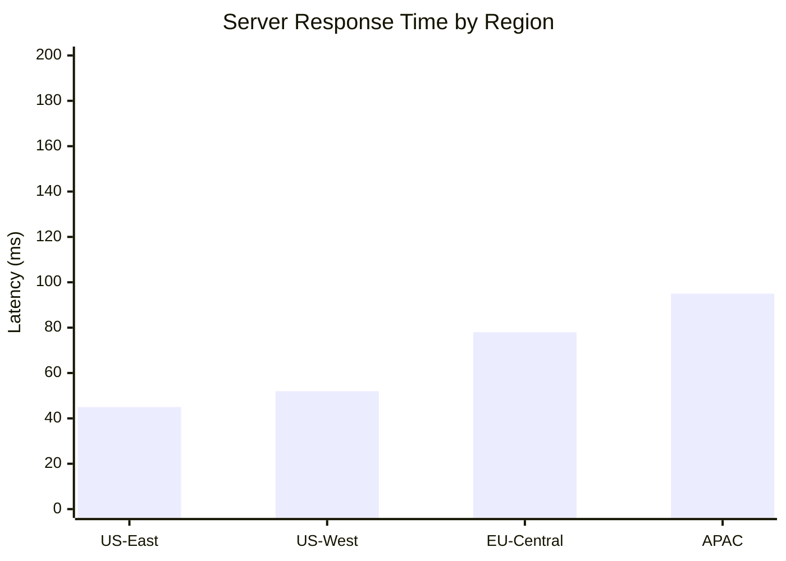

## Multiple Series

Combine multiple lines and bars:

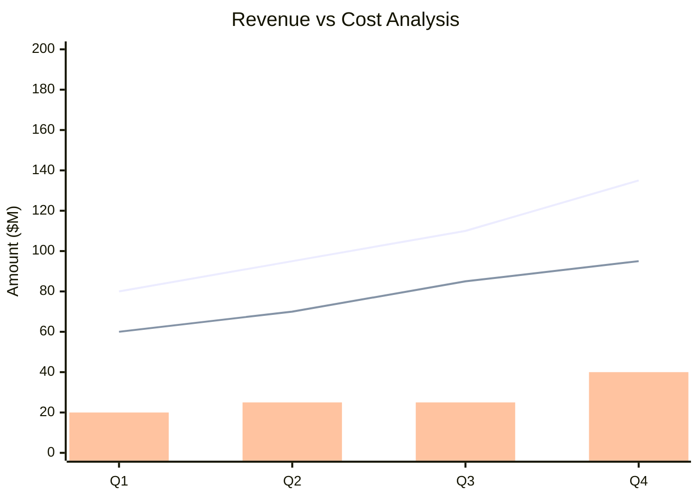

## Data Labels

Show values on data points:

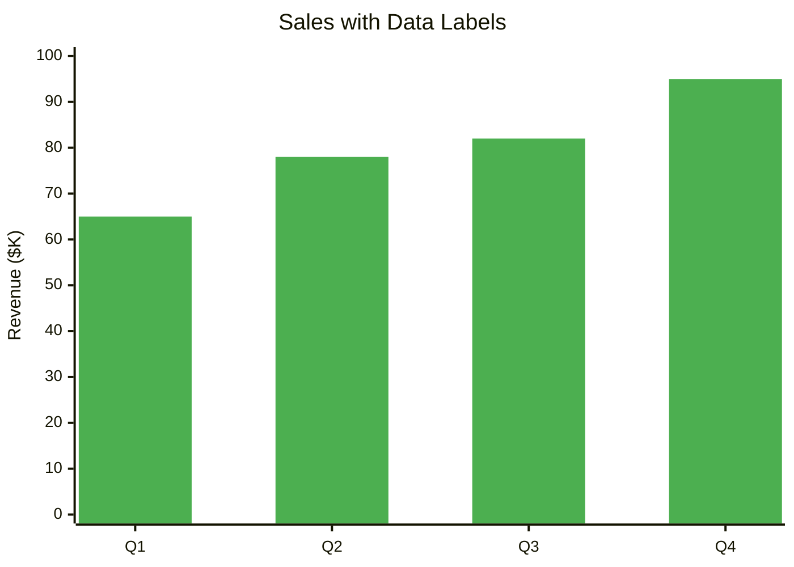

## Styling and Colors

### Custom Color Palette

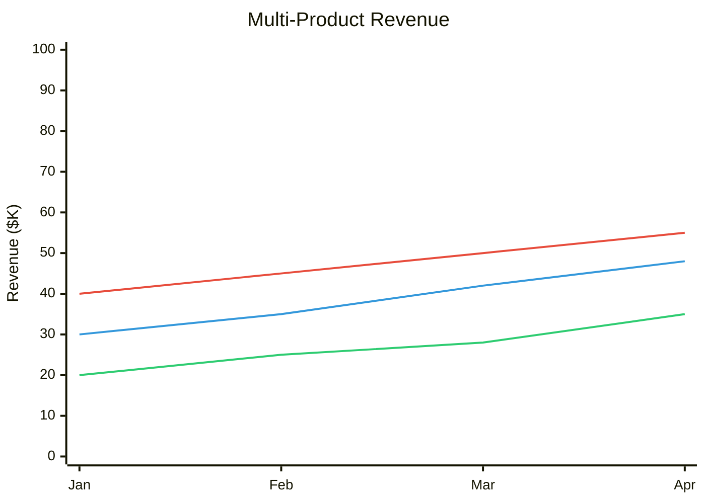

### Title and Label Colors

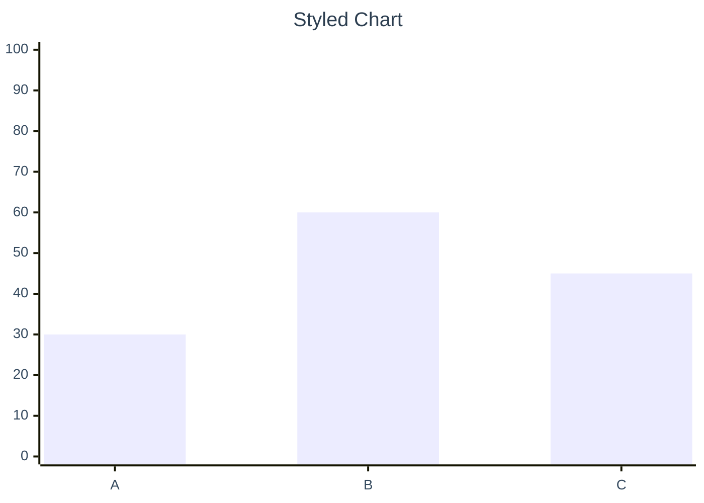

## Comprehensive Example: Application Performance Monitoring

```mermaid
xychart-beta
    title "API Performance Metrics - Last 12 Hours"
    x-axis "Time" [00:00, 02:00, 04:00, 06:00, 08:00, 10:00, 12:00, 14:00, 16:00, 18:00, 20:00, 22:00]
    y-axis "Response Time (ms)" 0 --> 500
    line [120, 115, 110, 125, 180, 250, 280, 320, 310, 280, 200, 150]
```

## Server Load Example

```mermaid
%%{init: {'themeVariables': { 'xyChart': {'plotColorPalette': '#e74c3c, #f39c12, #3498db'}}}}%%
xychart-beta
    title "Server Resource Utilization"
    x-axis [00:00, 04:00, 08:00, 12:00, 16:00, 20:00]
    y-axis "Percentage (%)" 0 --> 100
    line [25, 22, 45, 65, 70, 40]
    line [30, 28, 50, 68, 72, 45]
    line [15, 18, 35, 55, 60, 30]
```

## User Engagement Example

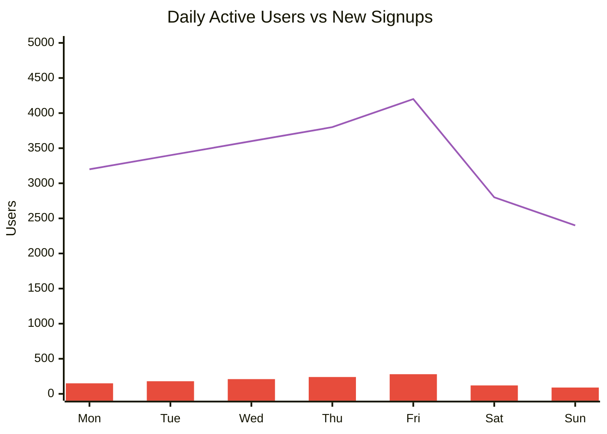

## Error Rate Monitoring

```mermaid
%%{init: {'themeVariables': { 'xyChart': {'plotColorPalette': '#e74c3c'}}}}%%
xychart-beta
    title "HTTP Error Rate (5xx) - Last 24 Hours"
    x-axis [00:00, 04:00, 08:00, 12:00, 16:00, 20:00, 23:59]
    y-axis "Errors per minute" 0 --> 50
    line [2, 1, 15, 28, 35, 20, 8]
```

## Database Query Performance

```mermaid
xychart-beta horizontal
    title "Average Query Execution Time by Table"
    x-axis "Time (ms)" 0 --> 1000
    y-axis [users, orders, products, invoices, sessions]
    bar [45, 280, 120, 650, 35]
```

## Multi-Region Latency

```mermaid
%%{init: {'themeVariables': { 'xyChart': {'plotColorPalette': '#3498db, #2ecc71, #e74c3c, #f39c12'}}}}%%
xychart-beta
    title "Multi-Region API Latency Comparison"
    x-axis [00:00, 06:00, 12:00, 18:00, 23:59]
    y-axis "Latency (ms)" 0 --> 300
    line [45, 48, 52, 50, 47]
    line [120, 125, 130, 128, 122]
    line [180, 190, 200, 195, 185]
    line [240, 250, 260, 255, 245]
```

## Deployment Success Rate

```mermaid
%%{init: {'themeVariables': { 'xyChart': {'plotColorPalette': '#2ecc71, #e74c3c'}}}}%%
xychart-beta
    title "Weekly Deployment Success vs Failures"
    x-axis [Week 1, Week 2, Week 3, Week 4]
    y-axis "Count" 0 --> 50
    bar [45, 48, 50, 52]
    bar [3, 2, 1, 2]
```

## Cache Hit Rate

```mermaid
%%{init: {'themeVariables': { 'xyChart': {'plotColorPalette': '#27ae60, #c0392b'}}}}%%
xychart-beta
    title "Cache Performance - Hit vs Miss"
    x-axis [Mon, Tue, Wed, Thu, Fri]
    y-axis "Percentage (%)" 0 --> 100
    line [85, 87, 88, 90, 92]
    line [15, 13, 12, 10, 8]
```

## Request Volume by Endpoint

```mermaid
xychart-beta horizontal
    title "API Endpoint Request Volume (last hour)"
    x-axis "Requests" 0 --> 10000
    y-axis [/api/users, /api/orders, /api/products, /api/auth, /api/health]
    bar [8500, 6200, 4800, 9200, 12000]
```

## A/B Test Results

```mermaid
%%{init: {'themeVariables': { 'xyChart': {'plotColorPalette': '#3498db, #e74c3c'}}}}%%
xychart-beta
    title "Conversion Rate - Variant A vs Variant B"
    x-axis [Day 1, Day 2, Day 3, Day 4, Day 5, Day 6, Day 7]
    y-axis "Conversion Rate (%)" 0 --> 10
    line [4.2, 4.5, 4.8, 5.0, 5.2, 5.1, 5.3]
    line [3.8, 4.0, 4.2, 4.3, 4.5, 4.6, 4.7]
```

## Configuration Options

### Chart Dimensions
```javascript
%%{init: {'themeVariables': {
    'xyChart': {
        'width': 800,
        'height': 400
    }
}}}%%
```

### Title Styling
```javascript
%%{init: {'themeVariables': {
    'xyChart': {
        'titleColor': '#2c3e50',
        'titleFontSize': 20
    }
}}}%%
```

### Data Labels
```javascript
%%{init: {'themeVariables': {
    'xyChart': {
        'showDataLabel': true
    }
}}}%%
```

### Plot Area
```javascript
%%{init: {'themeVariables': {
    'xyChart': {
        'plotReservedSpacePercent': 50
    }
}}}%%
```

## Tips for Effective XY Charts

1. **Choose appropriate chart type** - Lines for trends, bars for comparisons
2. **Set meaningful ranges** - Y-axis should show relevant scale
3. **Use auto-range carefully** - Can distort perception if values vary widely
4. **Limit series count** - Too many lines create visual clutter (max 3-4)
5. **Color for meaning** - Use consistent colors (green=good, red=bad)
6. **Add context with titles** - Clear titles explain what's being measured
7. **Show data labels sparingly** - Only when exact values matter
8. **Consider orientation** - Horizontal works well for long category names

## Common Use Cases

### Performance Monitoring
- API response times
- Server resource usage
- Database query performance

### Business Metrics
- Revenue trends
- User growth
- Conversion funnels

### Quality Metrics
- Error rates
- Test coverage
- Deployment success

### Comparison Analysis
- A/B test results
- Regional performance
- Multi-product metrics
